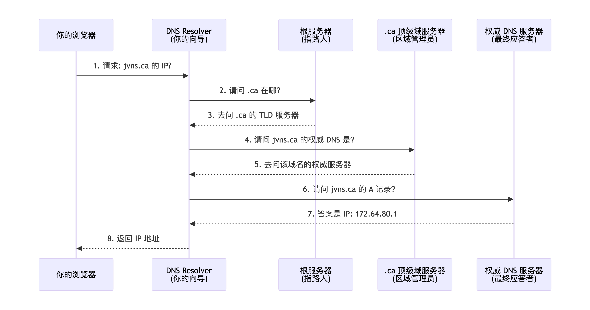

# 查询A记录
dig example.com A

# 查询NS记录
dig example.com NS

# 指定DNS服务器查询
dig @8.8.8.8 example.com A

# 反向DNS查询
dig -x 8.8.8.8

# 强制绑定域名和IP进行HTTPS请求
curl --resolve example.com:443:93.184.216.34 https://example.com -I

# 查看SSL证书信息
openssl s_client -connect 93.184.216.34:443 -servername example.com < /dev/null 2>/dev/null | openssl x509 -text | grep "Subject:"

---

### DNS 流程图

---

### DNS 图书馆图

---
