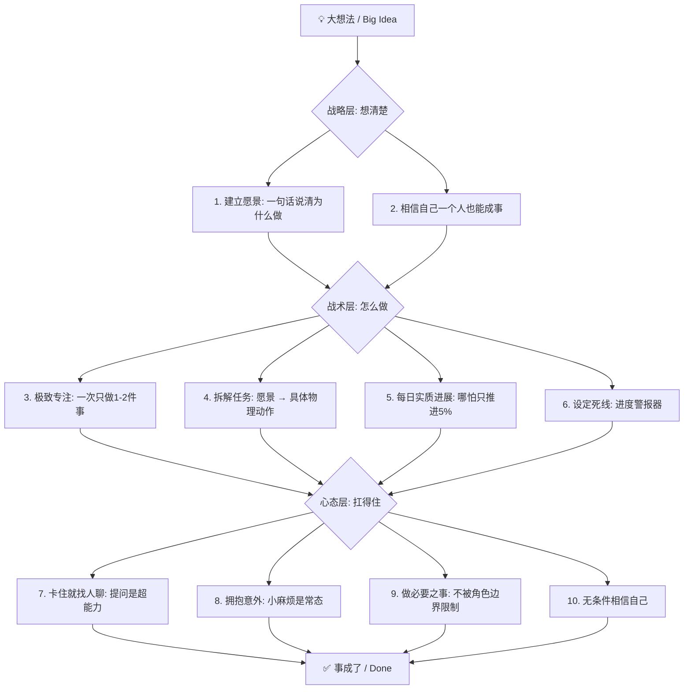

# 📌 Getting Things Done

> **💡 一句话总结 (TL;DR)**：Julia Evans 提出 10 条原则，从战略（愿景、信念）、战术（专注、拆解、每日推进、设死线）到心态（求助、拥抱意外、做必要之事、相信自己），把"大想法"真正变成"做完了"的现实。

---

## 📐 核心架构 / 流程图示 (Architecture & Flow)

---

**作者：** Julia Evans
**阅读日期：** 2026年7月7日

---

## 第一部分：战略层（想清楚）

### 1. 必须有一个愿景(Have a vision)

- **原文要点**：做事之前，必须能用一句话说清楚"我为什么要做这个"。

- **我的理解**：没有愿景，你会在无数琐碎的选择中迷失。

- **行动指南**：先选一个"看起来最对"的方向动起来，边做边修正，不要纠结于找到"绝对正确"的愿景。

### 2. 相信"一个人也能成事" (I can do a lot!)

- **原文要点**：只要方法得当，一个人的执行力远比想象中强大。

- **我的理解**：不要觉得自己势单力薄就不敢开始。作者用周末时间做的小册子，帮助了成千上万人。

---

## 第二部分：战术层（怎么做）

### 3. 极致的专注（一次只做1-2件事） (Focus)

- **原文要点**：同时做超过两件大事，所有的进度都会被拖慢。

- **我的理解**：专注一件事时，效率是指数级上升的。

- **适用边界**：这个方法对普通员工极有效，但可能不适用于需要处理大量突发事件的高管。

### 4. 拆解是核心技能 (Learn how to break things down)

- **原文要点**：愿景无法直接执行，必须拆解成具体的物理动作。

- **我的理解**：就像"去某个遥远小岛"，不能只想着"去那里"，要具体到"先走到码头坐船"。

- **心态**：拆解不容易，但多练会越来越好。

### 5. 保证"每天都有实质进展" (Try to get something done every day)

- **原文要点**：不需要迷信各种限制刷手机的时间管理技巧，但**必须确保每天往核心目标推进一步**。

- **我的理解**：哪怕只推进了5%，只要天天有动作，这件事就不会凉。

### 6. 设定"死线"（Deadline）

- **原文要点**：给大任务设个截止日（比如"六周搞定"）。

- **我的理解**：死线不是为了逼死自己，而是一个**警报器**。如果时间过半进度没到一半，你就知道该砍掉一些次要功能了。

---

## 第三部分：心态层（扛得住）

### 7. 卡住了？立刻找人"说出来" (Talk to someone when I get stuck)

- **原文要点**：遇到思维瓶颈时，抓个人过来聊一聊，哪怕只是复述问题，答案往往就出来了。

- **我的理解**：提问不是示弱，是一种超能力。

### 8. 拥抱"意外"和"小麻烦" (Don't be scared of small problems)

- **原文要点**：做事时总会有意想不到的破烂事冒出来。

- **我的理解**：不要恐慌（"完蛋了"），要换种心态："总会出点意外的，没事，慢慢解决就好了"。

### 9. 为了结果，做"必要之事" (Do whatever's necessary)

- **原文要点**：为了推进项目，有时候需要去改别的团队的代码，做点"越界"的事。

- **我的理解**：不要被"这不是我的活"限制住。先打个招呼沟通好，然后上手干，通常你都能搞定。

### 10. 无条件相信自己 (Believe in yourself)

- **原文要点**：相信自己真的能把这件事做成。

- **我的理解**：这不是盲目自信，因为根据以往的经验，大多数时候只要按上面的方法走，确实能做成。
