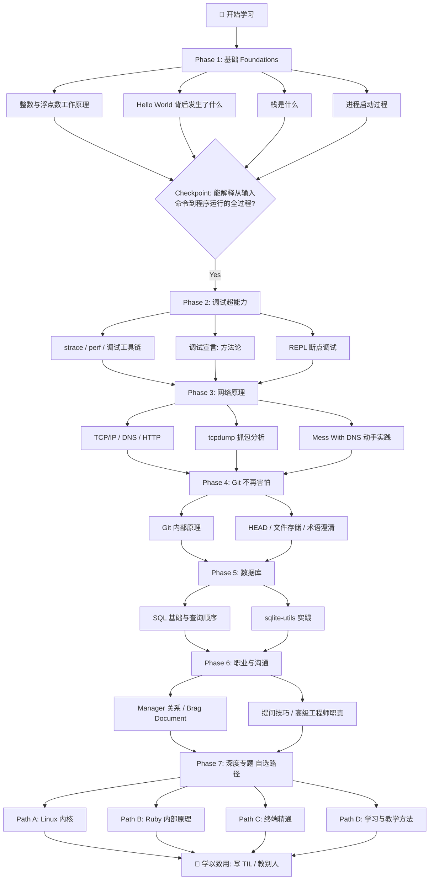

# 📌 Julia Evans Study Roadmap

> **💡 一句话总结 (TL;DR)**：利用 Julia Evans 的 10 本 zines + 450+ 博客文章，按照 7 个阶段系统学习计算机基础（程序运行原理 → 调试工具 → 网络 → Git → 数据库 → 职业沟通 → 深度专题），约 4 周完成核心阶段。

---

## 📐 核心架构 / 流程图示 (Architecture & Flow)

---

Your materials: 10 zines (PDF) + 450+ blog posts on jvns.ca + free posters + exercises.

---

## Phase 1: Foundations (Start Here)

These explain *how computers actually work*. No prerequisites.

| # | Zine/Resource | Time | Why First |
|---|--------------|------|-----------|
| 1 | **How Integers and Floats Work** (zine, PDF) | 1h | Foundation for all debugging. 0.1+0.2!=0.3 makes sense after this. |
| 2 | Blog: [Behind "Hello World" on Linux](https://jvns.ca/blog/2023/08/10/behind-hello-world-on-linux/) | 30m | What happens when you run a program. |
| 3 | Blog: [What is "the stack"?](https://jvns.ca/blog/2016/02/20/what-is-the-stack/) | 20m | Memory model. Critical mental model. |
| 4 | Blog: [What happens when you start a process on Linux?](https://jvns.ca/blog/2016/10/04/what-happens-when-you-start-a-process-on-linux/) | 30m | OS fundamentals. |

**Checkpoint:** Can you explain what happens from "type command" to "program runs"?

---

## Phase 2: Seeing Inside Programs (Debugging Superpowers)

Core debugging zines + blog. Build the skill of *looking inside* running programs.

| # | Resource | Time |
|---|---------|------|
| 1 | **Spying on your programs with Strace** (zine, PDF) | 1.5h |
| 2 | **Linux Debugging Tools You'll Love** (zine, PDF) | 1.5h |
| 3 | Blog: [A debugging manifesto](https://jvns.ca/blog/2022/12/08/a-debugging-manifesto/) | 15m |
| 4 | Blog: [Debugging by starting a REPL at a breakpoint](https://jvns.ca/blog/2021/09/20/debugging-by-starting-a-repl-at-a-breakpoint-is-fun/) | 15m |
| 5 | Blog: [Reasons why bugs might feel "impossible"](https://jvns.ca/blog/2021/06/21/reasons-why-bugs-might-feel-impossible/) | 15m |
| 6 | Free poster: [A debugging manifesto](https://wizardzines.com/posters/debugging-manifesto/) | print & pin |

**Practice:** Run `strace ls` and explain every line. Pick a slow program, attach `perf top`.

---

## Phase 3: Networking (How The Internet Works)

Zines first (visual, friendly), then blog deep-dives.

| # | Resource | Time |
|---|---------|------|
| 1 | **Networking ACK** (zine, PDF) | 1h |
| 2 | **How DNS Works** (zine, PDF) | 2h |
| 3 | **HTTP: Learn your browser's language** (zine, PDF) | 1.5h |
| 4 | **Let's learn tcpdump** (zine, PDF) | 1.5h |
| 5 | Blog: [How do HTTP requests get sent to the right place?](https://jvns.ca/blog/2016/07/14/how-do-http-requests-get-sent-to-the-right-place/) | 20m |
| 6 | Blog: [A toy DNS resolver](https://jvns.ca/blog/2022/02/01/a-toy-dns-resolver/) | 30m |
| 7 | Blog: [How to use dig](https://jvns.ca/blog/2021/12/04/how-to-use-dig/) | 20m |
| 8 | Tool: [Mess With DNS](https://messwithdns.net) — interactive playground | 1h |
| 9 | Blog: [Making a DNS query in Ruby from scratch](https://jvns.ca/blog/2022/11/06/making-a-dns-query-in-ruby-from-scratch/) | 45m |

**Practice:** Open Wireshark, browse a site, read the HTTP packets. Use `dig` to trace DNS resolution.

---

## Phase 4: Git (Stop Being Scared)

| # | Resource | Time |
|---|---------|------|
| 1 | **Oh shit, Git** (zine, PDF) | 1h |
| 2 | Blog series on git internals (15 posts, pick these 3 first): | |
|   | - [In a git repository, where do your files live?](https://jvns.ca/blog/2023/09/14/in-a-git-repository-where-do-your-files-live/) | 20m |
|   | - [How HEAD works in git](https://jvns.ca/blog/2024/03/08/how-head-works-in-git/) | 15m |
|   | - [Confusing git terminology](https://jvns.ca/blog/2023/11/01/confusing-git-terminology/) | 20m |
| 3 | [git exercises: navigate a repository](https://jvns.ca/blog/2019/08/30/git-exercises--navigate-a-repository/) | 1h |

---

## Phase 5: Databases

| # | Resource | Time |
|---|---------|------|
| 1 | **Become a SELECT star** (zine, PDF) | 2h |
| 2 | Blog: [SQL queries don't start with SELECT](https://jvns.ca/blog/2019/10/03/sql-queries-don-t-start-with-select/) | 15m |
| 3 | Blog: [Notes on building SQL exercises](https://jvns.ca/blog/2019/09/29/notes-on-building-sql-exercises/) | 15m |
| 4 | Tool: [sqlite-utils](https://jvns.ca/blog/2022/05/12/sqlite-utils--a-nice-way-to-import-data-into-sqlite-for-analysis/) — practice SQL locally | 1h |

**Practice:** Import a CSV into SQLite with `sqlite-utils` and write 10 queries.

---

## Phase 6: Career & Communication

| # | Resource | Time |
|---|---------|------|
| 1 | **Help I have a Manager** (zine, PDF) | 1h |
| 2 | Blog: [Get your work recognized: write a brag document](https://jvns.ca/blog/2019/06/21/get-your-work-recognized-write-a-brag-document/) | 15m |
| 3 | Blog: [What's a senior engineer's job?](https://jvns.ca/blog/2018/10/21/what-s-a-senior-engineer-s-job/) | 15m |
| 4 | Blog: [How to ask good questions](https://jvns.ca/blog/2016/12/22/how-to-ask-good-questions/) | 15m |
| 5 | Blog: [Things your manager might not know](https://jvns.ca/blog/2021/03/21/things-your-manager-might-not-know/) | 15m |

---

## Phase 7: Deep Dives (Pick Your Own Adventure)

Choose what interests you:

### Path A: Linux Internals
- Blog: [How containers work: overlayfs](https://jvns.ca/blog/2019/11/18/how-containers-work-overlayfs/)
- Blog: [What even is a container: namespaces and cgroups](https://jvns.ca/blog/2016/10/10/what-even-is-a-container/)
- Blog: [Async IO on Linux: select, poll, and epoll](https://jvns.ca/blog/2017/06/03/async-io-on-linux-select-poll-and-epoll/)
- Zine (buy): **How Containers Work!**

### Path B: Ruby Internals (relevant to your Ruby work)
- Blog: [How to spy on a Ruby program](https://jvns.ca/blog/2016/06/12/how-to-spy-on-a-ruby-program/)
- Blog: rbspy series (20 posts on building a Ruby profiler)
- Blog: [Surprises in Ruby HTTP libraries](https://jvns.ca/blog/2016/03/09/surprises-in-ruby-http-libraries/)

### Path C: Terminal Mastery
- Zine (buy): **The Secret Rules of the Terminal**
- Blog: [What happens when you press a key in your terminal?](https://jvns.ca/blog/2022/07/20/what-happens-when-you-press-a-key-in-your-terminal/)
- Blog: [Entering text in the terminal is complicated](https://jvns.ca/blog/2024/07/08/entering-text-in-the-terminal-is-complicated/)
- Free poster: [Terminal cheat sheet](https://wizardzines.com/posters/terminal-cheat-sheet/)

### Path D: How to Learn & Teach
- Blog: [How to teach yourself hard things](https://jvns.ca/blog/2018/09/01/how-to-teach-yourself-hard-things/)
- Blog: [How to get useful answers to your questions](https://jvns.ca/blog/2021/10/21/how-to-get-useful-answers-to-your-questions/)
- Blog: [Blog about what you've struggled with](https://jvns.ca/blog/2021/05/24/blog-about-what-you-ve-struggled-with/)
- Zine (free): **So you want to be a wizard**
- Free poster: [How to be a Wizard Programmer](https://wizardzines.com/posters/how-to-be-a-wizard-programmer/)

---

## Zines You Have vs. Zines Worth Buying

| Have (PDF) | Worth Buying (not in your collection) |
|------------|--------------------------------------|
| How Integers and Floats Work | How Git Works (newer, deeper than Oh Shit Git) |
| Spying on Programs with Strace | The Pocket Guide to Debugging |
| Linux Debugging Tools You'll Love | How Containers Work |
| Networking ACK | Bite Size Command Line |
| How DNS Works | Bite Size Bash |
| HTTP: Learn your browser's language | Bite Size Linux |
| Let's learn tcpdump | The Secret Rules of the Terminal |
| Oh shit, Git | So you want to be a wizard (free) |
| Become a SELECT star | |
| Help I have a Manager | |

---

## Study Rhythm

1. **One zine per week.** Read, then try every command/example on your machine.
2. **Pair zine with 1-2 blog posts** from the same topic. Zine = mental model. Blog = depth.
3. **Keep a TIL file.** Julia does this at [til.jvns.ca](https://til.jvns.ca). Do the same.
4. **Write after each topic.** 2 paragraphs explaining what you learned. Teaching = learning.
5. **Phase 1-4 = ~3 weeks.** Phase 5-6 = ~1 week. Phase 7 = ongoing.

---

## Key Links

- Blog: https://jvns.ca
- Zines: https://wizardzines.com
- DNS playground: https://messwithdns.net
- Integer playground: https://integer.exposed
- Questions: https://questions.wizardzines.com
