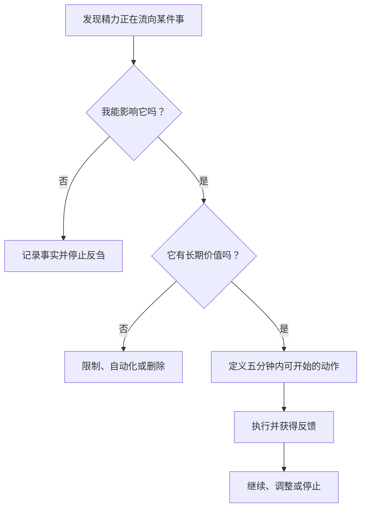

# 不增不减：把有限精力投向可控与复利

> **核心结论：精力管理不是把每一分钟塞满，而是停止无效消耗，把有限精力持续投入可控且能够积累的事情。**


## 一、从第一性原理出发

先不讨论时间管理技巧，只承认三个无法绕开的事实：

| 底层事实 | 推导 | 行动结论 |
| --- | --- | --- |
| **人的时间、注意力和体力有限** | 投入一件事，就意味着放弃其他可能 | 精力必须有明确优先级 |
| **行动只能直接发生在可控范围内** | 反复思考不可控之事，通常不能改变结果 | 把注意力从评价和猜测拉回下一步行动 |
| **不同投入的长期回报不同** | 有些行动一次性消耗，有些行动会积累并降低未来成本 | 优先建设技能、身体、关系和系统 |

因此，精力配置只有两步：

1. **做减法：** 停止向不可控、低价值、不可积累的事情持续供能。
2. **做加法：** 把释放出的精力投入可控、重要、能够复利的行动。

这不是消极地“什么都不做”，而是拒绝让有限资源流向错误的地方。

## 二、减法：停止三类精力泄漏

### 1. 不可控的人与事

- 他人的情绪、偏见和最终评价
- 已经发生、无法撤销的事实
- 市场、天气和宏观环境的短期变化
- 试图说服价值观和认知前提完全不同的人

不可控不等于不重要。正确做法是：**确认事实，评估自己能施加的影响，然后停止为影响范围之外的部分付费。**

### 2. 低价值的“假性忙碌”

- **过度准备：** 用长期规划、整理和排版代替真正开始。
- **信息过载：** 无目的地刷新通知、社交媒体和零碎资讯。
- **微小决策：** 为几乎不影响结果的选择反复权衡。
- **伪优化：** 在行动次数不足时，过早追求工具和流程的完美。

判断标准很简单：**这件事是否产生了可检查的结果，或者显著降低了下一次行动的成本？** 如果都没有，它大概率只是在制造忙碌感。

### 3. 没有出口的情绪循环

- 对尚未发生之事进行灾难化想象
- 反复追悔过去的次优选择
- 把一次失败扩大为对自我价值的否定
- 不断猜测他人的动机，却不核实事实

情绪本身不是敌人，它是信号。问题在于：**是否能从信号中提取信息，并转化为行动。** 若暂时没有行动，就先记录、休息或接受，而不是继续反刍。

## 三、加法：把精力投入三类复利资产

复利资产的共同点是：**今天的投入不只产生一次结果，还会提高未来行动的质量，或降低未来行动的成本。**

| 复利资产      | 投入重点                      | 为什么会复利           |
| --------- | ------------------------- | ---------------- |
| **核心能力**  | 深度思考、结构化表达、复杂问题拆解、编程与数学基础 | 能迁移到不同工具、岗位和问题中  |
| **健康身体**  | 睡眠、心肺、力量、饮食和恢复            | 提高每一天可用精力的上限与稳定性 |
| **高信任关系** | 少数能彼此支持、诚实反馈和共同成长的人       | 降低沟通、防御和协作成本     |

### 1. 能力复利：建设底座，不追逐表层技巧

工具会变化，底层能力迁移得更久。与其收集大量快捷键和方法，不如反复训练：

- 把复杂问题拆成可以验证的小问题
- 用清晰语言解释自己的判断
- 通过实际作品和实验获得反馈
- 从失败中提取可以复用的原则

### 2. 身体复利：先保护能量的物理底座

身体既会消耗，也能通过训练和恢复增强。精力管理首先依赖：

- 稳定且充足的睡眠
- 规律的有氧与力量训练
- 能长期坚持的饮食与恢复方式
- 对疼痛、疲劳和压力信号的及时响应

身体：**不是执行计划之后才处理的附属项，而是执行一切计划的前提。** 

### 3. 关系复利：用信任代替无效社交

关系的价值不取决于认识多少人，而取决于是否存在真实的理解、互助和反馈。把精力留给少数高信任关系，可以减少猜疑和表演，也能在低谷时提供支持。

## 四、掌控力：把注意力锁定在行动

很多心理疲惫来自一个结构性错误：**试图用自己的精力直接控制不受自己控制的结果。**

```text
┌──────────────────────────────────────┐
│ 关注圈：他人评价、市场、天气、过去、最终结果 │
└──────────────────┬───────────────────┘
                   │ 提取事实，接受剩余部分
                   ▼
┌──────────────────────────────────────┐
│ 影响圈：态度、选择、边界、技能、当下行动     │
└──────────────────┬───────────────────┘
                   │ 投入精力并获得反馈
                   ▼
              下一步可验证结果
```

### 事实—影响—行动

遇到挫折时，依次回答：

1. **事实是什么？** 去掉评价、猜测和自我攻击。
2. **其中什么可以被我影响？** 明确边界，不把“关心”误认为“能够控制”。
3. **下一步最小行动是什么？** 选择五分钟内能够开始的动作。

最小行动不是降低目标，而是用真实反馈替代想象中的困难。

## 五、系统：让正确行动更容易发生

如果每次行动都要重新说服自己，计划就很脆弱。系统的作用不是追求复杂自动化，而是**减少重复决策，让重要行为拥有稳定触发条件。**

| 系统手段 | 示例 | 作用 |
| --- | --- | --- |
| **默认选项** | 固定训练时段、早餐和工作启动流程 | 减少低价值选择 |
| **标准流程** | 为报告、复盘和环境配置保留模板 | 避免重复思考 |
| **环境设计** | 工作时把手机放到另一个房间 | 让干扰变得更难 |
| **启动触发器** | 打开 Daily Note 后立即写下唯一产出 | 让行动自然衔接 |

一个好系统应该足够简单：它能降低摩擦，却不会让维护系统本身成为新的假性忙碌。

## 六、一个可执行的精力决策框架

面对任何想投入精力的事情，先判断两个变量：**可控程度**与**长期价值**。

|  | **长期价值高** | **长期价值低** |
| --- | --- | --- |
| **可控程度高** | 立即行动，持续投入 | 自动化、批处理或设定上限 |
| **可控程度低** | 做一次可行的影响，然后接受结果 | 忽略、拒绝或隔离 |

每天只需完成这个最小循环：



## 七、关于幸福：从索取转向感受与参与

幸福很难被压缩成“付出大于索取”的单一公式。付出如果缺乏边界，也可能成为透支。更稳定的理解是：

> **幸福来自感受当下的能力、按照价值观行动的自由，以及与他人和世界形成建设性连接。**

贡献能够带来意义，接受帮助也同样必要。关键不是比较付出与索取的数量，而是判断：**我的精力是否正在支持我认同的生活。**

## 结语：不增不减，只做重新配置

真正的改变未必需要增加更多任务，而是重新配置已有精力：

1. 从不可控之事中撤回注意力。
2. 用边界和环境阻止持续泄漏。
3. 用简单系统降低正确行动的成本。
4. 把高质量精力投入能力、身体和关系。
5. 根据真实反馈持续调整，而不是追求一次设计完美。

> **用边界守住精力，用系统节省精力，用复利资产承接精力。**

---

相关：[[生活 SOP]]
