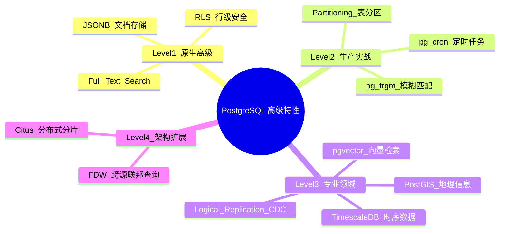
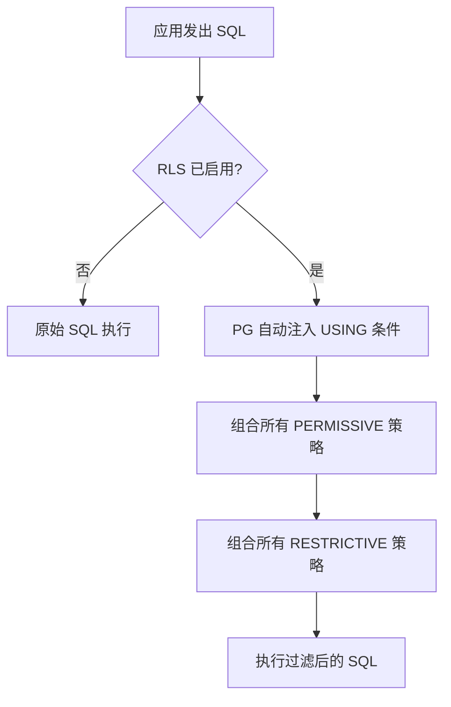

# PostgreSQL 高级特性与插件生态 RoadMap

Status: `todo` | `doing` | `done`

## 🧠 MindMap



## 📊 核心功能概览表

| 特性/功能名称 | 难易度 | 简介与核心用途 |
| :--- | :---: | :--- |
| **JSONB & 文档存储** | 🟢 Easy | 原生二进制JSON，GIN索引加速，混合存储半结构化数据 |
| **Full-Text Search** | 🟢 Easy | 内置分词+倒排索引，轻量搜索场景替代ES |
| **RLS 行级安全** | 🟢 Easy | 表级权限过滤规则，SaaS多租户隔离 |
| **Partitioning 表分区** | 🟡 Middle | 大表按范围/列表/Hash物理拆分，提升查询+清理效率 |
| **pg_cron 定时任务** | 🟡 Middle | 库内定时调度器，SQL级cron |
| **pg_trgm 模糊匹配** | 🟡 Middle | 三元组相似度，LIKE '%text%' 加速，拼写纠错 |
| **pgvector 向量检索** | 🔴 Difficult | 高维向量存储+ANN检索，AI语义搜索/RAG |
| **PostGIS 地理信息** | 🔴 Difficult | GIS行业标准，空间坐标计算、电子围栏 |
| **TimescaleDB 时序数据** | 🔴 Difficult | PG→时序数据库，自动分区+压缩+聚合 |
| **Citus 分布式** | 🔴 Difficult | 单机PG→透明分布式分片数据库 |
| **FDW 跨源查询** | 🔴 Difficult | 在PG里用SQL直接查MySQL/Mongo/CSV等外部数据源 |
| **Logical Replication & CDC** | 🔴 Difficult | 基于WAL的逻辑复制，数据变更捕获与同步 |

---

## 🟢 Level 1: Easy（原生高级特性，开箱即用）

### 1. 🔍 JSONB 与文档存储 (⭐)

**What is it**: PostgreSQL 原生支持两种 JSON 类型 — `json`(纯文本存) 和 `jsonb`(二进制解析后存)。`jsonb` 支持 GIN 索引、原地更新和高效查询，是推荐的 JSON 存储类型。

**What does it work for**:
- 电商商品 SKU 动态属性（不同品类属性不同，无法固定schema）
- API 日志存储（请求/响应 body 直接存 jsonb）
- 用户偏好设置（动态字段，无需 ALTER TABLE）

**How does it work**:
```
json (文本)：
  输入 → 精确保留空格/键序 → 纯文本存储 → 查询需每次都解析

jsonb (二进制)：
  输入 → 解析 → 去重键(只保留最后一次) → 排序键 → 二进制存储
  → 查询直接用 GIN 索引 → 支持 @>(包含), ?(键存在), ?|(任意键)
```

> [!NOTE]- JSONB 核心操作符
> | 操作符 | 含义 | 示例 |
> | :--- | :--- | :--- |
> | `->` | 取 JSON 对象字段(返回jsonb) | `data -> 'name'` |
> | `->>` | 取 JSON 对象字段(返回text) | `data ->> 'name'` |
> | `@>` | 左包含右 | `data @> '{"status":"active"}'` |
> | `?`  | 键是否存在 | `data ? 'email'` |
> | `\|\|` | 合并两个jsonb | `'{"a":1}'::jsonb \|\| '{"b":2}'` |

**Why does it work - Pros & Cons**:

| 优点 | 局限 |
| :--- | :--- |
| 灵活schema，适应动态属性 | 无强类型约束，靠应用层校验 |
| GIN 索引加速嵌套查询 | 更新整个大JSONB字段代价高 |
| 一条SQL搞定关系+文档混合查询 | 过深嵌套反而不如新建关联表 |

**💻 Code Example**:
```sql
-- 用 jsonb 存动态属性
CREATE TABLE products (
  id          SERIAL PRIMARY KEY,
  name        TEXT NOT NULL,
  category    TEXT,
  attributes  JSONB DEFAULT '{}',
  created_at  TIMESTAMPTZ DEFAULT now()
);

-- 不同品类的商品属性完全不同
INSERT INTO products (name, category, attributes) VALUES
('iPhone 16', 'electronics',
 '{"brand":"Apple","storage":"256GB","color":"black","weight":180}'),
('Nike Air Max', 'shoes',
 '{"brand":"Nike","size":42,"color":"white","material":"mesh"}'),
('三体', 'books',
 '{"author":"刘慈欣","pages":500,"isbn":"978-7-5360-0000-0"}');

-- 查询：找所有颜色为黑色的商品（不管什么品类）
SELECT name, category FROM products
WHERE attributes @> '{"color":"black"}';

-- 创建 GIN 索引加速查询
CREATE INDEX idx_products_attrs ON products USING GIN(attributes);

-- 更新嵌套字段（PG 9.5+ jsonb_set）
UPDATE products
SET attributes = jsonb_set(attributes, '{color}', '"red"')
WHERE id = 1;
```

**🎯 Deep Dive Task**:
> [!QUESTION] 挑战问题
> 日志表 `api_logs` 有 `payload JSONB` 字段存请求体。如何高效查询"payload 中包含 email 字段且值为 gmail.com 结尾"的日志？

**Solution**:
```sql
-- 用 jsonb 键存在 + 文本匹配
SELECT * FROM api_logs
WHERE payload ? 'email'
  AND payload->>'email' LIKE '%@gmail.com';

-- 加速：表达式索引（精确匹配可走索引，LIKE后缀不走但缩小了数据集）
CREATE INDEX idx_payload_email ON api_logs((payload->>'email'))
WHERE payload ? 'email';
```

---

### 2. 🔍 Full-Text Search 全文检索 (⭐)

**What is it**: PostgreSQL 内建文本搜索引擎，包含分词(tsvector)、查询解析(tsquery)、排名(ts_rank)和多种语言分词器。

**What does it work for**:
- 站内搜索：文章标题/内容搜索（轻量场景替代 Elasticsearch）
- 日志关键词检索
- 模糊搜索：拼写纠正、权重排序

**How does it work**:
```
原始文本: "The quick brown foxes jumped over the lazy dog"

  ↓ to_tsvector('english', text) — 分词 + 词干化

tsvector: 'brown':3 'dog':9 'fox':4 'jump':5 'lazi':8 'quick':2

  ↓ to_tsquery('english', query) — 解析用户搜索词

用户输入: "jumping fox"
tsquery: 'jump' & 'fox'

  ↓ @@ 匹配操作符 → 匹配成功！ts_rank() 计算相关性得分
```

> [!NOTE]- 中文分词
> PG 默认不包含中文分词器。需安装 `zhparser` 扩展或使用 `pg_bigm`/`pg_jieba`。

**Why does it work - Pros & Cons**:

| 优点 | 局限 |
| :--- | :--- |
| 零额外依赖，数据不离开PG | 中文分词需安装扩展 |
| 与关系查询无缝混合 | 亿级文档不如ES |
| 支持权重、排名、高亮 | 无分布式搜索能力 |

**💻 Code Example**:
```sql
-- 创建文档表，tsvector 列自动同步
CREATE TABLE articles (
  id          SERIAL PRIMARY KEY,
  title       TEXT NOT NULL,
  body        TEXT,
  search_vec  TSVECTOR GENERATED ALWAYS AS (
    setweight(to_tsvector('english', coalesce(title, '')), 'A') ||
    setweight(to_tsvector('english', coalesce(body, '')), 'B')
  ) STORED
);

-- GIN 索引加速搜索
CREATE INDEX idx_articles_search ON articles USING GIN(search_vec);

-- 全文搜索 + 排名 + 高亮
SELECT
  id, title,
  ts_rank(search_vec, query) AS rank,
  ts_headline('english', body, query,
    'StartSel=<mark>, StopSel=</mark>') AS snippet
FROM articles,
     plainto_tsquery('english', 'postgresql full text search') AS query
WHERE search_vec @@ query
ORDER BY rank DESC
LIMIT 20;

-- 搜索 + 关系查询混合（PG杀手锏！）
SELECT a.id, a.title, u.name AS author
FROM articles a
JOIN users u ON a.author_id = u.id
CROSS JOIN plainto_tsquery('english', 'machine learning') AS q
WHERE a.search_vec @@ q
  AND a.status = 'published'
ORDER BY ts_rank(a.search_vec, q) DESC
LIMIT 10;
```

**🎯 Deep Dive Task**:
> [!QUESTION] 挑战问题
> 设计一个支持"标题>正文"权重、并高亮命中关键词的wiki搜索系统。提供完整DDL + 查询。

**Solution**:
```sql
-- 加权向量生成函数
CREATE OR REPLACE FUNCTION make_search_vector(title TEXT, body TEXT, tags TEXT[])
RETURNS TSVECTOR AS $$
BEGIN
  RETURN
    setweight(to_tsvector('english', coalesce(title, '')), 'A') ||
    setweight(to_tsvector('english', coalesce(array_to_string(tags, ' '), '')), 'B') ||
    setweight(to_tsvector('english', coalesce(body, '')), 'C');
END;
$$ LANGUAGE plpgsql IMMUTABLE;

-- 搜索函数
CREATE OR REPLACE FUNCTION search_wiki(search_term TEXT)
RETURNS TABLE(id INT, title TEXT, snippet TEXT, rank REAL) AS $$
BEGIN
  RETURN QUERY
  SELECT
    w.id, w.title,
    ts_headline('english', w.body, plainto_tsquery('english', search_term),
      'MaxWords=30, MinWords=15, StartSel=**, StopSel=**') AS snippet,
    ts_rank(w.search_vec, plainto_tsquery('english', search_term))::REAL AS rank
  FROM wiki_pages w
  WHERE w.search_vec @@ plainto_tsquery('english', search_term)
  ORDER BY rank DESC
  LIMIT 20;
END;
$$ LANGUAGE plpgsql;
```

---

### 3. 🔍 RLS 行级安全策略 (⭐⭐)

**What is it**: Row Level Security — 在表级别定义策略，数据库自动在每条查询上强制注入过滤条件。应用层即使忘记写 `WHERE tenant_id = ?`，数据库也会自动过滤。

**What does it work for**:
- SaaS 多租户：每个租户只能看自己的数据
- 用户只能编辑自己的资料
- 老板看所有，员工只看自己的

**How does it work**:
```
应用层: SELECT * FROM orders;

  ↓ RLS 策略自动注入

实际执行: SELECT * FROM orders
          WHERE tenant_id = current_setting('app.current_tenant_id')::INT;

  ↓ 返回过滤后的结果（应用层完全无感知）
```



> [!WARNING] RLS 常见陷阱
> - 默认 OFF：`ALTER TABLE ... ENABLE ROW LEVEL SECURITY` 后，默认拒绝所有访问（表owner除外）
> - `BYPASSRLS` 属性的用户不受 RLS 限制
> - RLS 不防 `COPY` 命令

**💻 Code Example**:
```sql
-- 多租户表
CREATE TABLE tenants (id SERIAL PRIMARY KEY, name TEXT);
CREATE TABLE projects (
  id        SERIAL PRIMARY KEY,
  tenant_id INT REFERENCES tenants(id),
  name      TEXT,
  budget    NUMERIC
);

-- 启用 RLS
ALTER TABLE projects ENABLE ROW LEVEL SECURITY;

-- 租户隔离策略
CREATE POLICY tenant_isolation ON projects
  FOR ALL
  USING (tenant_id = current_setting('app.current_tenant_id')::INT)
  WITH CHECK (tenant_id = current_setting('app.current_tenant_id')::INT);

-- 应用层在连接池拿连接后立即设置
-- SELECT set_config('app.current_tenant_id', '42', false);

-- 多种策略组合（OR 关系 — 任一满足即可）
CREATE POLICY manager_override ON projects
  FOR ALL
  USING (EXISTS (
    SELECT 1 FROM users
    WHERE id = current_setting('app.current_user_id')::INT AND role = 'manager'
  ));
```

**🎯 Deep Dive Task**:
> [!QUESTION] 挑战问题
> 设计一个SaaS权限模型：租户内部有3种角色（admin/manager/staff）。admin可见全部、manager可见其部门+下级部门、staff只可见自己的数据。全部用RLS实现。

**Solution**:
```sql
ALTER TABLE sales_data ENABLE ROW LEVEL SECURITY;

-- admin → 全部可见
CREATE POLICY admin_all ON sales_data FOR ALL
  USING (EXISTS (
    SELECT 1 FROM employees e
    WHERE e.id = current_setting('app.user_id')::INT AND e.role = 'admin'
  ));

-- manager → 自己部门及所有子部门
CREATE POLICY manager_dept ON sales_data FOR ALL
  USING (EXISTS (
    WITH RECURSIVE dept_tree AS (
      SELECT id FROM departments
      WHERE id = (SELECT dept_id FROM employees
                  WHERE id = current_setting('app.user_id')::INT)
      UNION ALL
      SELECT d.id FROM departments d
      JOIN dept_tree t ON d.parent_dept_id = t.id
    )
    SELECT 1 FROM dept_tree WHERE id = sales_data.dept_id
  ) AND EXISTS (
    SELECT 1 FROM employees
    WHERE id = current_setting('app.user_id')::INT AND role = 'manager'
  ));

-- staff → 只看自己的
CREATE POLICY staff_own ON sales_data FOR ALL
  USING (employee_id = current_setting('app.user_id')::INT);
```

---

## 🟡 Level 2: Middle（生产实战与常用插件）

### 4. 🔍 Partitioning 表分区 (⭐⭐)

**What is it**: 将一张逻辑上的大表物理拆分为多个子表，按 RANGE/LIST/HASH 分布数据。应用层透明，查询自动路由到相关分区。

**What does it work for**:
- 日志表按月分区：`DROP` 过期分区瞬间完成（vs DELETE 逐行删）
- 大表按租户分区：不同租户数据物理隔离

**How does it work**:
```
CREATE TABLE events (
  id BIGINT, event_ts TIMESTAMPTZ, ...
) PARTITION BY RANGE (event_ts);

  ↓ 创建分区

events_2026_01 → CHECK (event_ts >= '2026-01-01' AND event_ts < '2026-02-01')
events_2026_02 → CHECK (event_ts >= '2026-02-01' AND event_ts < '2026-03-01')
...

查询: SELECT * FROM events WHERE event_ts = '2026-01-15';
  → PG 根据 CHECK 约束自动识别：只扫描 events_2026_01
  → Partition Pruning（分区裁剪）
```

**💻 Code Example**:
```sql
-- 创建分区表（按月）
CREATE TABLE events (
  id         BIGINT GENERATED ALWAYS AS IDENTITY,
  event_ts   TIMESTAMPTZ NOT NULL,
  event_type TEXT,
  payload    JSONB,
  PRIMARY KEY (id, event_ts)  -- 分区键必须在主键中
) PARTITION BY RANGE (event_ts);

CREATE TABLE events_2026_01 PARTITION OF events
  FOR VALUES FROM ('2026-01-01') TO ('2026-02-01');
CREATE TABLE events_2026_02 PARTITION OF events
  FOR VALUES FROM ('2026-02-01') TO ('2026-03-01');
CREATE TABLE events_default PARTITION OF events DEFAULT;

-- 删除旧数据：DROP 分区比 DELETE 快一万倍
DROP TABLE events_2026_01;  -- 毫秒级！

-- 自动创建分区的函数（配合 pg_cron 每月调用）
CREATE OR REPLACE FUNCTION create_monthly_partition()
RETURNS void AS $$
DECLARE
  next_month  DATE := date_trunc('month', now()) + INTERVAL '1 month';
  next_month2 DATE := next_month + INTERVAL '1 month';
  table_name  TEXT := 'events_' || to_char(next_month, 'YYYY_MM');
BEGIN
  EXECUTE format(
    'CREATE TABLE IF NOT EXISTS %I PARTITION OF events FOR VALUES FROM (%L) TO (%L)',
    table_name, next_month, next_month2
  );
END;
$$ LANGUAGE plpgsql;
```

---

### 5. 🔍 pg_cron 定时任务 (⭐⭐)

**What is it**: 运行在 PostgreSQL 进程内的 cron 调度器，直接用 SQL 管理定时任务。

**💻 Code Example**:
```sql
-- 安装（需 shared_preload_libraries = 'pg_cron' 在 postgresql.conf）
CREATE EXTENSION pg_cron;

-- 每天凌晨3点刷新物化视图
SELECT cron.schedule('refresh-daily-report', '0 3 * * *',
  'REFRESH MATERIALIZED VIEW CONCURRENTLY daily_sales');

-- 每小时清理过期会话
SELECT cron.schedule('cleanup-sessions', '0 * * * *',
  'DELETE FROM sessions WHERE expires_at < now()');

-- 查看任务和执行日志
SELECT * FROM cron.job;
SELECT * FROM cron.job_run_details ORDER BY start_time DESC LIMIT 10;

-- 暂停/调整/删除
SELECT cron.alter_job(job_id, schedule_text => '*/10 * * * *');
SELECT cron.unschedule(job_id);
```

---

### 6. 🔍 pg_trgm 模糊匹配 (⭐⭐)

**What is it**: 基于Trigram（三元组）的字符串相似度扩展。支持 `LIKE '%keyword%'` 索引加速和相似度计算。

**💻 Code Example**:
```sql
CREATE EXTENSION pg_trgm;

-- LIKE '%middle%' 加速（普通B-Tree索引对此无效！）
CREATE INDEX idx_users_name_trgm ON users USING GIN(name gin_trgm_ops);
-- 现在可以走索引了：
SELECT * FROM users WHERE name LIKE '%john%';

-- 相似度查询
SELECT name, similarity(name, 'Jonh') AS sim
FROM users
WHERE name % 'Jonh'  -- % = 相似度 > threshold (默认0.3)
ORDER BY sim DESC;

-- 全文搜索 + 相似度混合
SELECT *, GREATEST(
  similarity(name, 'search_term'),
  ts_rank(search_vec, query)
) AS score
FROM users, plainto_tsquery('english', 'search_term') AS query
WHERE search_vec @@ query OR name % 'search_term'
ORDER BY score DESC;
```

---

## 🔴 Level 3: Difficult（专业领域扩展）

### 7. 🔍 pgvector 向量检索 (⭐⭐⭐)

**What is it**: PostgreSQL 的高维向量存储和相似度检索扩展，支持精确检索(KNN)和近似检索(ANN via IVFFlat/HNSW)，是 RAG 架构的核心组件。

**How does it work**:
```
文本 → Embedding Model → Vector([0.12, -0.34, ...] x1536维)
                ↓
         INSERT INTO docs (content, embedding)
                ↓
         CREATE INDEX ON docs USING hnsw (embedding vector_cosine_ops)
                ↓
         SELECT * FROM docs ORDER BY embedding <=> query_vec LIMIT 10
```

> [!NOTE]- 距离度量
> | 操作符 | 含义 | 适用场景 |
> | :--- | :--- | :--- |
> | `<->` | L2(Euclidean) 距离 | 通用 |
> | `<#>` | 负内积 | OpenAI embedding |
> | `<=>` | 余弦距离 | 文本语义相似度 |

**💻 Code Example**:
```sql
CREATE EXTENSION vector;

CREATE TABLE documents (
  id        SERIAL PRIMARY KEY,
  title     TEXT,
  content   TEXT,
  embedding VECTOR(1536)  -- OpenAI ada-002: 1536维
);

-- HNSW 索引（比 IVFFlat 更快更准，PG 16+）
CREATE INDEX idx_docs_embedding ON documents
  USING hnsw (embedding vector_cosine_ops)
  WITH (m = 16, ef_construction = 200);

-- 语义搜索
SELECT id, title, 1 - (embedding <=> $1::vector) AS similarity
FROM documents
ORDER BY embedding <=> $1::vector
LIMIT 10;

-- 混合搜索：向量 + 元数据过滤
SELECT id, title, 1 - (embedding <=> $1::vector) AS sim_score
FROM documents
WHERE category = 'tech'
  AND created_at > now() - INTERVAL '7 days'
ORDER BY embedding <=> $1::vector
LIMIT 10;
```

**🎯 Deep Dive Task**:
> [!QUESTION] 挑战问题
> 设计"混合搜索"方案：向量相似度(60%) + 全文检索(30%) + 时效性衰减(10%)。给出完整 SQL。

**Solution**:
```sql
SELECT id, title, content,
  (1 - (embedding <=> $query_vec)) * 0.6 +
  COALESCE(ts_rank(fts_vec, plainto_tsquery('english', $keyword)), 0) * 0.3 +
  (1.0 / (1 + EXTRACT(DAY FROM now() - created_at))) * 0.1
  AS hybrid_score
FROM documents
WHERE embedding <=> $query_vec < 0.3
ORDER BY hybrid_score DESC
LIMIT 20;
```

---

### 8. 🔍 PostGIS 地理信息 (⭐⭐⭐)

**What is it**: 业界标准 GIS 扩展，支持几何类型、空间索引(R-Tree/GiST)、坐标系转换和数百个空间函数。

**💻 Code Example**:
```sql
CREATE EXTENSION postgis;

CREATE TABLE stores (
  id       SERIAL PRIMARY KEY,
  name     TEXT,
  location GEOGRAPHY(Point, 4326)  -- WGS84 坐标系
);

INSERT INTO stores (name, location) VALUES
('星巴克人民广场店', ST_SetSRID(ST_MakePoint(121.4737, 31.2304), 4326)),
('星巴克静安寺店',   ST_SetSRID(ST_MakePoint(121.4485, 31.2246), 4326));

-- 空间索引
CREATE INDEX idx_stores_location ON stores USING GIST(location);

-- 查找附近1公里内的门店
SELECT name,
  ST_Distance(location, ST_SetSRID(ST_MakePoint(121.47, 31.23), 4326)) AS dist_m
FROM stores
WHERE ST_DWithin(location, ST_SetSRID(ST_MakePoint(121.47, 31.23), 4326), 1000)
ORDER BY dist_m;

-- 电子围栏：找出多边形内的门店
SELECT name FROM stores
WHERE ST_Within(location,
  ST_GeomFromText('POLYGON((121.45 31.22, 121.50 31.22, 121.50 31.25, 121.45 31.25, 121.45 31.22))', 4326)
);
```

---

### 9. 🔍 TimescaleDB 时序数据 (⭐⭐⭐)

**What is it**: 将 PostgreSQL 改造为高性能时序数据库。核心机制：Hypertable（自动分区）+ 列式压缩 + 连续聚合。

**💻 Code Example**:
```sql
CREATE EXTENSION timescaledb;

CREATE TABLE sensor_data (
  ts        TIMESTAMPTZ NOT NULL,
  device_id INT,
  temp      DOUBLE PRECISION,
  humidity  DOUBLE PRECISION
);
SELECT create_hypertable('sensor_data', 'ts', chunk_time_interval => INTERVAL '1 day');

-- 连续聚合（自动维护）
CREATE MATERIALIZED VIEW sensor_hourly
WITH (timescaledb.continuous) AS
SELECT
  time_bucket('1 hour', ts) AS bucket,
  device_id,
  AVG(temp)     AS avg_temp,
  AVG(humidity) AS avg_humidity
FROM sensor_data
GROUP BY bucket, device_id;

-- 压缩（90天后列式压缩，节省90%+存储）
ALTER TABLE sensor_data SET (
  timescaledb.compress,
  timescaledb.compress_segmentby = 'device_id',
  timescaledb.compress_orderby = 'ts DESC'
);
SELECT add_compression_policy('sensor_data', INTERVAL '90 days');
```

---

## 🔴 Level 4: High（大规模架构与扩展）

### 10. 🔍 Citus 分布式 (⭐⭐⭐⭐)

**What is it**: 将单机 PG 转换为水平分片的分布式数据库，查询在 Worker 上并行执行。

```sql
-- SELECT citus_add_node('worker-1', 5432);
-- SELECT citus_add_node('worker-2', 5432);
SELECT create_distributed_table('events', 'tenant_id');  -- 按租户分片
```

---

### 11. 🔍 FDW 跨源联邦查询 (⭐⭐⭐⭐)

**What is it**: Foreign Data Wrapper 让 PostgreSQL 变成"数据库网关"，直接查询其他数据库/文件/API。

```sql
CREATE EXTENSION postgres_fdw;
CREATE SERVER mysql_server FOREIGN DATA WRAPPER postgres_fdw
  OPTIONS (host '10.0.0.5', dbname 'legacy', port '5432');
CREATE USER MAPPING FOR CURRENT_USER SERVER mysql_server
  OPTIONS (user 'reader', password 'secret');
CREATE FOREIGN TABLE legacy_users (
  id INT, name TEXT, email TEXT
) SERVER mysql_server OPTIONS (table_name 'users');

-- 跨库 JOIN（PG表 JOIN 外部表）
SELECT o.*, u.name
FROM orders o
JOIN legacy_users u ON o.user_id = u.id
WHERE o.amount > 100;
```

---

### 12. 🔍 Logical Replication & CDC (⭐⭐⭐⭐)

**What is it**: 基于 WAL 的逻辑复制，将变更事件从源库推送到目标库/Kafka/数据仓库。

**关键概念**:
- **Publication（发布）**：源库定义发布哪些表的变更
- **Subscription（订阅）**：目标库定义订阅哪个发布
- **REPLICA IDENTITY**：控制复制哪些旧值（默认只复制PK）

```sql
-- 源库
CREATE PUBLICATION pub_orders FOR TABLE orders (id, status, updated_at);
ALTER TABLE orders REPLICA IDENTITY FULL;

-- 目标库
CREATE SUBSCRIPTION sub_orders
  CONNECTION 'host=source-db dbname=mydb'
  PUBLICATION pub_orders;
```

---

## 🎯 推荐学习路径

1. **第1-2周（Level 1）**：JSONB + FTS + RLS → PG的三大原生高级能力
2. **第3-4周（Level 2）**：Partitioning + pg_cron + pg_trgm → 生产运维三件套
3. **第5-8周（Level 3）**：pgvector + PostGIS + TimescaleDB → 三大专业领域
4. **第9-12周（Level 4）**：Citus + FDW + CDC → 分布式架构与数据联邦
