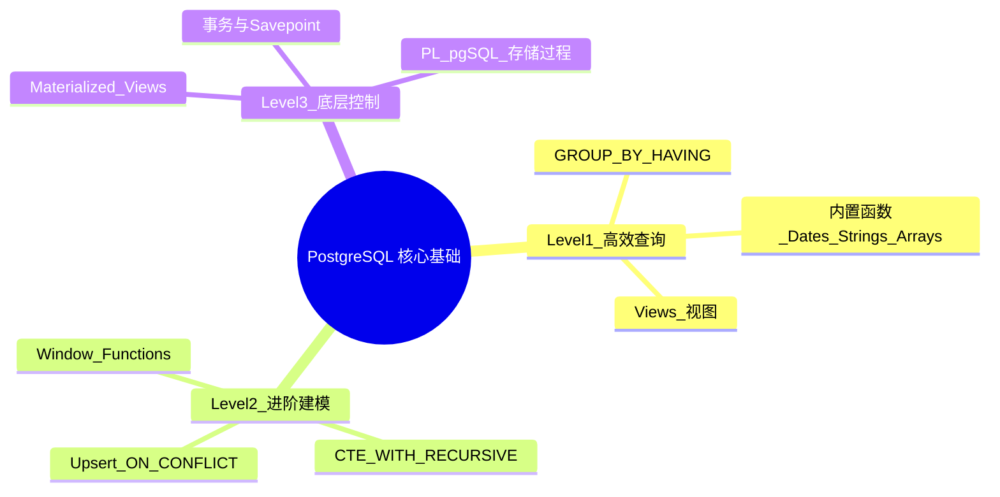

# PostgreSQL 核心基础：高效查询与数据组织 RoadMap

Status: `todo` | `doing` | `done`

## 🧠 MindMap



## 📊 核心功能概览表

| 特性/功能名称 | 难易度 | 简介与核心用途 |
| :--- | :---: | :--- |
| **GROUP BY & HAVING** | 🟢 Easy | 分组聚合与二次过滤，报表统计基石 |
| **内置函数 (Dates, Strings, Arrays)** | 🟢 Easy | 时间/字符串/数组处理，减少应用层代码 |
| **Views 视图** | 🟢 Easy | 封装复杂查询为虚拟表，简化接口层 |
| **Window Functions** | 🟡 Middle | 跨行计算，排行/同比/环比/TopN |
| **CTE / WITH RECURSIVE** | 🟡 Middle | SQL模块化+递归，树形结构查询利器 |
| **Upsert (ON CONFLICT)** | 🟡 Middle | 存在即更新，幂等写入 |
| **Materialized Views** | 🔴 Difficult | 查询结果磁盘持久化，异步刷新 |
| **事务与 Savepoint** | 🔴 Difficult | ACID 保证，局部回滚 |
| **PL/pgSQL 存储过程** | 🔴 Difficult | 库内业务逻辑，触发器联动 |

---

## 🟢 Level 1: Easy（基础入门与高效工具）

### 1. 🔍 GROUP BY & HAVING (⭐)

**What is it**: 将数据按指定列分组，对每组进行聚合计算（COUNT/SUM/AVG/MAX/MIN），HAVING 对聚合结果二次过滤。

**What does it work for**:
- 统计每个用户的订单数、总消费金额
- 找出重复数据：`GROUP BY email HAVING COUNT(*) > 1`

**How does it work - Theory**:
```
原始数据 → [GROUP BY 分桶] → [聚合函数计算每桶] → [HAVING 过滤桶结果] → 输出
```

> [!NOTE]- 执行顺序
> `FROM → WHERE → GROUP BY → HAVING → SELECT → ORDER BY → LIMIT`
> WHERE 在分组前过滤行，HAVING 在分组后过滤组。

**Why does it work - Pros & Cons**:

| 优点 | 局限 |
| :--- | :--- |
| 标准SQL，所有关系数据库通用 | 非聚合列必须出现在 GROUP BY 中 |
| 配合索引可高效扫描 | 大数据量分组可能需大量内存（work_mem） |
| HAVING 避免子查询嵌套 | 复杂分组逻辑不如窗口函数灵活 |

**💻 Code Example**:
```sql
-- 每个用户订单统计，只保留消费 > 500 的用户
SELECT
  user_id,
  COUNT(*)        AS order_count,
  SUM(amount)     AS total_spent,
  AVG(amount)     AS avg_order,
  MAX(created_at) AS last_order
FROM orders
WHERE created_at >= '2026-01-01'  -- 分组前过滤：只看今年
GROUP BY user_id
HAVING SUM(amount) > 500           -- 分组后过滤：只保留大客户
ORDER BY total_spent DESC
LIMIT 10;

-- 找出重复注册的邮箱
SELECT email, COUNT(*) AS cnt
FROM users
GROUP BY email
HAVING COUNT(*) > 1;
```

**🎯 Deep Dive Task**:
> [!QUESTION] 挑战问题
> 一张 `access_logs` 表（user_id, page, access_time），找出"访问了超过3个不同页面的用户，且其访问次数大于10次"。写出 SQL，并分析索引策略。

**解题思路**:
1. 按 `user_id` 分组，同时计算 `COUNT(*)` 和 `COUNT(DISTINCT page)`
2. HAVING 同时过滤两个条件
3. 索引建议：`(user_id)` 或 `(user_id, page)` 覆盖索引

**Solution**:
```sql
SELECT
  user_id,
  COUNT(*)              AS total_visits,
  COUNT(DISTINCT page)  AS unique_pages
FROM access_logs
GROUP BY user_id
HAVING COUNT(DISTINCT page) > 3
   AND COUNT(*) > 10
ORDER BY total_visits DESC;

-- 索引：加速 user_id 分组
CREATE INDEX idx_access_user ON access_logs(user_id, page);
```

---

### 2. 🔍 常用内置函数：Date/Time, String, Array (⭐)

**What is it**: PostgreSQL 内置丰富的类型处理函数，涵盖时间计算、字符串操作、数组操作三大领域。

**What does it work for**:
- 时区转换：`AT TIME ZONE`、`date_trunc()` 生成日报/月报
- 字符串：`string_agg()` 拼接、`regexp_replace()` 清洗
- 数组：原生 Array 类型代替中间表，用 `ANY()`/`unnest()` 查询

> [!TIP] PG 的 Array 类型可以替代多对多中间表（在不需要对关系本身存储额外属性的场景下）。

**How does it work - 常用函数速查**:

| 分类 | 函数 | 作用 |
| :--- | :--- | :--- |
| 时间 | `date_trunc('month', ts)` | 截断到月，用于月报分组 |
| 时间 | `EXTRACT(YEAR FROM ts)` | 提取年份 |
| 时间 | `ts AT TIME ZONE 'UTC'` | 时区转换 |
| 字符串 | `string_agg(col, ',')` | 分组拼接字符串 |
| 字符串 | `split_part(str, ',', 1)` | 按分隔符取第N段 |
| 字符串 | `regexp_replace(str, '\d+', 'X')` | 正则替换 |
| 数组 | `ARRAY[1,2,3]` 或 `'{1,2,3}'::int[]` | 创建数组 |
| 数组 | `1 = ANY(arr)` | 元素是否在数组中 |
| 数组 | `unnest(arr)` | 数组展开为行 |

**💻 Code Example**:
```sql
-- 时间：按月统计订单
SELECT
  date_trunc('month', created_at) AS month,
  COUNT(*)                        AS order_count,
  SUM(amount)                     AS revenue
FROM orders
GROUP BY 1
ORDER BY 1 DESC;

-- 数组：用数组存标签，无需额外中间表
CREATE TABLE articles (
  id    SERIAL PRIMARY KEY,
  title TEXT,
  tags  TEXT[]        -- ['postgresql', 'database', 'sql']
);

-- 查询包含任意标签的文章
SELECT * FROM articles WHERE tags @> ARRAY['postgresql'];

-- 查询包含至少一个标签的文章
SELECT * FROM articles WHERE tags && ARRAY['postgresql', 'mysql'];

-- 将数组展开为行统计
SELECT unnest(tags) AS tag, COUNT(*) FROM articles GROUP BY 1 ORDER BY 2 DESC;
```

**🎯 Deep Dive Task**:
> [!QUESTION] 挑战问题
> 用户表有 `login_history TIMESTAMP[]` 字段存储近30天登录时间。用一条 SQL 找出"连续3天登录"的用户。

**Solution**:
```sql
-- 思路：展开数组 → 去重排序 → 用 LAG 判断连续
WITH logins AS (
  SELECT DISTINCT user_id, unnest(login_history)::date AS login_date
  FROM users
),
with_lag AS (
  SELECT
    user_id,
    login_date,
    login_date - LAG(login_date) OVER (
      PARTITION BY user_id ORDER BY login_date
    ) AS gap_days
  FROM logins
)
SELECT DISTINCT user_id
FROM with_lag
WHERE gap_days = 1;
```

---

### 3. 🔍 Views 视图 (⭐)

**What is it**: 将一条 SELECT 查询保存为数据库中的"虚拟表"，每次查询视图时动态执行底层 SQL。

**What does it work for**:
- 封装复杂 JOIN 逻辑，应用层直接 `SELECT * FROM revenue_report`
- 权限隔离：只暴露部分字段给特定用户

**How does it work**:
```
应用层: SELECT * FROM active_users
         ↓
视图层: CREATE VIEW active_users AS SELECT ... FROM users WHERE status = 'active'
         ↓
查询重写: PG 透明地将查询重写为底层 SQL + 表层条件
         ↓
实际执行: SELECT ... FROM users WHERE status = 'active' AND ...(来自表层WHERE)
```

> [!WARNING] 视图 vs 物化视图
> - **普通视图**：不存数据，每次查询实时计算。适合数据实时性要求高、底层查询快的场景。
> - **物化视图**：存数据到磁盘，需手动刷新。适合计算复杂、实时性要求低的报表。

**Why does it work - Pros & Cons**:

| 优点 | 局限 |
| :--- | :--- |
| 封装复杂逻辑，API层SQL极简 | 每次查询都重新执行底层SQL |
| 权限控制：只暴露特定列 | 多层嵌套视图性能差（5层+） |
| 逻辑集中，底层表结构变更只需改视图 | 普通视图不能有索引 |

**💻 Code Example**:
```sql
-- 创建视图：活跃用户完整信息
CREATE VIEW active_user_profiles AS
SELECT
  u.id, u.name, u.email,
  COUNT(o.id)   AS order_count,
  COALESCE(SUM(o.amount), 0) AS total_spent
FROM users u
LEFT JOIN orders o ON u.id = o.user_id AND o.status = 'completed'
WHERE u.deleted_at IS NULL
GROUP BY u.id, u.name, u.email;

-- 应用层查询像查普通表一样
SELECT * FROM active_user_profiles WHERE order_count > 5;
```

**🎯 Deep Dive Task**:
> [!QUESTION] 挑战问题
> 为 SaaS 产品设计一个视图方案：总部管理员可以看到所有数据，但分公司管理员只能看到自己分公司的数据。如何用视图+RLS实现？

**解题思路**:
1. 视图本身不做权限过滤（保持通用）
2. 结合 Row Level Security (RLS) 策略，在表级别强加 `tenant_id` 过滤
3. 或者创建带参数的安全视图（`security_barrier` 视图 + 函数）

---

## 🟡 Level 2: Middle（进阶机制与复杂计算）

### 4. 🔍 Window Functions 窗口函数 (⭐⭐)

**What is it**: 在不改变结果行数的前提下，对"当前行相关的多行"进行跨行计算。核心：`聚合函数() OVER (PARTITION BY ... ORDER BY ...)`。

**What does it work for**:
- 排行榜：`RANK() OVER (ORDER BY score DESC)`
- 同比/环比：`LAG(revenue) OVER (PARTITION BY department ORDER BY month)`
- 累计和：`SUM(amount) OVER (ORDER BY created_at)`

**How does it work**:
```
原始数据排序后:
| row | user_id | score |
|-----|---------|-------|
|  1  |    1    |  100  |
|  2  |    1    |   90  |
|  3  |    1    |   90  |
|  4  |    2    |   95  |

窗口帧（Frame）：对每行定义一个"可见范围"

ROW_NUMBER() → 1,2,3,1（每行唯一）
RANK()       → 1,2,2,1（同分同排名，跳号）
DENSE_RANK() → 1,2,2,3（同分同排名，不跳号）
LAG(score)   → NULL,100,90,→（前一行的值）
SUM OVER()   → 100,190,280,→（累计到当前行）
```

> [!NOTE]- 窗口函数 vs GROUP BY
> | GROUP BY | 窗口函数 |
> | :--- | :--- |
> | 输出行数 = 分组数（缩减） | 输出行数 = 输入行数（不变） |
> | 每行失去个体细节 | 每行保留自身 + 加上聚合信息 |

**Why does it work - Pros & Cons**:

| 优点 | 局限 |
| :--- | :--- |
| 一条SQL替代多次子查询/N+1查询 | 不支持 WHERE（需用子查询/CTE） |
| 保留原始行，可加多个窗口列 | 大量分区 + 大窗口帧可能内存/IO密集 |
| 支持自定义窗口帧（ROWS/RANGE/GROUPS） | 初学者易与 GROUP BY 混淆 |

**💻 Code Example**:
```sql
-- 排行榜：每个部门的薪资排名
SELECT
  name, department, salary,
  RANK()       OVER (PARTITION BY department ORDER BY salary DESC) AS rank,
  DENSE_RANK() OVER (PARTITION BY department ORDER BY salary DESC) AS dense_rank,
  ROW_NUMBER() OVER (PARTITION BY department ORDER BY salary DESC) AS row_num
FROM employees;

-- 环比：每月收入与上月对比
SELECT
  date_trunc('month', created_at) AS month,
  SUM(amount)                     AS revenue,
  LAG(SUM(amount)) OVER (ORDER BY date_trunc('month', created_at)) AS prev_month,
  ROUND(
    (SUM(amount) - LAG(SUM(amount)) OVER (ORDER BY date_trunc('month', created_at))) * 100.0
    / NULLIF(LAG(SUM(amount)) OVER (ORDER BY date_trunc('month', created_at)), 0),
    2
  ) AS growth_pct
FROM orders
GROUP BY 1 ORDER BY 1;

-- 累计和 + Top N 每个部门薪资最高3人
WITH ranked AS (
  SELECT *, ROW_NUMBER() OVER (PARTITION BY dept ORDER BY salary DESC) AS rn
  FROM employees
)
SELECT * FROM ranked WHERE rn <= 3;
```

**🎯 Deep Dive Task**:
> [!QUESTION] 挑战问题
> 表 `user_actions` (user_id, action, created_at)。找出"会话"：同一个用户连续两次行为间隔超过30分钟就认为是一个新会话开始。用窗口函数给每个行为标记 session_id。

**Solution**:
```sql
WITH with_lag AS (
  SELECT
    *,
    LAG(created_at) OVER (PARTITION BY user_id ORDER BY created_at) AS prev_time
  FROM user_actions
),
session_flag AS (
  SELECT
    *,
    CASE
      WHEN prev_time IS NULL
        OR EXTRACT(EPOCH FROM (created_at - prev_time)) > 1800
      THEN 1 ELSE 0
    END AS new_session
  FROM with_lag
)
SELECT
  user_id, action, created_at,
  SUM(new_session) OVER (
    PARTITION BY user_id ORDER BY created_at
    ROWS BETWEEN UNBOUNDED PRECEDING AND CURRENT ROW
  ) AS session_id
FROM session_flag
ORDER BY user_id, created_at;
```

---

### 5. 🔍 CTE / WITH RECURSIVE (⭐⭐)

**What is it**: Common Table Expression — 用 `WITH` 定义命名子查询，可被后续查询引用。`WITH RECURSIVE` 支持自引用递归，用于树形/图结构遍历。

**What does it work for**:
- 多层嵌套查询扁平化，提升可读性
- 组织架构树、多级分类、BOM物料清单等层级数据

**How does it work**:
```sql
-- 普通 CTE
WITH
  user_stats AS (
    SELECT user_id, COUNT(*) AS cnt FROM orders GROUP BY user_id
  ),
  active_users AS (
    SELECT * FROM user_stats WHERE cnt > 10
  )
SELECT u.* FROM users u JOIN active_users a ON u.id = a.user_id;

-- 递归 CTE
WITH RECURSIVE cte AS (
  -- 1. 初始查询（非递归项）：找到根节点
  SELECT id, parent_id, name, 1 AS level
  FROM categories WHERE parent_id IS NULL

  UNION ALL

  -- 2. 递归项：子节点 = 父节点.children
  SELECT c.id, c.parent_id, c.name, cte.level + 1
  FROM categories c
  JOIN cte ON c.parent_id = cte.id
)
SELECT * FROM cte;
```

> [!NOTE]- 递归 CTE 执行流程
> ```
> 第1轮：执行非递归项 → 结果集(level=1)
> 第2轮：拿上轮结果集 JOIN 表 → 结果集(level=2) → 追加
> 第3轮：拿上轮结果集 JOIN 表 → 结果集(level=3) → 追加
> ...
> 第N轮：拿上轮结果集 JOIN 表 → 结果集为空 → 停止
> ```

**💻 Code Example**:
```sql
-- 组织架构树（无限层级）
CREATE TABLE org (
  id         SERIAL PRIMARY KEY,
  name       TEXT NOT NULL,
  manager_id INT REFERENCES org(id)
);

WITH RECURSIVE org_tree AS (
  SELECT id, name, manager_id, name AS path, 1 AS level
  FROM org WHERE manager_id IS NULL

  UNION ALL

  SELECT
    o.id, o.name, o.manager_id,
    t.path || ' → ' || o.name,   -- 路径拼接
    t.level + 1
  FROM org o
  JOIN org_tree t ON o.manager_id = t.id
)
SELECT * FROM org_tree ORDER BY path;

-- 限制递归深度（安全！）
WITH RECURSIVE org_tree AS (
  SELECT id, name, manager_id, 1 AS level
  FROM org WHERE manager_id IS NULL

  UNION ALL

  SELECT o.id, o.name, o.manager_id, t.level + 1
  FROM org o
  JOIN org_tree t ON o.manager_id = t.id
  WHERE t.level < 10  -- 深度保护
)
SELECT * FROM org_tree;
```

**🎯 Deep Dive Task**:
> [!QUESTION] 挑战问题
> 电商分类表 category (id, parent_id, name)。写一条 SQL 查询"手机"分类及其所有祖先和所有后代。

**Solution**:
```sql
-- 查所有后代（从手机往下）
WITH RECURSIVE children AS (
  SELECT id, parent_id, name, 1 AS depth
  FROM category WHERE name = '手机'
  UNION ALL
  SELECT c.id, c.parent_id, c.name, ch.depth + 1
  FROM category c JOIN children ch ON c.parent_id = ch.id
)
-- 查所有祖先（从手机往上）
, ancestors AS (
  SELECT id, parent_id, name, 0 AS depth
  FROM category WHERE name = '手机'
  UNION ALL
  SELECT c.id, c.parent_id, c.name, a.depth - 1
  FROM category c JOIN ancestors a ON c.id = a.parent_id
)
SELECT * FROM children
UNION
SELECT * FROM ancestors
ORDER BY depth;
```

---

### 6. 🔍 Upsert: ON CONFLICT (⭐⭐)

**What is it**: 插入数据时，遇到主键/唯一约束冲突自动转为 UPDATE（或DO NOTHING），实现幂等写入。

**What does it work for**:
- 计数器累加：`counter = counter + 1`
- 同步第三方数据："存在就更新，不存在就插入"
- 数据导入去重：`ON CONFLICT DO NOTHING`

**How does it work**:
```
INSERT INTO table VALUES (...)
  ↓
尝试插入 → 冲突？
  ├── 否 → 正常INSERT
  └── 是 → 捕获冲突(conflict_target)
           ├── DO NOTHING → 忽略
           └── DO UPDATE SET ... → 执行UPDATE
                   可引用 EXCLUDED.column 拿到"被拒绝的插入值"
```

> [!TIP] EXCLUDED 是 PostgreSQL 的特殊别名，代表 INSERT 试图插入的那行数据。

**💻 Code Example**:
```sql
-- 幂等写入：存在就更新全部字段
INSERT INTO users (id, email, name, updated_at)
VALUES (42, 'john@example.com', 'John Doe', now())
ON CONFLICT (email) DO UPDATE SET
  name       = EXCLUDED.name,
  updated_at = EXCLUDED.updated_at;

-- 计数器累加（经典用法！）
INSERT INTO page_view_counts (page_url, view_count)
VALUES ('/home', 1)
ON CONFLICT (page_url)
DO UPDATE SET view_count = page_view_counts.view_count + 1;

-- 批量导入去重
INSERT INTO products (sku, name, price)
VALUES ('SKU-001', 'Widget A', 9.99),
       ('SKU-002', 'Widget B', 19.99)
ON CONFLICT (sku) DO NOTHING;

-- 条件化更新：只更新部分冲突
INSERT INTO inventory (product_id, stock)
VALUES (1, 100)
ON CONFLICT (product_id)
DO UPDATE SET stock = EXCLUDED.stock
WHERE inventory.stock < EXCLUDED.stock;  -- 只有新库存更大才更新
```

**🎯 Deep Dive Task**:
> [!QUESTION] 挑战问题
> 用户积分表 `user_scores` (user_id PK, score, updated_at)。设计一个幂等接口：每天每个用户只能领取一次积分（+10），重复请求不能重复加。一条SQL实现。

**Solution**:
```sql
-- 方案1：用 updated_at 日期判断
INSERT INTO user_scores (user_id, score, updated_at)
VALUES (42, 10, now())
ON CONFLICT (user_id)
DO UPDATE SET
  score = user_scores.score + 10,
  updated_at = now()
WHERE user_scores.updated_at::date < now()::date;  -- 今天没更新过

-- 方案2：用 last_claim_date 字段更清晰
INSERT INTO user_scores (user_id, score, last_claim_date)
VALUES (42, 10, now()::date)
ON CONFLICT (user_id)
DO UPDATE SET
  score = user_scores.score + 10,
  last_claim_date = EXCLUDED.last_claim_date
WHERE user_scores.last_claim_date < EXCLUDED.last_claim_date
  OR user_scores.last_claim_date IS NULL;

-- 返回是否成功（RETURNING + 判断）
RETURNING (CASE WHEN score > 0 THEN 'claimed' ELSE 'already_claimed' END) AS result;
```

---

## 🔴 Level 3: Difficult（底层原理与调优控制）

### 7. 🔍 Materialized Views 物化视图 (⭐⭐⭐)

**What is it**: 将复杂查询的结果物理存储到磁盘上。与普通 View 不同，物化视图的数据是"快照"，不会随底层表实时变化。

**What does it work for**:
- 复杂报表缓存：秒级查询变毫秒级
- 预计算聚合：日活/月活等指标预先算好

**How does it work**:
```
普通 View：
  查询 → 重写SQL → 执行底层查询 → 返回结果（每次实时计算）

物化视图：
  [创建] 复杂查询 → 执行 → 结果写入磁盘
  [查询] 直接读磁盘 → 毫秒级返回（不需重算）
  [刷新] REFRESH MATERIALIZED VIEW → 重新执行全量查询 → 覆盖磁盘
```

> [!WARNING] 刷新策略
> - `REFRESH MATERIALIZED VIEW CONCURRENTLY`：不锁读，但需要唯一索引
> - 普通 `REFRESH`：会锁表，刷新期间不可读
> - 建议用 `pg_cron` 定时刷新，或应用层触发

**💻 Code Example**:
```sql
-- 创建物化视图：每日销售报表
CREATE MATERIALIZED VIEW daily_sales_report AS
SELECT
  date_trunc('day', o.created_at)::date AS sale_date,
  o.product_id,
  p.name                               AS product_name,
  COUNT(*)                             AS units_sold,
  SUM(o.quantity * o.unit_price)       AS revenue,
  COUNT(DISTINCT o.user_id)            AS unique_buyers
FROM orders o
JOIN products p ON o.product_id = p.id
WHERE o.status = 'completed'
GROUP BY 1, 2, 3;

-- 需要唯一索引才能 CONCURRENTLY 刷新
CREATE UNIQUE INDEX idx_daily_report ON daily_sales_report(sale_date, product_id);

-- 并发刷新（不阻塞读）
REFRESH MATERIALIZED VIEW CONCURRENTLY daily_sales_report;

-- 用 pg_cron 定时刷新
SELECT cron.schedule(
  'refresh-daily-report',
  '0 3 * * *',
  'REFRESH MATERIALIZED VIEW CONCURRENTLY daily_sales_report'
);
```

**🎯 Deep Dive Task**:
> [!QUESTION] 挑战问题
> 一个电商平台每小时有百万笔订单，需要实时展示 TOP 100 热销商品排行榜。物化视图刷新需要5分钟（太慢），有什么优化策略？

**解题思路**:
1. 物化视图存"小时"粒度，历史数据不变不需刷新
2. 当前小时数据实时查询 `orders` 表（有索引很快）
3. 应用层：历史TOP 100 UNION ALL 当前小时TOP 100，合并排序取 TOP 100
4. 进阶：用 Redis 缓存合并后的排行榜，每分钟刷新

---

### 8. 🔍 事务与 Savepoint (⭐⭐⭐)

**What is it**: `BEGIN...COMMIT/ROLLBACK` 保证多条 SQL 的原子性。`SAVEPOINT` 允许在事务内部创建"回滚点"，局部回退而不影响整个事务。

**What does it work for**:
- 转账：A转出 + B转入，任何一步失败全部回滚
- 批量数据处理：每1000行设一个 savepoint，某批失败只回滚该批

**How does it work**:
```
BEGIN;
  INSERT INTO accounts VALUES (...);       -- 操作1
  SAVEPOINT sp1;
    UPDATE accounts SET balance = ...;      -- 操作2（可能失败）
    -- 如果操作2失败：
    ROLLBACK TO sp1;  -- 只回滚到 sp1，操作1保留
  RELEASE SAVEPOINT sp1;
  INSERT INTO audit_log VALUES (...);      -- 操作3
COMMIT;  -- 全部提交
```

> [!NOTE]- PostgreSQL 隔离级别
> | 级别 | 脏读 | 不可重复读 | 幻读 |
> | :--- | :---: | :---: | :---: |
> | Read Uncommitted | ✗(PG中不会) | ✓ | ✓ |
> | Read Committed (默认) | ✗ | ✓ | ✓ |
> | Repeatable Read | ✗ | ✗ | ✗(PG中不会) |
> | Serializable | ✗ | ✗ | ✗ |

**💻 Code Example**:
```sql
-- 转账事务
BEGIN;
  -- 检查余额
  SELECT balance FROM accounts WHERE id = 1 FOR UPDATE;

  -- 转出
  UPDATE accounts SET balance = balance - 100 WHERE id = 1 AND balance >= 100;

  -- 转入
  UPDATE accounts SET balance = balance + 100 WHERE id = 2;

  -- 记录审计
  INSERT INTO transfers (from_id, to_id, amount, created_at)
  VALUES (1, 2, 100, now());
COMMIT;

-- Savepoint 批量处理
DO $$
DECLARE
  batch_size INT := 1000;
BEGIN
  FOR i IN 0..99 LOOP
    BEGIN
      INSERT INTO target_table (...)
      SELECT ... FROM source_table
      LIMIT batch_size OFFSET i * batch_size;

      SAVEPOINT batch_sp;
    EXCEPTION WHEN OTHERS THEN
      ROLLBACK TO batch_sp;
      RAISE NOTICE 'Batch % failed, continuing...', i;
    END;
  END LOOP;
END $$;
```

**🎯 Deep Dive Task**:
> [!QUESTION] 挑战问题
> 在高并发库存扣减场景中（秒杀），100个用户同时扣减同一SKU的最后1件库存。如何避免超卖、避免死锁、保证性能？

**解题思路**:
1. 用 `SELECT ... FOR UPDATE` 加行锁
2. 在 UPDATE 里加 `WHERE stock >= 1` 作为 double-check
3. 避免 `SELECT count(*) FOR UPDATE`（锁太多行）
4. 考虑用 Redis 做库存预扣减，异步同步到 PG

---

### 9. 🔍 PL/pgSQL 存储过程与触发器 (⭐⭐⭐)

**What is it**: 在数据库内部用 PL/pgSQL 语言编写函数和存储过程，结合触发器（Trigger）在 INSERT/UPDATE/DELETE 时自动执行。

**What does it work for**:
- 自动审计日志（谁改了哪张表的什么字段）
- 复杂业务校验（跨表、跨行约束）
- 自动维护派生字段、缓存列

**How does it work**:
```
用户执行 INSERT INTO orders ...

  ↓ 语句触发
Trigger: BEFORE INSERT ON orders
  ↓ 执行
FUNCTION check_order_rules():
  1. 验证 user 是否存在且状态正常
  2. 验证 product 库存足够
  3. 计算 total_amount
  4. 抛出异常 OR 修改 NEW 行数据
  ↓ 通过
INSERT 实际写入磁盘
  ↓
Trigger: AFTER INSERT ON orders
FUNCTION audit_order_change():
  → INSERT INTO audit_log (...)
```

**💻 Code Example**:
```sql
-- 自动更新 updated_at 的函数
CREATE OR REPLACE FUNCTION set_updated_at()
RETURNS TRIGGER AS $$
BEGIN
  NEW.updated_at = now();
  RETURN NEW;
END;
$$ LANGUAGE plpgsql;

-- 应用到所有表
CREATE TRIGGER trg_set_updated_at
  BEFORE UPDATE ON users
  FOR EACH ROW EXECUTE FUNCTION set_updated_at();

-- 审计日志表 + 自动记录
CREATE TABLE audit_log (
  id          SERIAL PRIMARY KEY,
  table_name  TEXT,
  record_id   INT,
  action      TEXT,
  old_data    JSONB,
  new_data    JSONB,
  changed_by  TEXT,
  changed_at  TIMESTAMPTZ DEFAULT now()
);

CREATE OR REPLACE FUNCTION audit_trigger()
RETURNS TRIGGER AS $$
BEGIN
  IF TG_OP = 'INSERT' THEN
    INSERT INTO audit_log (table_name, record_id, action, new_data)
    VALUES (TG_TABLE_NAME, NEW.id, 'INSERT', to_jsonb(NEW));
  ELSIF TG_OP = 'UPDATE' THEN
    INSERT INTO audit_log (table_name, record_id, action, old_data, new_data)
    VALUES (TG_TABLE_NAME, NEW.id, 'UPDATE', to_jsonb(OLD), to_jsonb(NEW));
  ELSIF TG_OP = 'DELETE' THEN
    INSERT INTO audit_log (table_name, record_id, action, old_data)
    VALUES (TG_TABLE_NAME, OLD.id, 'DELETE', to_jsonb(OLD));
  END IF;
  RETURN NULL;
END;
$$ LANGUAGE plpgsql;

CREATE TRIGGER trg_users_audit
  AFTER INSERT OR UPDATE OR DELETE ON users
  FOR EACH ROW EXECUTE FUNCTION audit_trigger();
```

**🎯 Deep Dive Task**:
> [!QUESTION] 挑战问题
> 电商系统需要实现：下单时自动冻结库存、30分钟未支付自动释放、已取消订单不能修改。如何用触发器组合实现？

**解题思路**:
1. `BEFORE INSERT ON orders` 触发器：检查并扣减库存
2. `BEFORE UPDATE ON orders` 触发器：如果 `status = 'cancelled'`，禁止修改其他字段
3. 定时任务（pg_cron）+ 函数：查询超时未支付订单 → 恢复库存 → 更新状态

---

## 🎯 推荐学习路径

1. **第1周**：GROUP BY + 内置函数 + Views → 打好查询基础
2. **第2周**：Window Functions → 攻克80%复杂报表需求
3. **第3周**：CTE + Upsert → 优雅处理层级数据和幂等写入
4. **第4周**：物化视图 + 事务/Savepoint → 性能优化与数据安全保障
5. **第5周**：PL/pgSQL + 触发器 → 数据库层自动化逻辑
