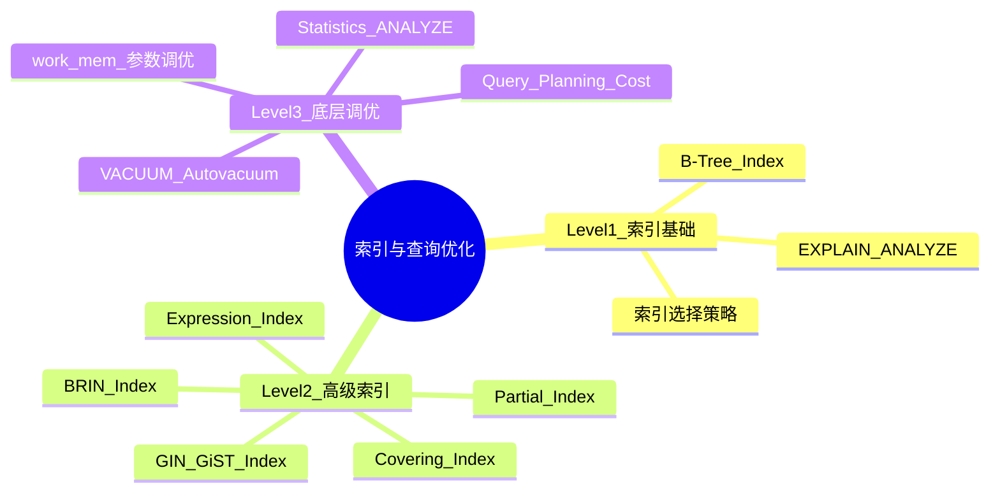

# PostgreSQL 索引与查询优化 RoadMap

Status: `todo` | `doing` | `done`

## 🧠 MindMap



## 📊 核心功能概览表

| 特性/功能名称 | 难易度 | 简介与核心用途 |
| :--- | :---: | :--- |
| **B-Tree 索引** | 🟢 Easy | 默认索引类型，平衡树结构，支持 =, <, >, BETWEEN, ORDER BY |
| **EXPLAIN ANALYZE** | 🟢 Easy | 分析查询计划和实际执行统计，优化必用工具 |
| **索引选择策略** | 🟢 Easy | 何时建索引、建什么索引、联合索引字段顺序 |
| **GIN 索引** | 🟡 Middle | 倒排索引，JSONB/数组/全文检索加速 |
| **GiST 索引** | 🟡 Middle | 通用搜索树，PostGIS/全文检索/范围类型 |
| **Partial Index 部分索引** | 🟡 Middle | 只对满足WHERE条件的行建索引，节省空间+提升性能 |
| **Expression Index 表达式索引** | 🟡 Middle | 对表达式/函数结果建索引，如 `LOWER(email)` |
| **Covering Index 覆盖索引** | 🟡 Middle | INCLUDE 额外列，实现 Index-Only Scan |
| **BRIN 索引** | 🟡 Middle | 块级范围索引，超大表的极简索引 |
| **Query Planning & Cost** | 🔴 Difficult | 查询优化器如何估算成本、选择计划 |
| **Statistics & ANALYZE** | 🔴 Difficult | 统计信息如何影响计划、如何调优 |
| **VACUUM & Bloat** | 🔴 Difficult | 死元组清理、表膨胀、Autovacuum 配置 |
| **Server 参数调优** | 🔴 Difficult | work_mem, shared_buffers, effective_cache_size 等 |

---

## 🟢 Level 1: Easy（索引基础与性能分析）

### 1. 🔍 B-Tree 索引 — PostgreSQL 的默认武器 (⭐)

**What is it**: 平衡树(Balanced Tree)数据结构。所有叶子节点在同一深度，每个节点包含多个有序键值和子节点指针。支持O(log N)查找。

**What does it work for**:
- 主键/外键索引（自动创建）
- WHERE: `=`, `<`, `>`, `<=`, `>=`, `BETWEEN`, `IN`
- ORDER BY 加速（利用索引已有顺序）
- LIKE 前缀匹配：`LIKE 'prefix%'`

**How does it work**:
```
B-Tree 索引结构：

        [50 | 100]           ← root node
        /    |    \
  [10|20|30] [60|70|80] [110|120|130]  ← internal nodes
    /|\  ...                               ← leaf nodes (含数据指针)

查找 70：
1. root (50|100) → 70 ≥ 50, 70 < 100 → 走中间分支
2. internal (60|70|80) → 找到 70 → 获取数据指针
3. 读数据页（Heap Fetch）
```

> [!NOTE]- 什么是 Index-Only Scan?
> ```
> 普通索引扫描：Index → Heap(捞数据) → 返回
> Index-Only：  Index → 返回（索引已包含所有需要的列）
> ```
> 达成条件：1. SELECT 列都在索引中 2. visibility map 足够新

**Why does it work - Pros & Cons**:

| 优点 | 局限 |
| :--- | :--- |
| O(log N)，极快 | 写入需维护索引 |
| 支持 ORDER BY / DISTINCT / 范围 | 不适合 LIKE '%middle%' |
| 自动创建（PK/UNIQUE） | 占磁盘空间（表数据10-30%） |

**💻 Code Example**:
```sql
-- 默认 B-Tree 索引
CREATE INDEX idx_users_email ON users(email);

-- 联合索引（注意字段顺序！）
CREATE INDEX idx_orders_user_date ON orders(user_id, created_at DESC);

-- 字段顺序规则：等值条件放前 → 范围/排序放后
-- ✅ 两条查询都走索引：
SELECT * FROM orders WHERE user_id = 42 ORDER BY created_at DESC LIMIT 10;
SELECT * FROM orders WHERE user_id = 42 AND created_at > '2026-01-01';

-- ❌ 跳过前导列 user_id，不走索引：
SELECT * FROM orders WHERE created_at > '2026-01-01';
```

**🎯 Deep Dive Task**:
> [!QUESTION] 挑战问题
> `orders` 表1000万行。最常见查询：
> ```sql
> SELECT * FROM orders WHERE status = 'pending' AND created_at > '2026-01-01'
> ORDER BY created_at DESC LIMIT 20;
> ```
> status 3种值，pending占5%，completed占80%。设计最优索引。

**Solution**:
```sql
-- 部分索引（最佳！只索引5%数据）
CREATE INDEX idx_orders_pending_created
  ON orders(created_at DESC)
  WHERE status = 'pending';
-- 索引大小只有全表的5%，查询极快
```

---

### 2. 🔍 EXPLAIN ANALYZE — 查询分析核心工具 (⭐)

**What is it**: PostgreSQL 的查询计划分析工具。`EXPLAIN` 显示预估，`EXPLAIN ANALYZE` 实际执行并显示真实统计。

**How to read EXPLAIN output**:
```
QUERY PLAN
Limit  (cost=0.42..8.44 rows=1 width=100) (actual time=0.012..0.012 rows=0 loops=1)
  → Index Scan using idx_email on users (cost=0.42..8.44 rows=1 width=100)
    Index Cond: (email = 'test@example.com'::text)

解读：
- cost=0.42..8.44：启动成本..总成本(任意单位)
- rows=1：预估行数
- actual time=0.012..0.012：实际启动时间..总时间(ms)
```

> [!TIP]- 关键指标速查
> | 节点 | 含义 | 优化方向 |
> | :--- | :--- | :--- |
> | `Seq Scan` | 全表扫描 | 加索引 |
> | `Index Scan` | 索引扫描+回表 | 好 |
> | `Index Only Scan` | 只扫索引 | 最佳 |
> | `Bitmap Index/Heap Scan` | 位图扫描 | 检查是否需联合索引 |
> | `Nested Loop` | 小表驱动大表 | JOIN正常 |
> | `Hash Join` | 建Hash表JOIN | 大表JOIN正常 |

**💻 Code Example**:
```sql
-- 实际执行（推荐！）
EXPLAIN ANALYZE SELECT * FROM users WHERE email = 'test@example.com';

-- 详细信息
EXPLAIN (ANALYZE, BUFFERS)
SELECT u.name, COUNT(o.id)
FROM users u
JOIN orders o ON u.id = o.user_id
GROUP BY u.name;
-- Hit = 从缓存读（快），Read = 从磁盘读（慢）
```

---

### 3. 🔍 索引选择策略 (⭐)

**决策框架**:
```
1. 查询频繁吗？→ 否 → 不建
                → 是 →
2. 有高选择性过滤条件？→ 无 → 不建
                        → 有 →
3. 表够大吗？→ < 1000行 → 不建
             → 大 → 建
```

> [!WARNING] 常见误区
> - **低选择性列单独建索引**：gender只有M/F，索引几乎无用
> - **过多索引**：INSERT/UPDATE变慢
> - **冗余索引**：`(a)` 和 `(a, b)` 同时存在 → 前者冗余
> - **忘记定期检查**：`SELECT * FROM pg_stat_user_indexes WHERE idx_scan = 0`

---

## 🟡 Level 2: Middle（高级索引类型）

### 4. 🔍 GIN 索引 — JSONB/数组/全文检索引擎 (⭐⭐)

**What is it**: Generalized Inverted Index — 倒排索引。将一个复合值（JSONB/数组/tsvector）拆解为多个 key → 行指针映射。

**How does it work**:
```
JSONB: {"tags":["postgresql","database"], "status":"published"}
  ↓ 拆解为 keys
postgresql → [row1]
database   → [row1]
published  → [row1]

查询 data @> '{"status":"published"}' → 找key "published" → rows [row1] → ✅
```

**💻 Code Example**:
```sql
-- JSONB GIN 索引
CREATE INDEX idx_products_attrs ON products USING GIN(attributes jsonb_path_ops);

-- 数组 GIN 索引
CREATE INDEX idx_articles_tags ON articles USING GIN(tags);
SELECT * FROM articles WHERE tags @> ARRAY['postgresql'];
SELECT * FROM articles WHERE tags && ARRAY['postgresql', 'mysql'];

-- 全文检索 GIN 索引
CREATE INDEX idx_articles_fts ON articles USING GIN(to_tsvector('english', body));
```

---

### 5. 🔍 Partial Index & Expression Index (⭐⭐)

**💻 Code Example**:
```sql
-- 部分索引：只索引高优先级未处理订单
CREATE INDEX idx_orders_pending ON orders(created_at)
  WHERE status = 'pending';

-- 部分唯一索引：已激活用户Email唯一，未激活可重复
CREATE UNIQUE INDEX idx_users_active_email ON users(email)
  WHERE is_active = true;

-- 表达式索引：不区分大小写搜索
CREATE INDEX idx_users_lower_email ON users(LOWER(email));
SELECT * FROM users WHERE LOWER(email) = 'john@example.com';  -- 走索引！

-- 部分+表达式组合
CREATE INDEX idx_orders_upper_sku ON orders(UPPER(sku))
  WHERE deleted_at IS NULL;
```

---

### 6. 🔍 Covering Index & BRIN (⭐⭐)

**Covering Index (INCLUDE)**:
```sql
-- PG 11+：用 INCLUDE 包含不需要搜索但需返回的列
CREATE INDEX idx_orders_user_status ON orders(user_id, status)
  INCLUDE (amount, created_at);
-- SELECT user_id, status, amount, created_at FROM orders WHERE user_id = 42;
-- → Index-Only Scan（不需要回表！）
```

**BRIN (Block Range INdex)**:
```sql
-- 超大表（10亿行+）按时间顺序 → BRIN 比 B-Tree 小100-1000倍
CREATE INDEX idx_events_time_brin ON events USING BRIN(event_ts)
  WITH (pages_per_range = 32);

-- 原理：表按物理存储每32页一个range
-- | range1: ts [Jan1-Jan2] | range2: ts [Jan2-Jan3] | ...
-- 查Jan2数据 → 只扫range2中的页
-- ✅ 时序数据天然满足 ❌ 随机顺序数据近乎无用
```

**索引类型对比**:

| 索引类型 | 操作符/场景 | 大小(vs B-Tree) | 写入速度 |
| :--- | :--- | :--- | :--- |
| B-Tree | =, <, >, BETWEEN, LIKE 'pre%' | 1x | 快 |
| Hash | = (纯等值) | 更小 | 快 |
| GIN | @>, ?, @@, LIKE '%str%' | 2-5x | 慢 |
| GiST | 空间, 范围, 全文 | 1-3x | 中等 |
| BRIN | 范围(大数据量) | 0.001x | 极快 |

---

## 🔴 Level 3: Difficult（底层原理与参数调优）

### 7. 🔍 Query Planning & Cost Model (⭐⭐⭐)

**What is it**: PostgreSQL 基于成本(Cost-Based Optimizer)选择最优执行计划。

**核心参数**:
```sql
SHOW seq_page_cost;        -- 默认 1.0（顺序读页成本）
SHOW random_page_cost;     -- 默认 4.0（SSD改为1.1-1.5）
SHOW cpu_tuple_cost;       -- 默认 0.01
SHOW cpu_index_tuple_cost; -- 默认 0.005
```

> [!WARNING] SSD 必须调 random_page_cost
> HDD: `random_page_cost = 4` 合理。SSD: 设为 `1.1-1.5`。否则优化器会错误偏向 Seq Scan。

**优化器选择示例**:
```sql
-- 表1万页，索引1千页，查100行
-- Seq Scan:  10000 × 1.0 = 10000
-- Index Scan: 1000×4.0 + 100×4.0 = 4400 → 选 Index Scan

-- 查5000行：
-- Index Scan: 1000×4.0 + 5000×4.0 = 24000
-- Seq Scan:   10000 → 选 Seq Scan（对的！）
```

**🎯 Deep Dive Task**:
> [!QUESTION] 挑战问题
> 查询 explain 预估100行（实际100万行），选了 Nested Loop 而非 Hash Join，慢100倍。如何修复？

**答案**:
1. `ANALYZE table_name` — 更新统计信息
2. `ALTER TABLE t ALTER COLUMN c SET STATISTICS 1000` — 提高采样精度
3. 表达式相关：`CREATE STATISTICS ...` — 扩展统计
4. 紧急临时：`SET enable_nestloop = off`（仅调试用）

---

### 8. 🔍 Statistics & ANALYZE (⭐⭐⭐)

```sql
-- 查看统计信息
SELECT
  attname, n_distinct, most_common_vals, most_common_freqs, histogram_bounds
FROM pg_stats
WHERE tablename = 'orders' AND attname = 'status';

-- n_distinct: 正数=去重值数, -1=全唯一, -0.5=50%唯一

-- Extended Statistics (PG 10+):
-- 解决列间依赖问题：WHERE country='CN' AND city='Shanghai'
CREATE STATISTICS s_country_city (dependencies) ON country, city FROM users;
ANALYZE users;
```

---

### 9. 🔍 VACUUM & MVCC 死元组清理 (⭐⭐⭐)

**What is it**: MVCC 在 UPDATE/DELETE 时标记旧行为"死元组"。VACUUM 回收空间，防止表/索引无限膨胀。

**MVCC 机制**:
```
原始行: (id=1, name='Alice', xmin=100, xmax=0)

UPDATE name='Bob':
  → 旧行: (id=1, name='Alice', xmin=100, xmax=200)
  → 新行: (id=1, name='Bob',   xmin=200, xmax=0)

VACUUM:
  → 发现 (xmin=100, xmax=200) 无活跃事务引用 → 标记空间可复用
```

> [!WARNING] 表膨胀(Bloat)
> - 物理大小远大于预期 → 死元组堆积
> - 查询越来越慢
> - 原因：长时间无VACUUM，或 autovacuum 配置太保守

**💻 Code Example**:
```sql
-- 查看死元组比例
SELECT
  relname, n_live_tup, n_dead_tup,
  n_dead_tup * 100.0 / NULLIF(n_live_tup + n_dead_tup, 0) AS dead_ratio,
  last_vacuum, last_autovacuum
FROM pg_stat_user_tables
WHERE n_dead_tup > 0
ORDER BY dead_ratio DESC;

-- 手动 VACUUM（不阻塞读写）
VACUUM ANALYZE table_name;

-- 大表建议降低 scale_factor
ALTER TABLE big_table SET (
  autovacuum_vacuum_scale_factor = 0.05,
  autovacuum_vacuum_threshold = 1000
);
```

---

### 10. 🔍 Server 参数调优 (⭐⭐⭐)

**核心参数速查**:

| 参数 | 建议值 | 含义 |
| :--- | :--- | :--- |
| `shared_buffers` | 25% RAM | PG 共享缓存 |
| `effective_cache_size` | 50-75% RAM | 告知优化器OS缓存大小 |
| `work_mem` | `(RAM - shared_buffers) / max_conn / 4` | 单操作排序/Hash内存 |
| `maintenance_work_mem` | 5-10% RAM | VACUUM/CREATE INDEX |
| `random_page_cost` | SSD: 1.1, HDD: 4.0 | 随机页读成本 |
| `effective_io_concurrency` | SSD: 200, HDD: 2 | 并发I/O数 |
| `max_parallel_workers_per_gather` | CPU核/2 | 并行查询worker |

> [!TIP] work_mem 注意事项
> 每个连接每操作可用work_mem。max_connections=200时，理论最大=200×work_mem。用pgbouncer后活跃连接少，可适当增大work_mem。

**最佳实践**:
```sql
-- 缓存命中率检查（应 > 99%）
SELECT datname,
  blks_hit * 100.0 / NULLIF(blks_hit + blks_read, 0) AS cache_hit_ratio
FROM pg_stat_database
WHERE datname NOT LIKE 'template%';
```

---

## 🎯 推荐学习路径

1. **第1周**：B-Tree + EXPLAIN ANALYZE + 索引选择策略 → 独立优化80%慢查询
2. **第2周**：GIN + Partial + Expression + Covering + BRIN → 全部高级索引类型
3. **第3周**：Query Planning + Statistics + Cost Model → 理解优化器决策
4. **第4周**：VACUUM + 表膨胀治理 + Server参数 → 生产环境运维
