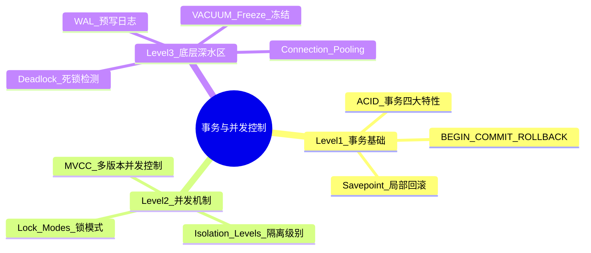
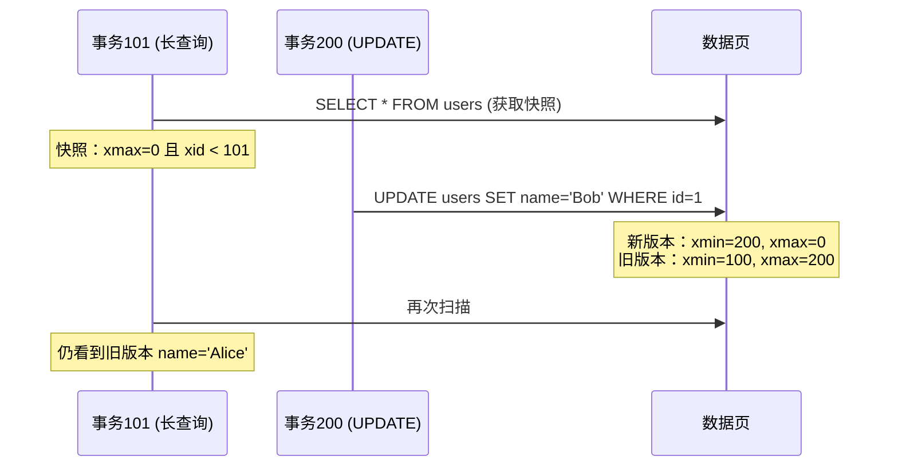

# PostgreSQL 事务与并发控制 RoadMap

Status: `todo` | `doing` | `done`

## 🧠 MindMap



## 📊 核心功能概览表

| 特性/功能名称 | 难易度 | 简介与核心用途 |
| :--- | :---: | :--- |
| **ACID 四大特性** | 🟢 Easy | 理解事务的本质：原子性、一致性、隔离性、持久性 |
| **BEGIN / COMMIT / ROLLBACK** | 🟢 Easy | 事务基本操作，保证多条SQL原子执行 |
| **Savepoint 局部回滚** | 🟢 Easy | 事务内部创建回滚点，局部回退不影响整体 |
| **MVCC 多版本控制** | 🟡 Middle | PostgreSQL并发核心机制，读写互不阻塞 |
| **Isolation Levels 隔离级别** | 🟡 Middle | 4种隔离级别的行为、差异与异常 |
| **Lock Modes 锁模式** | 🟡 Middle | 8种表级锁+行级锁，理解锁冲突矩阵 |
| **Deadlock 死锁** | 🔴 Difficult | 死锁成因、检测机制、预防策略 |
| **WAL 预写日志** | 🔴 Difficult | 事务持久性的物理保证，崩溃恢复 |
| **VACUUM & Freeze** | 🔴 Difficult | 死元组清理+事务ID回卷防护 |
| **Connection Pooling** | 🔴 Difficult | pgbouncer连接池模式与配置 |

---

## 🟢 Level 1: Easy（事务基础）

### 1. 🔍 ACID — 事务四大特性 (⭐)

**What is it**: ACID 是关系型数据库事务的四个核心保证。

**What does it work for**:
- 转账：A减100 + B加100，必须同时成功或同时失败
- 订单创建：插入order + 扣库存 + 插入order_items，不可部分成功

**How does it work**:
```
A = Atomicity (原子性)
  要么全成功，要么全回滚。PostgreSQL 通过 MVCC + WAL 实现。

C = Consistency (一致性)
  事务前后数据库都处于合法状态。由用户+DB共同保证。

I = Isolation (隔离性)
  并发事务之间互不干扰。通过 MVCC + 快照隔离实现。

D = Durability (持久性)
  已提交的事务即使断电也不丢失。通过 WAL(Write-Ahead Log) 实现。
```

> [!NOTE]- ACID 在 PostgreSQL 中的实现
> | 特性 | PG 实现机制 |
> | :--- | :--- |
> | Atomicity | MVCC：xmin/xmax，COMMIT可见，ROLLBACK不可见 |
> | Consistency | CHECK约束、FK约束、UNIQUE约束、触发器 |
> | Isolation | 快照隔离(Snapshot Isolation) |
> | Durability | WAL：先写日志，后写数据；fsync强制落盘 |

---

### 2. 🔍 BEGIN / COMMIT / ROLLBACK (⭐)

**💻 Code Example**:
```sql
-- 基本事务
BEGIN;
  UPDATE accounts SET balance = balance - 100 WHERE id = 1;
  UPDATE accounts SET balance = balance + 100 WHERE id = 2;
COMMIT;

-- PL/pgSQL 中的事务控制（存储过程 PG 11+）
CREATE PROCEDURE transfer(from_id INT, to_id INT, amount NUMERIC)
LANGUAGE plpgsql AS $$
BEGIN
  UPDATE accounts SET balance = balance - amount WHERE id = from_id;
  UPDATE accounts SET balance = balance + amount WHERE id = to_id;
  COMMIT;
EXCEPTION WHEN OTHERS THEN
  ROLLBACK;
  RAISE;
END $$;
```

---

### 3. 🔍 Savepoint — 事务内局部回滚 (⭐)

**What is it**: 在事务内部设置回滚点，出错时只回滚到该点，保留之前的操作。

**What does it work for**:
- 批量数据导入：每1000行一个Savepoint，某批失败只回滚该批
- 复杂业务流程：步骤2失败不影响步骤1

**💻 Code Example**:
```sql
BEGIN;
  -- 步骤1：创建用户（必须成功）
  INSERT INTO users (name, email) VALUES ('Alice', 'alice@example.com');

  -- 步骤2：发积分（可能失败，不影响步骤1）
  SAVEPOINT bonus_sp;
  BEGIN
    UPDATE user_scores SET points = points + 100 WHERE user_id = currval('users_id_seq');
  EXCEPTION WHEN OTHERS THEN
    ROLLBACK TO bonus_sp;
    RAISE NOTICE 'Bonus failed, user created anyway';
  END;
  RELEASE SAVEPOINT bonus_sp;
COMMIT;
```

---

## 🟡 Level 2: Middle（并发控制机制）

### 4. 🔍 MVCC — 多版本并发控制 (⭐⭐)

**What is it**: PostgreSQL 的核心并发机制。每个 SQL 语句看到一个"快照"(snapshot)，而非最新实时数据。UPDATE/DELETE 不直接修改/删除旧行，而是创建新版本。

**What does it work for**:
- 读写互不阻塞：Reader 不会阻塞 Writer，Writer 不会阻塞 Reader
- 长查询不受并发写入影响

**How does it work**:
```
每行都含系统隐藏列：
  xmin → 创建此行的事务ID
  xmax → 删除此行的事务ID（0=可见）

可见性判断：
  行对事务 T 可见 ⟺ xmin < T 且 xmin 已提交
                  且 (xmax = 0 或 xmax > T 或 xmax 未提交)

表：每次 UPDATE 产生新版本
| id | name  | xmin | xmax |
|----|-------|------|------|
| 1  | Alice | 100  | 200  | ← 事务101看到: name='Alice' (xmax=200 > 101)
| 1  | Bob   | 200  | 0    | ← 事务101看到: xmin=200 > 101，不可见
                           ← 事务201看到: xmin=200 ≤ 201, name='Bob'
```



> [!TIP] 关键洞察
> PG 的 MVCC 是**无 UNDO 日志**的。旧版本保留在表里直到 VACUUM 清理。
> - UPDATE 繁重的表需要 VACUUM 频繁运行
> - 长事务阻止 VACUUM 清理旧版本

**Why does it work - Pros & Cons**:

| 优点 | 局限 |
| :--- | :--- |
| 读写互不阻塞 | 表膨胀：旧版本堆积 |
| 无需 UNDO 日志 | 需要 VACUUM 定期清理 |
| 快照隔离天然避免脏读 | 事务ID回卷问题（需 Freeze） |

---

### 5. 🔍 Isolation Levels — 隔离级别 (⭐⭐)

**What is it**: SQL 标准定义了4种隔离级别。PostgreSQL 默认 `READ COMMITTED`。

**并发异常类型**:

| 异常 | 描述 | 例子 |
| :--- | :--- | :--- |
| **脏读** | 读到未提交数据 | 事务A改但未提交，事务B读到 |
| **不可重复读** | 同事务两次读值不同 | 期间事务B修改并提交 |
| **幻读** | 同事务两次结果集不同 | 期间事务B插入新行并提交 |
| **序列化异常** | 并发无法串行重现 | 复杂写冲突 |

**隔离级别对比**:

| 隔离级别 | 脏读 | 不可重复读 | 幻读 | 序列化异常 | PG实现 |
| :--- | :---: | :---: | :---: | :---: | :--- |
| Read Uncommitted | N | Y | Y | Y | 等同 Read Committed |
| **Read Committed（默认）** | N | Y | Y | Y | 每语句新快照 |
| Repeatable Read | N | N | N(*) | Y | 事务开始建快照 |
| Serializable | N | N | N | N | SSI |

> [!NOTE]- PG Repeatable Read 无幻读
> PG 的 Repeatable Read 使用快照隔离，天然避免幻读（整个事务同一快照）。SQL 标准允许幻读，但 PG 更进一步。

**💻 Code Example**:
```sql
-- 设置隔离级别
BEGIN TRANSACTION ISOLATION LEVEL REPEATABLE READ;
COMMIT;

-- Serializable：冲突时主动报错
BEGIN TRANSACTION ISOLATION LEVEL SERIALIZABLE;
  -- ...
COMMIT;
-- ERROR: could not serialize access due to read/write dependencies
-- 应用层需要实现重试逻辑！
```

**🎯 Deep Dive Task**:
> [!QUESTION] 挑战问题
> 余额检查+扣款场景：
> ```sql
> SELECT balance FROM accounts WHERE id = 1; -- 读到100
> UPDATE accounts SET balance = balance - 100 WHERE id = 1;
> ```
> Read Committed 下两个并发事务会有什么问题？如何解决？

**解题思路**:
- Read Committed：两事务都读到100，都扣100 → 余额变-100（超卖！）
- 解决1: `SELECT ... FOR UPDATE`（悲观锁）
- 解决2: `UPDATE ... WHERE balance >= 100` 检查影响行数（乐观锁）
- 解决3: `REPEATABLE READ` 级别下第二个 UPDATE 检测版本冲突报错

**Solution**:
```sql
-- 悲观锁（最可靠）
BEGIN;
  SELECT balance FROM accounts WHERE id = 1 FOR UPDATE;
  UPDATE accounts SET balance = balance - 100 WHERE id = 1;
COMMIT;

-- 乐观锁（无锁，高并发）
UPDATE accounts SET balance = balance - 100
WHERE id = 1 AND balance >= 100;
-- 检查 rows affected: 0→余额不足, 1→成功
```

---

### 6. 🔍 Lock Modes — 锁模式 (⭐⭐)

**What is it**: PostgreSQL 有8种表级锁 + 行级锁。不同锁之间的冲突关系决定并发行为。

**表级锁（从松到严）**:
```
ACCESS SHARE         ← SELECT
  ↓ 冲突 ↑
ROW SHARE            ← SELECT FOR UPDATE/SHARE
  ↓ 冲突 ↑
ROW EXCLUSIVE        ← INSERT/UPDATE/DELETE
  ↓ 冲突 ↑
SHARE UPDATE EXCL.   ← VACUUM/ANALYZE/CREATE INDEX CONCURRENTLY
  ↓ 冲突 ↑
SHARE                ← CREATE INDEX
  ↓ 冲突 ↑
SHARE ROW EXCLUSIVE  ← 很少
  ↓ 冲突 ↑
EXCLUSIVE            ← REFRESH MAT. VIEW CONCURRENTLY
  ↓ 冲突 ↑
ACCESS EXCLUSIVE     ← ALTER TABLE/DROP TABLE/VACUUM FULL（最重！）
```

> [!WARNING] PostgreSQL 不会像 MySQL 那样做锁升级。但 ALTER TABLE 直接拿 ACCESS EXCLUSIVE，阻塞一切。

**行级锁**:
```sql
SELECT * FROM orders WHERE id = 1 FOR UPDATE;       -- 排他行锁（准备更新）
SELECT * FROM orders WHERE id = 1 FOR NO KEY UPDATE;-- 弱排他（不锁键）
SELECT * FROM orders WHERE id = 1 FOR SHARE;        -- 共享行锁
SELECT * FROM orders WHERE id = 1 FOR KEY SHARE;    -- 最弱行锁

-- FOR UPDATE 阻塞所有
-- FOR SHARE  只阻塞 FOR UPDATE / FOR NO KEY UPDATE
```

**🎯 Deep Dive Task**:
> [!QUESTION] 挑战问题
> 为什么 `ALTER TABLE ADD COLUMN` 在生产可能让应用短暂不可用？安全替代方案？

**答案**:
- `ALTER TABLE ADD COLUMN` 获取 ACCESS EXCLUSIVE — 阻塞所有读写
- 大表或长 statement_timeout → 新查询排队 → 雪崩
- 安全做法：
  - `SET lock_timeout = '2s'` 再执行 DDL
  - `ADD COLUMN DEFAULT NULL` 很快（不需重写每行）
  - `ADD COLUMN DEFAULT NOT NULL` 在 PG11+ 也很快
  - 大表DDL用在线工具 `pg_repack`

---

## 🔴 Level 3: Difficult（底层机制与深水区）

### 7. 🔍 Deadlock 死锁 (⭐⭐⭐)

**What is it**: 两个事务互相等待对方释放锁，形成循环等待。PostgreSQL 自动检测并中止其中一个。

**死锁经典场景**:
```
T1: UPDATE accounts SET balance = balance - 100 WHERE id = 1; ← 锁 row_1
T2: UPDATE accounts SET balance = balance - 100 WHERE id = 2; ← 锁 row_2
T1: UPDATE accounts SET balance = balance + 100 WHERE id = 2; ← 等 T2 放 row_2
T2: UPDATE accounts SET balance = balance + 100 WHERE id = 1; ← 等 T1 放 row_1
    ↓
死锁！PG 检测到后中止其中一个，报错：
ERROR: deadlock detected
```

**PostgreSQL 死锁检测**:
```
死锁检测器定期（deadlock_timeout，默认1s）检查锁等待图：

Wait-For Graph:
  T1 → row_2 → T2
  T2 → row_1 → T1
  形成环 → 检测到死锁 → 中止最后到达的事务
```

> [!TIP] 避免死锁
> 1. **固定访问顺序**：所有事务按 id ASC 操作
> 2. **减少锁持有时间**：非DB操作移出事务
> 3. **NOWAIT / SKIP LOCKED**：不等锁
> 4. **应用层重试**：指数退避重试

**💻 Code Example**:
```sql
-- ❌ 死锁风险
BEGIN;
  UPDATE accounts SET balance = balance - 100 WHERE id = 1;
  UPDATE accounts SET balance = balance + 100 WHERE id = 2;
COMMIT;

-- ✅ 固定顺序
BEGIN;
  UPDATE accounts SET balance = balance - 100 WHERE id = LEAST(1, 2);
  UPDATE accounts SET balance = balance + 100 WHERE id = GREATEST(1, 2);
COMMIT;

-- NOWAIT：不等锁，立即失败
SELECT * FROM orders WHERE id = 1 FOR UPDATE NOWAIT;

-- SKIP LOCKED：跳过已锁定的行（队列处理！）
SELECT * FROM job_queue
WHERE status = 'pending'
ORDER BY created_at
LIMIT 10
FOR UPDATE SKIP LOCKED;
```

---

### 8. 🔍 WAL — Write-Ahead Log 预写日志 (⭐⭐⭐)

**What is it**: 每次变更先写入 WAL 日志（顺序写、快），再写入数据文件（随机写、慢）。崩溃恢复时重放 WAL。

**What does it work for**:
- 崩溃恢复：断电后从 WAL 重放
- 流复制(Streaming Replication)：Standby 实时同步
- PITR(Point-in-Time Recovery)：时间点恢复

**How does it work**:
```
事务提交：
  1. 写入 WAL 日志（顺序写 → 快！fsync 强制落盘）
  2. 返回 COMMIT OK
  3. 异步写入数据文件（Checkpointer 后台批量刷盘）

崩溃恢复：
  1. 读最后一个 Checkpoint
  2. 从 Checkpoint 位置重放 WAL
  3. 未提交事务：回滚
  4. 已提交未写数据文件：从 WAL 恢复
```

> [!NOTE]- LSN (Log Sequence Number)
> WAL 日志中每个记录的唯一位置标识。
> - `pg_current_wal_lsn()` — 当前 WAL 写入位置
> - `pg_wal_lsn_diff()` — 计算复制延迟

**💻 Code Example**:
```sql
SELECT pg_current_wal_lsn();
SELECT pg_current_wal_flush_lsn();

-- 手动 Checkpoint
CHECKPOINT;

-- 切换 WAL 段文件
SELECT pg_switch_wal();
```

**关键 WAL 参数**:

| 参数 | 默认 | 含义 |
| :--- | :--- | :--- |
| `wal_level` | replica | minimal/replica/logical |
| `fsync` | on | 强制fsync！关掉跑分快但不安全 |
| `max_wal_size` | 1GB | WAL 最多保留空间 |
| `min_wal_size` | 80MB | WAL 最小保留空间 |

---

### 9. 🔍 VACUUM & Transaction ID Wraparound (⭐⭐⭐)

**What is it**: PostgreSQL 用32位事务ID，约21亿事务后"回卷"。VACUUM FREEZE 冻结旧行 XID，防止回卷导致数据丢失。

**事务ID回卷问题**:
```
XID = 32位 = 约2^32 = 42.9亿 ≈ 21亿 + 21亿
           ├────过去21亿────┼──────未来21亿──────┤
当前事务T:                 ↑
"可见"范围：T往前数21亿个XID

某行 xmin 超过21亿 → 无法判断可见性 → 数据丢失！

解决：VACUUM FREEZE
→ 把够旧的行的 xmin 标记为 FrozenXID（对所有事务可见）
```

> [!WARNING] 回卷保护
> - XID 使用 1000万 → WARNING 日志
> - XID 使用 1900万 → 拒绝写入（只读模式）
> - 此时必须手动 VACUUM FREEZE！

**💻 Code Example**:
```sql
-- 检查回卷风险
SELECT datname, age(datfrozenxid) AS xid_age,
  2^31 - age(datfrozenxid) AS xid_remaining
FROM pg_database
ORDER BY xid_age DESC;
-- xid_age > 1.5亿 需关注

-- 手动冻结
VACUUM FREEZE table_name;

-- 激进autovacuum配置
ALTER TABLE big_table SET (
  autovacuum_vacuum_scale_factor = 0.01,
  autovacuum_freeze_max_age = 100000000
);
```

---

### 10. 🔍 Connection Pooling — 连接池 (⭐⭐⭐)

**What is it**: PostgreSQL 每连接一个进程（fork），资源消耗大。pgbouncer 复用少数数据库连接服务大量客户端。

**Why needed**:
```
无连接池：2000客户端 → 2000 PG进程 × 10MB = 20GB RAM
有连接池：2000客户端 → pgbouncer → 50 PG进程 = 500MB RAM
```

**pgbouncer 三种模式**:

| 模式 | 描述 | 场景 | 注意事项 |
| :--- | :--- | :--- | :--- |
| **Session** | 连接跟随客户端生命周期 | 需会话状态 | 复用率最低 |
| **Transaction** | 连接跟随事务 | 大多数Web应用 | 推荐！不能用LISTEN/NOTIFY |
| **Statement** | 连接跟随语句 | 最简单场景 | 自动提交 |

**核心配置**:
```ini
; pgbouncer.ini
[databases]
mydb = host=localhost port=5432 dbname=mydb

[pgbouncer]
pool_mode = transaction      ; ★ 事务级复用
max_client_conn = 2000
default_pool_size = 25       ; 每DB/用户的PG连接数
server_idle_timeout = 600    ; 空闲连接10分钟释放
```

**🎯 Deep Dive Task**:
> [!QUESTION] 挑战问题
> Rails 应用 `SET application_name = 'my-app'` 连 pgbouncer(Transaction mode) 后失效。为什么？解决？

**答案**:
- Transaction mode：每个事务后连接归还池，下一个事务可能换连接
- `SET application_name` 是会话级别，换连接丢失
- 解决：连接字符串用 `options=-c%20application_name=my-app` 或在 pgbouncer.ini 配置

---

## 🎯 推荐学习路径

1. **第1周**：ACID + BEGIN/COMMIT/ROLLBACK + Savepoint → 事务基本操作
2. **第2周**：MVCC 深度理解 + 4种隔离级别 → 并发控制本质
3. **第3周**：Lock Modes + Deadlock → 生产和诊断锁问题
4. **第4周**：WAL + VACUUM/Freeze → 崩溃恢复和事务ID回卷
5. **第5周**：Connection Pooling → pgbouncer 部署与调优
