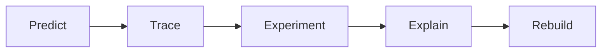
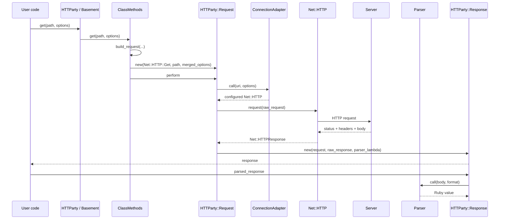

# From Ruby Call to HTTP Response

> A lifecycle-guided reading of HTTParty's source code.

## The promise of this book

By the end, we will be able to explain—without using the word “magic”—how this
single Ruby expression becomes a network request and then a useful Ruby object:

```ruby
response = HTTParty.get(
  "https://api.example.com/users",
  query: { page: 2 }
)
```

The book follows one value through the system instead of reading the repository
alphabetically.


## First-principles model

An HTTP client must ultimately perform only five essential jobs:

1. **Describe** a request: method, URI, headers, and optional body.
2. **Open** a connection to the destination.
3. **Serialize and send** the request according to HTTP.
4. **Receive** a status line, headers, and optional body.
5. **Interpret** those bytes for the caller.

HTTParty does not replace HTTP or `Net::HTTP`. It adds configuration,
normalization, orchestration, parsing, and a convenient response interface
around those jobs.

## Reading contract

This book is pinned to **HTTParty v0.24.2**. Use the tagged source while reading,
because `main` can change:

```bash
git clone https://github.com/jnunemaker/httparty.git
cd httparty
git checkout v0.24.2
test "$(git rev-parse HEAD)" = "9c89e55ce3578b393e17b2928acab5b5f941e808"
bundle install
bundle exec rake
```

For every chapter, use the same active-reading loop:



| Step | Required action | Evidence of learning |
|---|---|---|
| **Predict** | State what you expect before opening the implementation. | A falsifiable prediction |
| **Trace** | Follow one real call through methods and objects. | A small call graph |
| **Experiment** | Change one input or run one focused spec. | Observed output |
| **Explain** | Describe the mechanism in your own words. | A short teaching note |
| **Rebuild** | Implement the smallest equivalent behavior. | A `MiniParty` feature |

## Catalog

### Part I — Establish the ground truth

| Ch. | Chapter | Central question | Primary source | Output |
|---:|---|---|---|---|
| 0 | **[How to Read a Ruby Gem](chapters/00-how-to-read-a-ruby-gem.md)** | How do we map a repository before following details? | `httparty.gemspec`, `lib/httparty.rb`, `spec/` | Repository map and reading setup |
| 1 | **[HTTP Without HTTParty](chapters/01-http-without-httparty.md)** | What work must an HTTP client perform? | Ruby `uri` and `net/http` standard libraries | A working explicit `Net::HTTP` request |
| 2 | **[The Smallest Useful Trace](chapters/02-smallest-useful-trace.md)** | Which objects and methods participate in one GET? | `lib/httparty.rb`, `lib/httparty/request.rb`, `lib/httparty/response.rb` | First end-to-end call graph |

### Part II — Enter through the public API

| Ch. | Lifecycle stage | Central question | Primary source | Ruby concepts |
|---:|---|---|---|---|
| 3 | **[`HTTParty.get`](chapters/03-httparty-get.md)** | Why does the module-level call pass through `Basement`? | `lib/httparty.rb` | modules, delegation, splats, blocks |
| 4 | **[`include HTTParty`](chapters/04-include-httparty.md)** | How does inclusion create a class-level HTTP DSL? | `HTTParty.included`, `ClassMethods` | `include`, `extend`, hooks, method lookup |
| 5 | **[Class Configuration](chapters/05-class-configuration.md)** | Where do `base_uri`, headers, auth, and defaults live? | `module_inheritable_attributes.rb`, `lib/httparty.rb` | class instance variables, inheritance, duplication |

### Part III — Build the request

| Ch. | Lifecycle stage | Central question | Primary source | HTTP concepts |
|---:|---|---|---|---|
| 6 | **[From `get` to `Request.new`](chapters/06-get-to-request.md)** | How are defaults and per-call options combined? | `perform_request`, `build_request`, `headers_processor.rb` | request configuration and precedence |
| 7 | **[Construct the URI](chapters/07-construct-uri.md)** | How do base URI, path, query, and default parameters become one URI? | `Request#uri`, `hash_conversions.rb` | URI components, percent-encoding, query strings |
| 8 | **[Construct the Headers](chapters/08-construct-headers.md)** | How are static headers, dynamic headers, and cookies merged? | `headers_processor.rb`, `cookie_hash.rb` | header fields, cookies, case-insensitivity |
| 9 | **[Construct the Body](chapters/09-construct-body.md)** | When is a body raw, form-encoded, or multipart? | `request/body.rb`, multipart helpers | media types, form encoding, multipart boundaries |
| 10 | **[Create the Raw Request](chapters/10-create-raw-request.md)** | How does HTTParty choose and populate a `Net::HTTP` request class? | `Request#setup_raw_request` | verbs, request target, headers versus body |

### Part IV — Cross the network boundary

| Ch. | Lifecycle stage | Central question | Primary source | HTTP/network concepts |
|---:|---|---|---|---|
| 11 | **[Configure the Connection](chapters/11-configure-connection.md)** | Which options configure TCP/TLS behavior? | `connection_adapter.rb`, `Request#http` | TLS, proxy, open/read/write timeout |
| 12 | **[Send and Receive](chapters/12-send-and-receive.md)** | Where does control pass from HTTParty to `Net::HTTP`? | `Request#perform`, `Net::HTTP#request` | blocking I/O, request serialization, response framing |
| 13 | **[Stream the Body](chapters/13-stream-response-body.md)** | How can data be consumed before the whole response arrives? | `response_fragment.rb`, streaming path in `Request#perform` | chunks, buffering, memory trade-offs |

### Part V — Turn the response into Ruby values

| Ch. | Lifecycle stage | Central question | Primary source | Ruby/HTTP concepts |
|---:|---|---|---|---|
| 14 | **[Normalize Response Bytes](chapters/14-normalize-response-bytes.md)** | Why must a client decompress and transcode before parsing? | `decompressor.rb`, `text_encoder.rb`, `Request#handle_response` | content encoding versus character encoding |
| 15 | **[Select and Run a Parser](chapters/15-select-and-run-parser.md)** | How does `Content-Type` lead to JSON, XML, CSV, or text? | `parser.rb`, `Request#format` | MIME types, dispatch, custom parsers |
| 16 | **[The Response Facade](chapters/16-response-facade.md)** | How can one object expose metadata and behave like parsed data? | `response.rb`, response specs | lazy evaluation, delegation, object identity |

### Part VI — Behavior that bends the straight line

| Ch. | Branch | Central question | Primary source | Design concern |
|---:|---|---|---|---|
| 17 | **[Redirects](chapters/17-redirects.md)** | When is a second request created, and can its method or credentials change? | redirect methods in `request.rb` | recursion, redirect limits, credential safety |
| 18 | **[Authentication](chapters/18-authentication.md)** | Where are Basic and Digest authentication applied? | auth paths in `request.rb`, `net_digest_auth.rb` | challenge-response and secret handling |
| 19 | **[Failures and Retries](chapters/19-failures-and-retries.md)** | Which failures become responses and which become exceptions? | `exceptions.rb`, rescue/retry paths, specs | transport versus protocol/application failure |
| 20 | **[Tests as Executable Documentation](chapters/20-tests-as-documentation.md)** | How do specs reveal contracts hidden by implementation details? | `spec/httparty/` | seams, fakes, expectations, regression tests |

### Part VII — Synthesis

| Ch. | Project | Guiding constraint | Deliverable |
|---:|---|---|---|
| 21 | **[Annotated End-to-End Trace](chapters/21-annotated-end-to-end-trace.md)** | Explain every transition for one GET with query parameters and JSON. | A sequence diagram linked to exact methods |
| 22 | **[Build `MiniParty`](chapters/22-build-miniparty.md)** | Use only Ruby’s standard library; implement features in lifecycle order. | A small client with GET, query, JSON, timeout, and errors |
| 23 | **[Evaluate the Abstraction](chapters/23-evaluate-the-abstraction.md)** | When is HTTParty helpful, leaky, or the wrong tool? | A trade-off matrix and production checklist |
| 24 | **[Teach It](chapters/24-teach-it.md)** | Can we explain the entire lifecycle to another Ruby learner? | A publishable article or recorded walkthrough |

## The spine of the book

The main path we will repeatedly return to is:



The diagram intentionally separates **response creation** from **body parsing**:
the parser is passed into `HTTParty::Response` as a lambda, so parsing can be
deferred until parsed data is requested.

## Chapter template

Every chapter should cover these concerns. Closely related concerns may be
combined into one section when that makes the chapter easier to read:

1. **Problem Solver** — What problem is this stage solving? What would we write
   without the abstraction?
2. **Lifecycle Position** — What enters this stage, and what leaves it?
3. **Source Map** — The smallest set of files, classes, and methods to inspect.
4. **Under the Hood** — A line-by-line trace of one concrete example.
5. **Ruby Lens** — The language mechanism used by the implementation.
6. **HTTP Lens** — The protocol rule or network concept being represented.
7. **Trade-offs** — Convenience, complexity, performance, and failure modes.
8. **Mental Sandbox** — Predictions and edge cases to test.
9. **Build It** — Add one capability to `MiniParty`.
10. **Teach-back** — Questions that must be answered without looking at the source.

## Progress tracker

| Part | Status | Completion evidence |
|---|---|---|
| I. Ground truth | Draft complete — exercises pending | Baseline request, repository map, and end-to-end trace |
| II. Public API | Draft complete — exercises pending | Explain `HTTParty.get` and `include HTTParty` |
| III. Request building | Draft complete — exercises pending | Print the final URI, headers, and body |
| IV. Network boundary | Draft complete — exercises pending | Identify the exact `Net::HTTP#request` handoff |
| V. Response values | Draft complete — exercises pending | Explain decompression, encoding, and lazy parsing |
| VI. Branches | Draft complete — exercises pending | Redirect/auth/failure experiments |
| VII. Synthesis | Draft complete — projects pending | `MiniParty` plus teach-back article |

## Questions before Chapter 0

Write down answers now; revisit them after Chapter 24:

1. What is the minimum information required to describe an HTTP request?
2. Which responsibilities belong to HTTParty, and which belong to `Net::HTTP`?
3. At what exact point do Ruby objects become network bytes?
4. Does `HTTParty.get` parse the response body immediately? How could we prove it?
5. What should happen when transport succeeds but the server returns `500`?

## Primary references

- [HTTParty repository](https://github.com/jnunemaker/httparty)
- [HTTParty v0.24.2 release](https://github.com/jnunemaker/httparty/releases/tag/v0.24.2)
- [Ruby `Net::HTTP` documentation](https://docs.ruby-lang.org/en/master/Net/HTTP.html)
- [RFC 9110: HTTP Semantics](https://www.rfc-editor.org/rfc/rfc9110)
- [RFC 9112: HTTP/1.1](https://www.rfc-editor.org/rfc/rfc9112)
