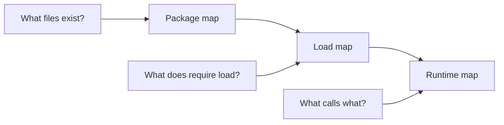
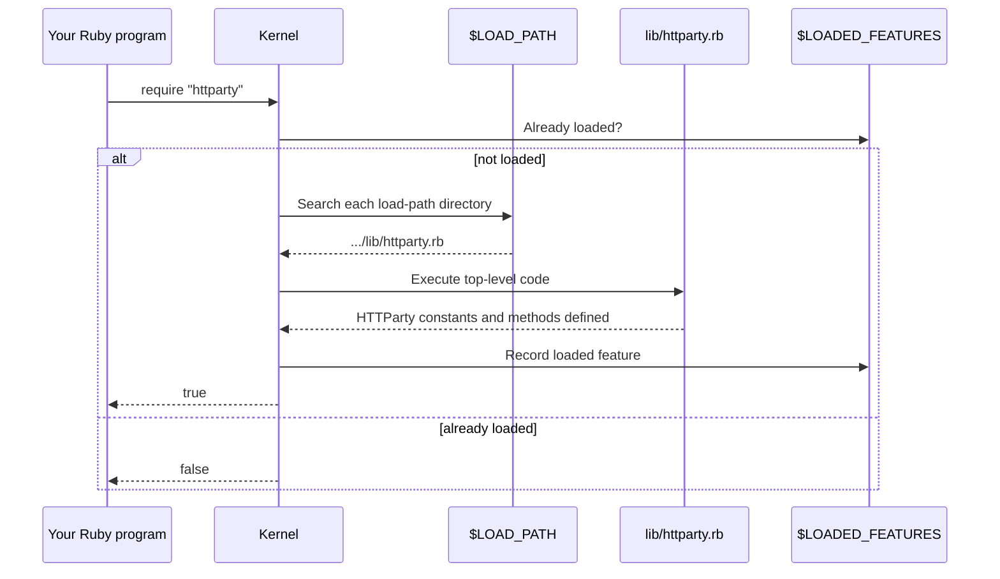
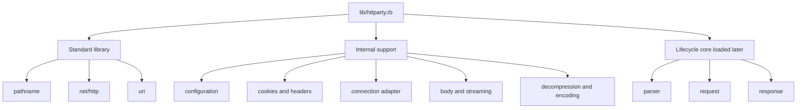

# Chapter 0 — How to Read a Ruby Gem

> **Goal:** Build a reliable map of HTTParty before reading individual methods.

## 0.1 Problem Solver — why map the repository first?

Source code is not a book. Its files are organized for the runtime and the
maintainers, not necessarily for a learner.

If we start at the first line of the first file and read downward, we quickly
encounter names whose roles we do not yet understand. That creates two common
failures:

| Failure | Symptom | Root cause |
|---|---|---|
| **Local understanding** | Every method makes sense, but the request lifecycle does not. | We studied syntax without tracing data flow. |
| **Imaginary architecture** | We guess how components relate and remember the guess as fact. | We did not verify the entry point and runtime calls. |

The remedy is to establish three maps first:



- The **package map** tells us what is shipped and where responsibilities live.
- The **load map** tells us which Ruby files define the available constants and
  methods.
- The **runtime map** tells us which of those definitions participate in one
  request.

This chapter builds the first two. Chapter 2 will build the first runtime map.

## 0.2 First principles — what is a gem?

At the lowest useful level, a Ruby gem is:

```text
metadata + packaged files + load paths + optional executables + dependencies
```

A gem is **not** automatically the same thing as a Ruby module. In this project:

| Name | Kind | Role |
|---|---|---|
| `httparty` | Gem/package name | Installed and resolved by RubyGems/Bundler |
| `httparty.rb` | Conventional entry-point file | Loaded by `require "httparty"` |
| `HTTParty` | Ruby module constant | Holds behavior exposed to Ruby code |
| `httparty` | CLI executable | Runs HTTParty from a terminal |

These names are intentionally similar, but they live in different layers.

## 0.3 The package boundary — read the gemspec

Start with `httparty.gemspec`, not with the implementation. A gemspec answers:

1. What is the package called?
2. Which Ruby versions can run it?
3. Which other gems must be present?
4. Which files and executables are shipped?
5. Which directories become require paths?

For HTTParty v0.24.2, the important facts are:

| Question | Answer | Consequence for our reading |
|---|---|---|
| Package name | `httparty` | The Gemfile dependency is `gem "httparty"`. |
| Version source | `HTTParty::VERSION` | Version information lives in `lib/httparty/version.rb`. |
| Required Ruby | Ruby 2.7 or newer | The source may use features available from Ruby 2.7 onward. |
| Runtime dependencies | `csv`, `multi_xml`, `mini_mime` | Some parsing and MIME behavior is delegated to other libraries. |
| Require path | `lib` | `require "httparty"` searches for `lib/httparty.rb`. |
| Executable directory | `bin` | The command-line client is separate from the library entry point. |
| Shipped tests | Excluded from the built gem | Clone the repository—not only the installed gem—to study specs. |

The key line is conceptually:

```ruby
spec.require_paths = ["lib"]
```

That one setting connects the package layer to Ruby's loading system.

## 0.4 What happens when Ruby sees `require "httparty"`?

Assume the gem has been activated by RubyGems or Bundler.



Three distinctions matter:

| Mechanism | Meaning |
|---|---|
| `$LOAD_PATH` | Directories Ruby searches when resolving `require`. |
| `$LOADED_FEATURES` | Files already loaded, preventing repeated execution. |
| `require_relative` | Loads relative to the current source file rather than searching the load path. |

HTTParty's entry point uses `require` for both standard-library features and
its internal files. That works because the gem's `lib` directory is already on
the load path.

### Experiment: inspect the loader

Run from the cloned HTTParty repository:

```bash
bundle exec ruby -Ilib -e '
  puts $LOAD_PATH.grep(/httparty/)
  first = require "httparty"
  second = require "httparty"
  puts "first require: #{first.inspect}"
  puts "second require: #{second.inspect}"
  puts $LOADED_FEATURES.grep(/httparty\.rb/)
'
```

Before running it, predict:

1. Why does `-Ilib` matter when executing directly from the repository?
2. Why should the two `require` calls return different Boolean values?
3. Does `require` create the `HTTParty` module, or execute a file that creates it?

## 0.5 Repository map

At v0.24.2, the top-level repository can be compressed into this learning map:

```text
httparty/
├── httparty.gemspec       package boundary and dependencies
├── lib/
│   ├── httparty.rb        public entry point and class-level DSL
│   └── httparty/          focused implementation components
├── spec/                  executable behavior contracts
├── features/              user-level behavior scenarios
├── examples/              usage examples
├── bin/httparty           command-line entry point
├── docs/                  explanatory documentation
├── Gemfile                development dependency entry point
├── Rakefile               common development tasks
└── README.md              public product-level introduction
```

This is a **semantic map**, not merely a directory listing. Each region answers
a different type of question:

| If you want to know… | Read first |
|---|---|
| What users are promised | `README.md`, `docs/`, `features/` |
| What gets installed | `httparty.gemspec` |
| What `require "httparty"` exposes | `lib/httparty.rb` |
| How one component works | Corresponding file under `lib/httparty/` |
| What behavior maintainers protect | Corresponding file under `spec/httparty/` |
| How contributors run checks | `CONTRIBUTING.md`, `Rakefile` |
| How the terminal command works | `bin/httparty` |

## 0.6 The entry point is a dependency map

The top of `lib/httparty.rb` loads three categories of code:



Do not deep-read every required file yet. At this stage, classify each filename
as a hypothesis about responsibility. We will verify those hypotheses when the
lifecycle reaches them.

### Why loading order matters

Ruby executes a required file immediately. Therefore, a constant normally must
exist before code tries to use it at runtime.

HTTParty's entry point is also a rough dependency ordering:

```text
supporting definitions
        ↓
main HTTParty module and ClassMethods
        ↓
hash utilities, exceptions, parser, request, response
```

The order is not yet the request lifecycle. **Load order answers “what must be
defined first?” Runtime order answers “what is called first?”** Confusing these
two orders is a classic source-reading mistake.

## 0.7 Source files are responsibility boundaries

Use filenames to build hypotheses, not conclusions:

| File | Initial responsibility hypothesis | Lifecycle stage to verify it |
|---|---|---|
| `module_inheritable_attributes.rb` | Preserve class-level configuration across inheritance | Class configuration |
| `headers_processor.rb` | Merge and evaluate request headers | Request building |
| `cookie_hash.rb` | Store and serialize cookies | Request building and redirects |
| `hash_conversions.rb` | Convert nested Ruby data into parameter strings | URI and body construction |
| `request/body.rb` | Select and encode request-body representation | Body construction |
| `connection_adapter.rb` | Produce a configured `Net::HTTP` connection | Connection setup |
| `request.rb` | Orchestrate most of the request lifecycle | Request through response creation |
| `decompressor.rb` | Decode compressed response content | Response normalization |
| `text_encoder.rb` | Normalize response text encoding | Response normalization |
| `parser.rb` | Convert body text into Ruby values | Parsing |
| `response.rb` | Present raw response metadata and parsed data | Public response interface |
| `response_fragment.rb` | Represent streamed response pieces | Streaming |

Notice that `request.rb` is broad. Large orchestrator files often reveal where
the central lifecycle lives, while smaller files reveal extracted policies.

## 0.8 Tests are the behavioral index

Implementation tells us **how the current code works**. Tests often tell us
**which behavior is intentional**.

For source reading, pair each production file with its nearest spec:

```text
lib/httparty/request.rb
        ↕
spec/httparty/request_spec.rb
```

Use the tests in three modes:

| Mode | Action | Purpose |
|---|---|---|
| **Search** | Find a method or option name in specs. | Discover intended cases quickly. |
| **Focus** | Run the smallest matching spec/example. | Observe one contract without noise. |
| **Perturb** | Temporarily change an expectation or input. | Confirm what the test actually protects. |

Helpful commands from the repository root:

```bash
# Find likely definitions.
rg 'def (get|build_request|perform_request)' lib

# Find behavior associated with a method or option.
rg 'build_request|base_uri|query' spec

# Run the project checks described by the repository.
bundle exec rake
```

Do not equate “the test suite passes” with “I understand the code.” A passing
suite is feedback from the project; understanding requires prediction and
explanation.

## 0.9 A disciplined navigation workflow

For every unfamiliar call, record four facts:

| Fact | Example question |
|---|---|
| **Owner** | Which class or module defines `build_request`? |
| **Receiver** | Which object receives this call at runtime? |
| **Input/output** | What values enter, and what object returns? |
| **Next boundary** | Which method receives that returned object? |

Use a trace table rather than uncontrolled jumping:

| Step | Receiver | Method | Important input | Return value | Next step |
|---:|---|---|---|---|---|
| 1 | Unknown initially | `get` | URL and options | Unknown initially | Find definition |
| 2 | — | — | — | — | Fill during Chapter 2 |

The word **unknown** is useful. It separates verified knowledge from assumptions.

## 0.10 Ruby lens — definitions are not executions

When Ruby evaluates this code:

```ruby
module Example
  def self.call
    Worker.new.perform
  end
end
```

Ruby defines `Example` and its `.call` method. It does **not** create `Worker` or
invoke `perform` until someone later calls `Example.call`.

While reading HTTParty, label lines as one of:

| Kind | Examples | When it matters |
|---|---|---|
| **Load-time execution** | `require`, opening modules/classes, certain top-level assignments | When `require "httparty"` runs |
| **Definition** | `def`, `class`, `module` bodies | Establishes future behavior |
| **Request-time execution** | Calls reached from `.get` | When the application performs a request |

This prevents us from mistaking file order for runtime order.

## 0.11 Trade-offs — what this map hides

A map is a deliberate simplification.

| Benefit | Cost |
|---|---|
| Reduces cognitive load | Omits implementation details |
| Gives us a reading order | Can bias what we notice |
| Makes responsibilities visible | A file may hold more than one responsibility |
| Separates HTTParty from dependencies | Can obscure behavior delegated to `Net::HTTP` or another gem |

We should update the map whenever source evidence contradicts it.

## 0.12 Mental sandbox

Answer before checking the source or running Ruby:

1. If `lib` were removed from the gem's require paths, what would
   `require "httparty"` fail to find?
2. If `lib/httparty.rb` did not require `httparty/request`, when would the missing
   constant become visible?
3. Why might an installed gem be insufficient for studying the test suite?
4. If a file appears earlier in the entry point, does it necessarily execute
   earlier during a GET request?
5. What is the difference between the gem named `httparty`, the file
   `httparty.rb`, and the module `HTTParty`?

## 0.13 Chapter project — produce the repository map

Clone and pin the source:

```bash
git clone https://github.com/jnunemaker/httparty.git
cd httparty
git checkout v0.24.2
bundle install
bundle exec rake
```

Then produce these three artifacts in your learning notes:

### Artifact A — environment record

```text
HTTParty tag:
Commit SHA:
Ruby version:
Bundler version:
Full test command:
Test result:
```

### Artifact B — package map

Explain the role of:

- `httparty.gemspec`
- `lib/httparty.rb`
- `lib/httparty/`
- `spec/httparty/`
- `bin/httparty`

### Artifact C — initial hypothesis

Without deep-reading `request.rb`, predict where each lifecycle transition lives:

| Transition | Predicted file/method | Confidence | Later correction |
|---|---|---:|---|
| `.get` → request builder | | | |
| Request builder → `Net::HTTP` object | | | |
| `Net::HTTP` response → parser | | | |
| Parsed value → public response | | | |

Confidence should be a number from 0 to 100. The purpose is not to be correct;
it is to make learning visible when evidence changes the model.

## 0.14 Teach-back checkpoint

You are ready for Chapter 1 when you can explain:

- Why `require "httparty"` resolves to `lib/httparty.rb`.
- Why the gemspec is part of source-code reading rather than packaging trivia.
- The difference between load order and request-time call order.
- Why a production file should be read alongside its spec.
- Which files you expect to own request building, network configuration,
  parsing, and response wrapping.

In one sentence:

> **We map a Ruby gem by moving from package metadata, to load behavior, to
> runtime calls—and we treat every architectural guess as a hypothesis to test.**

## Primary sources

- [HTTParty v0.24.2 repository](https://github.com/jnunemaker/httparty/tree/v0.24.2)
- [HTTParty v0.24.2 gemspec](https://github.com/jnunemaker/httparty/blob/v0.24.2/httparty.gemspec)
- [HTTParty v0.24.2 entry point](https://github.com/jnunemaker/httparty/blob/v0.24.2/lib/httparty.rb)
- [HTTParty v0.24.2 library files](https://github.com/jnunemaker/httparty/tree/v0.24.2/lib/httparty)
- [HTTParty v0.24.2 specs](https://github.com/jnunemaker/httparty/tree/v0.24.2/spec/httparty)

