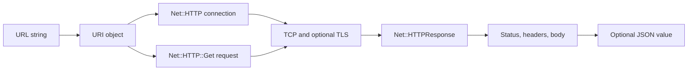
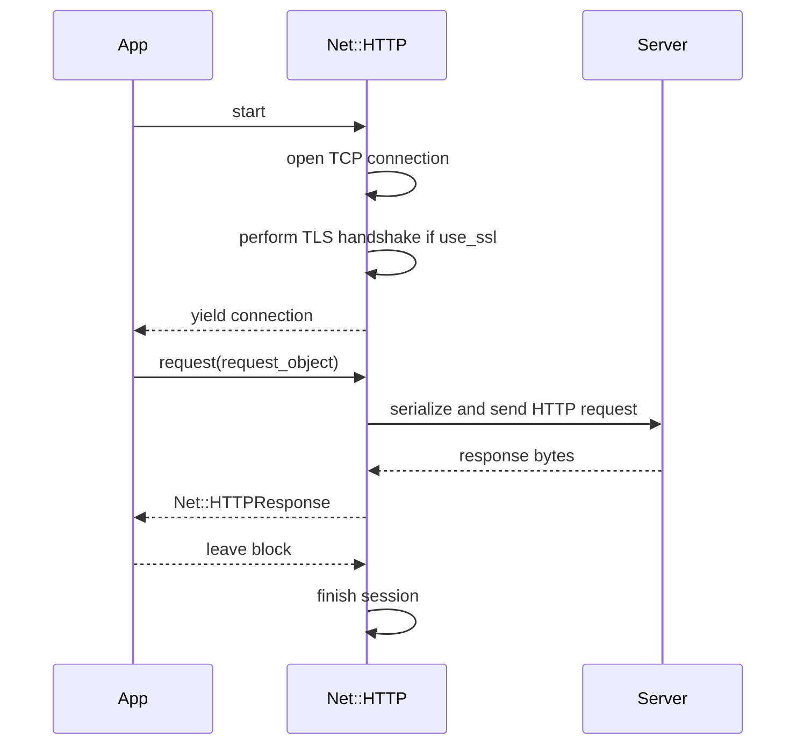
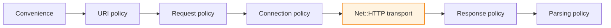

# Chapter 1 — HTTP Without HTTParty

> **Goal:** Perform one GET with `Net::HTTP` and account for every transformation
> between a URL string and a response body.

## 1.1 Problem Solver — why remove HTTParty first?

We cannot understand an abstraction until we know what it abstracts.

Compare these two calls:

```ruby
HTTParty.get(url)
Net::HTTP.get(URI(url))
```

They are both convenient, but both hide intermediate objects. To build a useful
baseline, we will use the more explicit `Net::HTTP` interface:



This gives us a control specimen. Later, whenever HTTParty performs a step, we
can ask: **which explicit `Net::HTTP` responsibility moved behind the API?**

## 1.2 First principles — HTTP is request and response messages

Ignoring connection reuse, redirects, proxies, and streaming for the moment,
HTTP follows a simple exchange:

```text
client                                              server
  │                                                    │
  │  request: method + target + headers + body?        │
  ├───────────────────────────────────────────────────▶│
  │                                                    │
  │  response: status + headers + body?                │
  │◀───────────────────────────────────────────────────┤
  │                                                    │
```

The smallest useful model is:

| Message | Required conceptual parts | Example |
|---|---|---|
| Request | Method, target, header fields, optional content | `GET /todos/1?verbose=true` |
| Response | Status code, header fields, optional content | `200`, `Content-Type`, JSON bytes |

HTTP semantics do not require every response to have a body. A `HEAD` response,
for example, is handled differently from a normal `GET` response. This is why
the body is **optional** in our model.

## 1.3 A URL contains several different decisions

Consider:

```text
https://api.example.com:8443/users?page=2#profile
└─┬─┘   └──────┬──────┘ └┬─┘ └─┬──┘ └──┬─┘ └──┬──┘
scheme          host      port  path    query  fragment
```

Each component serves a different job:

| Component | Used for | Sent as part of HTTP request target? |
|---|---|---:|
| Scheme | Select plain HTTP or HTTP over TLS | No |
| Host | Resolve and connect to a server; populate `Host` | Usually represented by a header, not the origin-form target |
| Port | Select the remote service endpoint | No |
| Path | Identify a resource on that server | Yes |
| Query | Parameterize the target | Yes |
| Fragment | Client-side resource navigation | No |

The distinction between **destination** and **request target** is foundational:

```text
connection destination = host + port
request target          = path + optional query
transport security      = determined by scheme
```

`URI` turns one string into structured fields so `Net::HTTP` can use them for
different purposes.

## 1.4 Build the URI safely

Use Ruby's URI encoder for query parameters rather than string concatenation:

```ruby
require "uri"

uri = URI("https://jsonplaceholder.typicode.com/todos")
uri.query = URI.encode_www_form(userId: 1, completed: false)
```

The resulting URI is conceptually:

```text
https://jsonplaceholder.typicode.com/todos?userId=1&completed=false
```

Why not interpolate values directly?

```ruby
# Fragile: values may contain spaces, &, =, Unicode, or reserved characters.
uri.query = "search=#{user_input}"
```

Encoding is not decoration. It preserves the boundary between parameter data
and URI syntax.

## 1.5 Build the connection

The connection object represents how to reach a server:

```ruby
http = Net::HTTP.new(uri.hostname, uri.port)
http.use_ssl = uri.scheme == "https"
http.open_timeout = 5
http.read_timeout = 10
http.write_timeout = 10
```

| Setting | Limits which wait? | Typical failure |
|---|---|---|
| `open_timeout` | Establishing the connection | Host unreachable or connection establishment is too slow |
| `read_timeout` | Waiting while reading response data | Server accepts but responds too slowly |
| `write_timeout` | Waiting while writing request data | Peer or network stops accepting outgoing data |

A single generic “timeout” sounds simple but hides distinct failure phases.
HTTParty will later map its options onto these connection properties.

### HTTPS does not mean a different HTTP method

`GET` remains `GET`. HTTPS adds TLS beneath HTTP:

```text
HTTP request semantics
        ↓
TLS encryption and peer verification
        ↓
TCP byte stream
```

Setting `use_ssl` changes connection behavior, not the meaning of the request.

## 1.6 Build the request

The request object describes the message we want to send:

```ruby
request = Net::HTTP::Get.new(uri)
request["Accept"] = "application/json"
request["User-Agent"] = "httparty-source-book/1.0"
```

The class encodes the HTTP method:

```text
Net::HTTP::Get
       │ inherits
       ▼
Net::HTTPRequest
       │ inherits
       ▼
Net::HTTPGenericRequest
```

This helps explain why HTTParty passes classes such as `Net::HTTP::Get` through
its own request-building pipeline. The verb is represented as behavior, not
only as an arbitrary string.

### Connection versus request

Do not merge these two objects in your mental model:

| Object | Describes | Examples |
|---|---|---|
| `Net::HTTP` | Transport/session configuration | Host, port, TLS, proxy, timeouts |
| `Net::HTTP::Get` | One HTTP request | Method, target, headers, body rules |

One connection may send multiple requests to the same origin. This separation
supports session reuse.

## 1.7 Cross the network boundary

With both objects prepared:

```ruby
response = http.start do |connection|
  connection.request(request)
end
```

The block form of `start` owns the session lifecycle:



At the public API boundary, `connection.request(request)` is the key handoff.
Inside `Net::HTTP`, the request object is eventually written to a socket and the
response is read back into a response object. HTTParty orchestrates this
handoff; it does not itself implement TCP.

## 1.8 Read the response in layers

An HTTP response is more than its body:

```ruby
puts response.code
puts response.message
puts response["content-type"]
puts response.body
```

| Ruby expression | Protocol information | Example |
|---|---|---|
| `response.code` | Status code as a string | `"200"` |
| `response.message` | Reason phrase, when available | `"OK"` |
| `response.to_hash` | Header fields | `{ "content-type" => [...] }` |
| `response.body` | Representation data | JSON text |
| `response.class` | Status-family-specific Ruby class | `Net::HTTPOK` |

`Net::HTTPResponse` subclasses enable category checks:

```ruby
case response
when Net::HTTPSuccess
  # 2xx
when Net::HTTPRedirection
  # 3xx
when Net::HTTPClientError
  # 4xx
when Net::HTTPServerError
  # 5xx
end
```

### Transport success is not application success

If the server returns `500`, the network exchange succeeded:

```text
DNS/TCP/TLS worked
        +
request was sent
        +
response was received
        ≠
application operation succeeded
```

This distinction will matter when we study HTTParty's error behavior. An HTTP
error status is still an HTTP response unless client policy turns it into an
exception.

## 1.9 Parse only after identifying the representation

The body begins as bytes/string data. JSON parsing is a separate policy:

```ruby
require "json"

content_type = response["content-type"].to_s
data = JSON.parse(response.body) if content_type.include?("application/json")
```

Parsing requires at least two inputs:

```text
body data + expected format → Ruby value
```

The format may come from:

- The response's `Content-Type` header.
- Explicit caller configuration.
- A custom rule or parser.

HTTParty adds this policy layer and later wraps both the raw HTTP response and
the parsed result in `HTTParty::Response`.

## 1.10 The complete explicit request

The runnable example for this chapter is:

[Chapter 1 example](../examples/01_net_http_get.rb)

Its central lifecycle is:

```ruby
uri = URI(url)
request = Net::HTTP::Get.new(uri)
http = Net::HTTP.new(uri.hostname, uri.port)
http.use_ssl = uri.scheme == "https"
response = http.start { |connection| connection.request(request) }
```

Run it from the book directory:

```bash
ruby examples/01_net_http_get.rb
```

Or supply another HTTP(S) URL:

```bash
ruby examples/01_net_http_get.rb https://example.com/
```

The default example uses a public endpoint also used by the Ruby documentation,
so it requires network access. The program prints response metadata and only a
short body preview.

## 1.11 Map the baseline to HTTParty's lifecycle

We can now replace vague boxes with concrete responsibilities:

| Lifecycle stage | Explicit `Net::HTTP` baseline | HTTParty component to investigate later |
|---|---|---|
| Public call | Our script coordinates everything | `HTTParty.get`, `ClassMethods#get` |
| Build URI | `URI(...)`, `URI.encode_www_form` | `Request#uri`, query normalizers |
| Build request | `Net::HTTP::Get.new(uri)` and headers | `build_request`, `setup_raw_request` |
| Configure connection | `Net::HTTP.new`, TLS, timeouts | `ConnectionAdapter` |
| Send/receive | `connection.request(request)` | `Request#perform` |
| Interpret status | `case response` | `HTTParty::Response`, `raise_on` policy |
| Parse content | `JSON.parse(response.body)` | `Parser` and parser lambda |
| Public result | Separate response and parsed value | `HTTParty::Response` facade |



The orange box is the key dependency boundary. HTTParty controls policy and
orchestration around it; `Net::HTTP` performs the lower-level transport work.

## 1.12 Trade-offs of the explicit version

| Benefit | Cost |
|---|---|
| Every stage is visible | Repetitive setup |
| Timeouts and TLS are explicit | Easy to forget an important option |
| Request and connection are separate | More objects to understand |
| Status handling is deliberate | Every application may reinvent policy |
| Parsing is clearly separate | Content-type and encoding edge cases become our responsibility |

HTTParty's value is not that these steps are impossible. Its value is that they
can be normalized, configured once, reused, and tested as a coherent client.

## 1.13 Mental sandbox

Predict before running an experiment:

1. What changes when the URI scheme changes from `https` to `http`?
2. Which URI components determine the TCP destination?
3. Which URI components become the request target?
4. Why should a URL fragment never reach the HTTP server?
5. What Ruby object represents the request before it is serialized?
6. Does a `404` prove the network request failed?
7. Why is `JSON.parse` not inherently part of HTTP?
8. What information is lost if we use `Net::HTTP.get(uri)` and keep only the
   returned body string?

## 1.14 Experiments

### Experiment A — inspect object boundaries

Add these lines before sending the request:

```ruby
p uri.class
p http.class
p request.class
p request.method
p request.path
```

Explain why three objects are needed instead of one.

### Experiment B — force a protocol-level failure

Request a path that does not exist. Record:

```text
Did Ruby raise a network exception?
Response class:
Status code:
Response body present?:
```

### Experiment C — force a transport-level failure

Point the client at a local port on which nothing is listening. Compare the
result with Experiment B.

```text
HTTP error:       a response object exists
Transport error:  no valid HTTP response was received
```

### Experiment D — inspect debug output

Temporarily add:

```ruby
http.set_debug_output($stderr)
```

Use this only for learning and avoid it around secrets. Identify the request
line, request headers, status line, response headers, and body. For HTTPS, the
debug stream is produced by the client around an encrypted transport; packets
on the network are not plain HTTP text.

## 1.15 Build It — `MiniParty` milestone 1

Without copying the example, implement:

```ruby
MiniParty.get(url, headers: {}, open_timeout: 5, read_timeout: 10)
```

For this milestone, it may return `Net::HTTPResponse` directly.

Constraints:

- Accept only `http` and `https` schemes.
- Use a `Net::HTTP::Get` request object.
- Configure TLS from the URI scheme.
- Apply caller-provided headers.
- Set explicit open and read timeouts.
- Do not parse JSON yet.
- Do not follow redirects yet.

These constraints preserve the lifecycle boundaries instead of building a
second one-line wrapper with hidden behavior.

## 1.16 Teach-back checkpoint

You are ready for Chapter 2 when you can explain, without looking at the code:

1. Why URI parsing must happen before connection and request construction.
2. The responsibility difference between `Net::HTTP` and `Net::HTTP::Get`.
3. What `http.start { |connection| connection.request(request) }` owns.
4. Why an HTTP `500` differs fundamentally from `Net::OpenTimeout`.
5. Why response parsing is a policy layered on top of HTTP transport.

In one sentence:

> **A Ruby HTTP client turns a structured URI and request object into a transport
> exchange, then applies application policy to the returned status, headers,
> and body.**

## Primary sources

- [Ruby 3.4 `Net::HTTP`](https://docs.ruby-lang.org/en/3.4/Net/HTTP.html)
- [Ruby 3.4 `URI`](https://docs.ruby-lang.org/en/3.4/URI.html)
- [Ruby 3.4 `Net::HTTPResponse`](https://docs.ruby-lang.org/en/3.4/Net/HTTPResponse.html)
- [RFC 9110: HTTP Semantics](https://www.rfc-editor.org/rfc/rfc9110)
- [RFC 9112: HTTP/1.1](https://www.rfc-editor.org/rfc/rfc9112)

