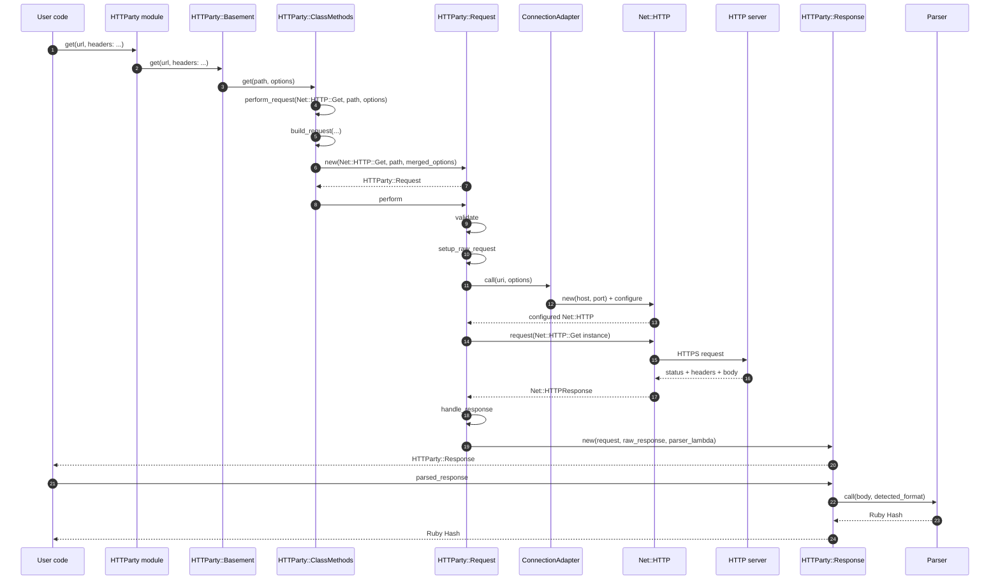
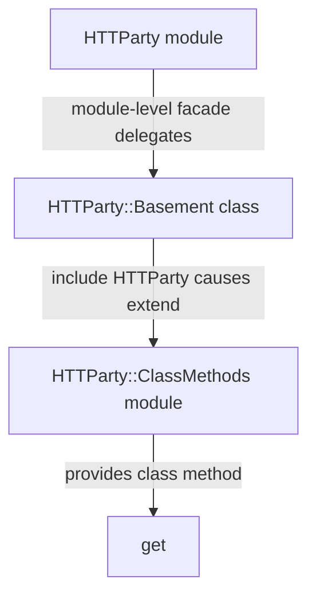
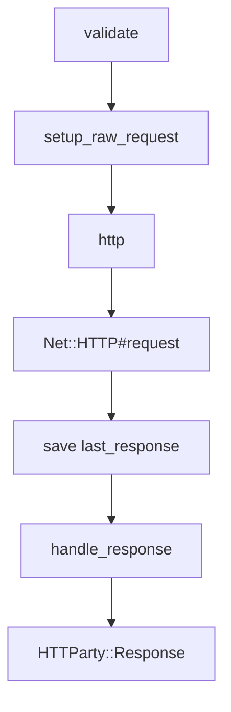
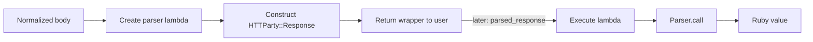
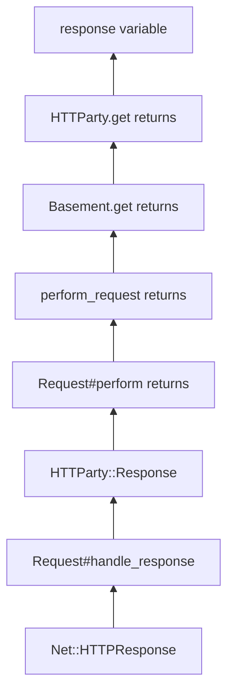

# Chapter 2 — The Smallest Useful Trace

> **Goal:** Follow one `HTTParty.get` call from public API to parsed Ruby value,
> naming every important receiver, input, return object, and dependency boundary.

## 2.1 Problem Solver — why trace before deep-reading?

Chapter 0 gave us a repository map. Chapter 1 gave us an explicit `Net::HTTP`
baseline. We now need a **runtime map** connecting them.

A runtime trace answers:

```text
Who receives the call?
    ↓
Which method runs?
    ↓
What data enters?
    ↓
What object returns?
    ↓
Where does that object go next?
```

Without this map, it is easy to spend an hour understanding a helper method
without knowing whether it participates in our request.

This is a reconnaissance pass. We will intentionally leave many boxes unopened.

## 2.2 Fix one concrete scenario

We will trace:

```ruby
response = HTTParty.get(
  "https://jsonplaceholder.typicode.com/todos/1",
  headers: { "Accept" => "application/json" }
)

todo = response.parsed_response
```

Assumptions:

| Dimension | Fixed condition | Why we constrain it |
|---|---|---|
| HTTP method | `GET` | Avoid request-body rules for now |
| URL | Absolute HTTPS URL | Avoid class-level `base_uri` initially |
| Response | Successful JSON response | Keep one straight path through response handling |
| Redirect | None | Redirects recursively perform another request |
| Authentication | None | Digest auth may introduce another exchange |
| Streaming block | None | Streaming changes how the response body is consumed |
| Custom parser/adapter | None | Follow HTTParty's defaults first |

Constraints are not omissions to apologize for. They are a tool for isolating
one mechanism.

## 2.3 The whole trace in one diagram



The trace contains two different return journeys:

1. **Request result:** the server response travels back as an
   `HTTParty::Response`.
2. **Parsed result:** a later call travels through the stored parser lambda and
   returns a Ruby value.

## 2.4 Stage 1 — the module facade delegates to `Basement`

The receiver in user code is the module object:

```ruby
HTTParty.get(url, options)
```

Near the bottom of `lib/httparty.rb`, the module-level `.get` forwards its
arguments and optional block to:

```ruby
HTTParty::Basement.get(url, options)
```

`Basement` is a class that includes `HTTParty`. Inclusion gives that class the
methods defined in `HTTParty::ClassMethods`.



### Why have this extra class?

HTTParty supports two public styles:

```ruby
# Direct convenience style
HTTParty.get(url)

# Configurable client style
class TodoClient
  include HTTParty
  base_uri "https://jsonplaceholder.typicode.com"
end

TodoClient.get("/todos/1")
```

`Basement` lets the module-level convenience API reuse the same configurable
class-method machinery instead of maintaining a separate request pipeline.

We will prove exactly how `include` and `extend` create this behavior in
Chapter 4.

## 2.5 Stage 2 — `ClassMethods#get` selects the HTTP method

The effective method body performs one important translation:

```text
friendly name :get
        ↓
request class Net::HTTP::Get
```

It then calls the private orchestrator:

```text
perform_request(Net::HTTP::Get, path, options)
```

This mirrors Chapter 1, where we explicitly constructed a
`Net::HTTP::Get` instance. HTTParty carries the request **class** forward so it
can instantiate the raw request after finishing URI, header, and option setup.

## 2.6 Stage 3 — `perform_request` composes build and perform

`perform_request` is conceptually:

```ruby
build_request(http_method, path, options).perform
```

Read it from left to right as object transformation:

```text
method class + path + caller options
                 │
                 ▼ build_request
          HTTParty::Request
                 │
                 ▼ perform
          HTTParty::Response
```

This small method is the hinge between two major phases:

| Phase | Question |
|---|---|
| `build_request` | What request should exist? |
| `perform` | How is it executed and converted into a public response? |

## 2.7 Stage 4 — `build_request` creates HTTParty's request model

At a high level, `build_request` performs four actions:


The returned object is **not** yet `Net::HTTP::Get`. It is an
`HTTParty::Request` that still contains higher-level policy:

```text
HTTParty::Request
├── HTTP method class: Net::HTTP::Get
├── path: parsed URI
├── merged options
├── parser policy
├── connection-adapter policy
└── redirect/authentication state
```

During `HTTParty::Request#initialize`:

- The HTTP method class is stored.
- HTTParty's request defaults are merged with the supplied options.
- The path string is parsed and normalized through the configured URI adapter.
- Initial authentication state is established.

We are only recording these responsibilities. Chapters 5–10 will inspect their
mechanics.

## 2.8 Stage 5 — `Request#perform` orchestrates the exchange

For our constrained scenario, `perform` follows this straight path:



### 2.8.1 Validate

Validation rejects incompatible or malformed options before attempting the
network exchange. Examples include an unsupported method or incompatible
authentication modes.

### 2.8.2 Create the raw request

`setup_raw_request` eventually performs the transformation we predicted in
Chapter 1:

```text
Net::HTTP::Get class
        +
request target and headers
        ↓
Net::HTTP::Get instance
```

This raw request is stored in `@raw_request`. For a GET without a request body,
body construction does not participate in our straight-line trace.

### 2.8.3 Create the connection

The private `http` method delegates to the configured connection adapter:

```text
connection_adapter.call(uri, options)
```

The default adapter constructs and configures a `Net::HTTP` object using the
URI's host and port, TLS requirements, timeouts, proxy settings, and other
connection policy.

### 2.8.4 Send the request

This is the central dependency boundary:

```ruby
current_http.request(@raw_request)
```

Immediately before this call, HTTParty owns control and has Ruby objects:

```text
current_http  → configured Net::HTTP
@raw_request  → configured Net::HTTP::Get
```

During the call, `Net::HTTP` owns transport. When it returns, HTTParty receives
a `Net::HTTPResponse` subclass and stores it as `last_response`.

```text
HTTParty policy ──▶ Net::HTTP transport ──▶ HTTParty response policy
```

This is the precise version of “send request” in our lifecycle diagram.

## 2.9 Stage 6 — normalize and wrap the response

For a non-redirect response, `handle_response`:

1. Gets the body from the `Net::HTTPResponse`.
2. Applies decompression policy.
3. Applies text-encoding policy.
4. Constructs `HTTParty::Response` with:
   - The original `HTTParty::Request`.
   - The raw `Net::HTTPResponse`.
   - A lambda that can parse the normalized body.
   - The response body exposed by the wrapper.

```text
HTTParty::Response
├── request       → HTTParty::Request
├── response      → Net::HTTPResponse
├── body          → response body string
├── headers       → HTTParty::Response::Headers
└── parsed block  → deferred parsing recipe
```

The wrapper preserves both worlds:

| World | Examples |
|---|---|
| HTTP metadata | Status, headers, raw response object |
| Application data | Parsed JSON/XML/CSV/text result |

## 2.10 Stage 7 — parsing is deferred

`handle_response` does not directly store the parsed JSON value. It passes a
lambda representing future work.



When user code calls:

```ruby
response.parsed_response
```

the response executes the stored block. The request asks its configured parser
to process the body using the selected format. For a JSON response, the result
is usually a Ruby `Hash` or `Array`.

The response memoizes truthy parsed results with `||=`. A subtle consequence is
that a parser returning `nil` or `false` may be invoked again on the next call.
We will inspect that trade-off in Chapter 16.

### Parsing can be triggered implicitly

Calling `parsed_response` is not the only possible trigger. The response facade
delegates unknown methods to the parsed value or underlying response, and its
inspection/pretty-printing behavior may also consult parsed data.

Therefore this debugging line can change the execution trace:

```ruby
p response
```

Observation tools are not always behavior-neutral when objects implement lazy
work in `inspect` or delegation methods.

## 2.11 The trace table

Use this table as the spine for all later chapters:

| Step | Runtime receiver | Method | Important input | Important return |
|---:|---|---|---|---|
| 1 | `HTTParty` module object | `.get` | URL, options, block | Result of `Basement.get` |
| 2 | `HTTParty::Basement` class | `.get` from `ClassMethods` | Path and options | Result of `perform_request` |
| 3 | `Basement` | private `.perform_request` | `Net::HTTP::Get`, path, options | Result of `Request#perform` |
| 4 | `Basement` | `.build_request` | Method class, path, options | `HTTParty::Request` |
| 5 | `HTTParty::Request` instance | `#perform` | Stored request state | `HTTParty::Response` |
| 6 | `HTTParty::Request` | `#setup_raw_request` | URI, headers, method class | Stored `Net::HTTP::Get` |
| 7 | `ConnectionAdapter` | `.call` | URI and options | Configured `Net::HTTP` |
| 8 | `Net::HTTP` instance | `#request` | `Net::HTTP::Get` | `Net::HTTPResponse` subclass |
| 9 | `HTTParty::Request` | `#handle_response` | Raw response/body | `HTTParty::Response` |
| 10 | `HTTParty::Response` | `#parsed_response` | Stored parser lambda | Parsed Ruby value |
| 11 | Configured parser | `.call` | Body and format | Hash, array, string, or custom value |

### Ownership versus definition

The runtime receiver and the module that defines a method can differ.

For example, the receiver at step 2 is the `Basement` class, but the `.get`
implementation comes from `HTTParty::ClassMethods` because `Basement` was
extended with that module.

```text
receiver:       HTTParty::Basement
method owner:   HTTParty::ClassMethods
```

Ruby method lookup makes this distinction essential.

## 2.12 The return journey

Call graphs are often drawn only downward. A complete mental model follows
values back upward:



The result returned by `HTTParty.get` is not the raw `Net::HTTPResponse` and not
usually the parsed Hash. It is the wrapper connecting those values.

## 2.13 What we deliberately did not open

| Black box | Recorded contract for now | Deep-reading chapter |
|---|---|---:|
| `Basement` inclusion | Supplies configurable class methods | 4 |
| Default option inheritance | Produces independent merged request options | 5–6 |
| URI/query normalization | Produces final URI and request target | 7 |
| Header/cookie processing | Produces final header set | 8 |
| Request body | Produces raw/form/multipart content | 9 |
| `setup_raw_request` | Produces a `Net::HTTPRequest` | 10 |
| `ConnectionAdapter` | Produces configured `Net::HTTP` | 11 |
| `Net::HTTP#request` | Performs transport and returns response | 12 |
| Decompression/encoding | Produces normalized response body | 14 |
| Parser | Produces application value | 15 |
| Response facade | Exposes metadata and parsed behavior | 16 |

Good source reading permits temporary black boxes, as long as their boundaries
are explicit and they are scheduled for later verification.

## 2.14 Experiment — observe calls with `TracePoint`

Ruby's `TracePoint` can observe call and return events without changing HTTParty.
The chapter includes a focused tracer:

[Chapter 2 TracePoint example](../examples/02_trace_httparty_get.rb)

Run it inside an HTTParty v0.24.2 checkout so the local source wins:

```bash
bundle exec ruby -Ilib \
  /absolute/path/to/httparty-source-code-book/examples/02_trace_httparty_get.rb
```

The script filters aggressively. An unfiltered trace would include Ruby's
standard library, dependencies, and many helper calls, obscuring the lifecycle.

Before running it, predict the ordering of:

```text
HTTParty.get
ClassMethods#get
ClassMethods#perform_request
ClassMethods#build_request
Request#initialize
Request#perform
ConnectionAdapter.call
Net::HTTP#request
Response#initialize
Response#parsed_response
Parser.call
```

Then compare prediction with observation. A difference is learning evidence,
not failure.

## 2.15 Experiment — inspect object identities

After the request returns, inspect without printing the full response first:

```ruby
puts response.class
puts response.request.class
puts response.response.class
puts response.body.class
puts response.headers.class
```

Only afterward call:

```ruby
puts response.parsed_response.class
```

Record which objects exist before explicitly requesting parsed data.

## 2.16 Build It — `MiniParty` milestone 2

Refactor the Chapter 1 client into three visible phases:

```ruby
request = MiniParty.build_request(url, options)
response = request.perform
data = response.parsed_response
```

Define only these contracts:

| Object | Required responsibility |
|---|---|
| `MiniParty::Request` | Hold URI/options, create `Net::HTTP` objects, perform exchange |
| `MiniParty::Response` | Hold raw response and defer JSON parsing |
| `MiniParty.build_request` | Translate public inputs into a request object |

Constraints:

- Do not add redirects, inheritance, authentication, or multipart bodies.
- Keep `Net::HTTP#request` as a visible dependency boundary.
- Pass parsing as a block or callable object to the response.
- Prove with a counter that parsing does not happen during response construction.

The goal is architecture, not feature count.

## 2.17 Teach-back checkpoint

You are ready for Part II when you can answer from memory:

1. Why does `HTTParty.get` delegate through `HTTParty::Basement`?
2. Which object receives the `.get` supplied by `ClassMethods`?
3. What is the difference between `HTTParty::Request` and
   `Net::HTTP::Get`?
4. Where is the exact handoff from HTTParty to `Net::HTTP`?
5. What raw object returns across that boundary?
6. Why does `HTTParty.get` return a wrapper rather than parsed JSON directly?
7. When can the parser lambda run?

In one sentence:

> **`HTTParty.get` reuses a configurable class API to build an orchestration
> object, which creates `Net::HTTP` connection/request objects, delegates the
> transport exchange, and wraps the raw response with deferred parsing.**

## Primary sources

- [HTTParty v0.24.2 public API and request builder](https://github.com/jnunemaker/httparty/blob/v0.24.2/lib/httparty.rb#L530-L691)
- [HTTParty v0.24.2 request lifecycle](https://github.com/jnunemaker/httparty/blob/v0.24.2/lib/httparty/request.rb#L56-L168)
- [HTTParty v0.24.2 raw request and response handling](https://github.com/jnunemaker/httparty/blob/v0.24.2/lib/httparty/request.rb#L230-L329)
- [HTTParty v0.24.2 connection adapter](https://github.com/jnunemaker/httparty/blob/v0.24.2/lib/httparty/connection_adapter.rb)
- [HTTParty v0.24.2 response wrapper](https://github.com/jnunemaker/httparty/blob/v0.24.2/lib/httparty/response.rb)
