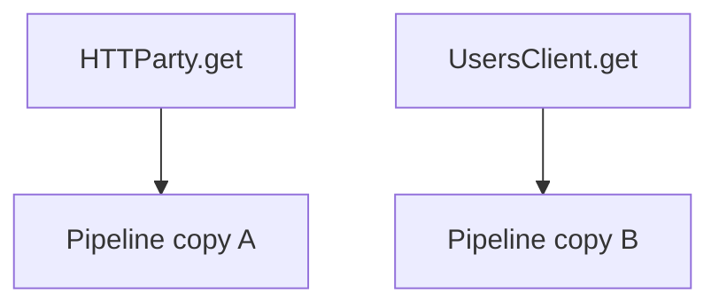
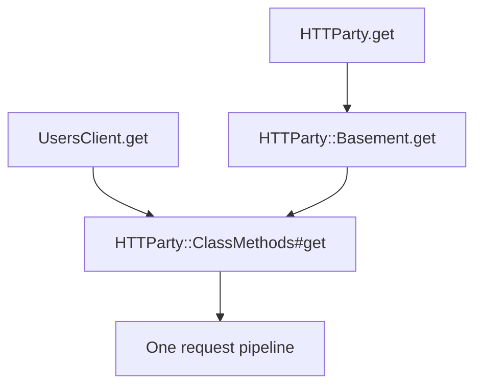
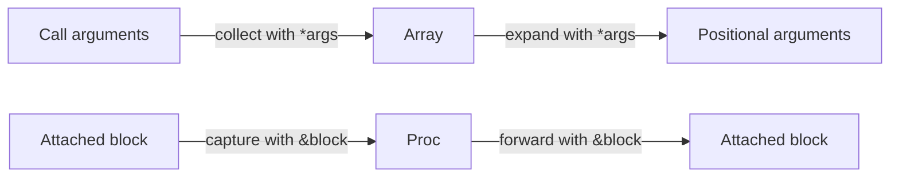
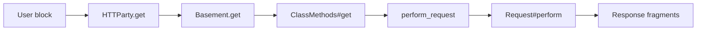
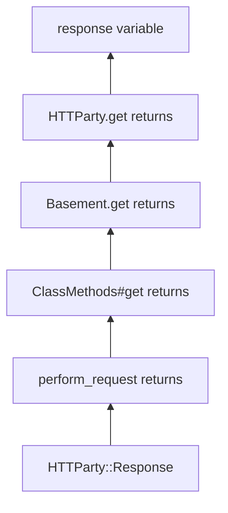

# Chapter 3 — `HTTParty.get`

> **Goal:** Explain why `HTTParty.get(...)` crosses two receivers before request
> construction, and prove that its arguments, block, and return value survive
> the delegation.

## 3.1 Problem Solver — one feature, two public styles

HTTParty offers two ways to make the same kind of request:

```ruby
# Direct convenience API
HTTParty.get("https://api.example.com/users/1")
```

```ruby
# Reusable configured client
class UsersClient
  include HTTParty
  base_uri "https://api.example.com"
  headers "Accept" => "application/json"
end

UsersClient.get("/users/1")
```

The underlying problem is not merely “provide a `.get` method.” It is:

> **How can a module-level shortcut and user-defined client classes share one
> configurable request pipeline?**

A naive design could implement both paths independently:



That creates two places for behavior to diverge. HTTParty instead funnels both
styles into the class-level API:



## 3.2 There are two different `.get` definitions

The source contains two relevant methods with the same name:

| Method | Receiver | Role |
|---|---|---|
| `HTTParty.get` | The `HTTParty` module object | Public convenience facade |
| `ClassMethods#get` | A class extended with `HTTParty::ClassMethods` | Select HTTP method and enter the pipeline |

They are not overloads. Ruby selects methods by **receiver and method lookup**.

```ruby
HTTParty.get(...)
# receiver: HTTParty
```

```ruby
HTTParty::Basement.get(...)
# receiver: HTTParty::Basement
```

The method name is identical, but the receiver changed.

## 3.3 Stage 1 — the facade captures the call

The module-level method has this conceptual shape:

```ruby
def self.get(*args, &block)
  Basement.get(*args, &block)
end
```

Three Ruby features do almost all the work:

| Syntax | Meaning at definition | Value in this design |
|---|---|---|
| `self.get` | Define a singleton method on the module object | Enables `HTTParty.get` |
| `*args` | Collect positional arguments into an array | Keeps the facade independent of the detailed signature |
| `&block` | Capture an attached block as a `Proc`-like object | Preserves streaming behavior |

Suppose the user calls:

```ruby
HTTParty.get(url, headers: { "Accept" => "application/json" }) do |fragment|
  consume(fragment)
end
```

Inside the facade, the values are conceptually:

```text
args
├── [0] URL string
└── [1] options Hash

block
└── callable body that accepts a fragment
```

HTTParty's options are a positional Hash, not a declared `**keywords` parameter.
The call syntax looks keyword-like, but the downstream `.get` signature receives
that data as its `options` Hash.

## 3.4 Stage 2 — splatting reconstructs the call

The same `*` symbol performs the reverse operation at the call site:

```ruby
Basement.get(*args, &block)
```



| Position | Operation | Example |
|---|---|---|
| Method definition | `*args` collects | `("/users", {timeout: 5})` → array |
| Method invocation | `*args` expands | array → `("/users", {timeout: 5})` |
| Method definition | `&block` captures | attached block → callable object |
| Method invocation | `&block` forwards | callable object → attached block |

The facade does not need to understand the path, options, or streamed fragments.
Its contract is **transparent forwarding**.

## 3.5 Why the block must be forwarded explicitly

Ruby blocks are associated with a method call, but they are not ordinary
positional arguments.

This wrapper loses the caller's block:

```ruby
def self.get(*args)
  Basement.get(*args)
end
```

This wrapper preserves it:

```ruby
def self.get(*args, &block)
  Basement.get(*args, &block)
end
```

That matters because HTTParty uses the block form for response-body streaming.
The block travels through several layers until `Request#perform` uses it while
reading response fragments.



The module facade does not perform streaming; it preserves the capability by
not dropping the block.

## 3.6 Stage 3 — why delegate to `Basement`?

`Basement` is a small internal class:

```ruby
class Basement
  include HTTParty
end
```

Including `HTTParty` causes the class to receive the class-level DSL, including
`.get`, `.post`, `.headers`, `.base_uri`, and configuration state.

For now, treat inclusion as this contract:

```text
plain class
    + include HTTParty
    ↓
configurable HTTP client class
```

Chapter 4 will unpack the `included` hook, `extend`, and method lookup that make
this happen.

### `Basement` as the default client

The direct API still needs some object to own class-level defaults. `Basement`
fills that role:

```text
HTTParty module
    │ facade
    ▼
Basement class
    │ owns default_options/default_cookies
    ▼
shared ClassMethods request pipeline
```

The name “Basement” signals that it is infrastructure underneath the public
facade. The name itself has no special meaning in Ruby.

## 3.7 Stage 4 — the real `.get` chooses `Net::HTTP::Get`

After delegation, Ruby finds `.get` supplied by `HTTParty::ClassMethods`. Its
conceptual responsibility is narrow:

```ruby
def get(path, options = {}, &block)
  perform_request(Net::HTTP::Get, path, options, &block)
end
```

It translates a friendly HTTP verb method into a `Net::HTTP` request class:

```text
.get   → Net::HTTP::Get
.post  → Net::HTTP::Post
.patch → Net::HTTP::Patch
.put   → Net::HTTP::Put
```

This means `.get` does not build the URI, open a connection, send data, or parse
the response. It selects a method representation and forwards the work.

## 3.8 Return-value transparency

Neither facade adds an explicit `return`. In Ruby, a method returns the value of
its final evaluated expression.



Therefore the wrapper preserves three channels:

| Channel | Direction | Mechanism |
|---|---|---|
| Arguments | Caller → pipeline | `*args` collection and expansion |
| Block | Caller → pipeline | `&block` capture and forwarding |
| Return value | Pipeline → caller | Ruby's last-expression return |

Transparent delegation means all three survive.

## 3.9 Ruby lens — module object versus included behavior

The same module participates in two different ways:

```text
HTTParty as an object
└── owns singleton method HTTParty.get

HTTParty as an includable module
└── runs inclusion behavior for Basement and user client classes
```

These should not be collapsed into one mental box.

### Ask Ruby who owns the methods

After loading HTTParty:

```ruby
puts HTTParty.method(:get).owner
puts HTTParty::Basement.method(:get).owner
```

Expected conceptual result:

```text
HTTParty.get owner:           singleton class of HTTParty
HTTParty::Basement.get owner: HTTParty::ClassMethods
```

`method.owner` answers **where lookup found the implementation**, not which
object received the call.

| Question | Ruby tool |
|---|---|
| Which object receives this call? | Read the expression to the left of `.` |
| Which module/class supplied the implementation? | `object.method(:name).owner` |
| Where is the Ruby implementation located? | `object.method(:name).source_location` |
| What lookup chain applies to a class's instances? | `klass.ancestors` |
| What lookup chain applies to class methods? | Inspect `klass.singleton_class.ancestors` |

## 3.10 Experiment — rebuild the facade without HTTP

The runnable example isolates delegation from networking:

[Chapter 3 facade example](../examples/03_facade_and_forwarding.rb)

Run it with:

```bash
ruby examples/03_facade_and_forwarding.rb
```

It demonstrates:

- A module singleton method.
- An internal default client class.
- `include` plus `extend`.
- Positional argument collection and expansion.
- Block capture and forwarding.
- Method ownership.
- Return-value propagation.

Because there is no HTTP request, every observed effect belongs to Ruby's object
and method model.

## 3.11 Experiment — break one forwarding channel

Modify only one piece at a time:

| Mutation | Prediction to make first | Behavior to observe |
|---|---|---|
| Remove `*` from `Basement.get(*args)` | How many arguments reach `.get`? | The array becomes one positional argument |
| Remove `&block` from facade definition | Can the facade capture the block? | Downstream method receives no block |
| Capture but do not forward the block | Where does the block stop? | Facade has it; downstream does not |
| Add a literal after the delegated call | What does facade return? | Literal replaces the downstream return value |
| Call `ClassMethods.get` directly | Is it a module singleton method? | Module instance methods are not automatically module methods |

Restore the example after each experiment.

## 3.12 Trade-offs of this facade

| Benefit | Cost |
|---|---|
| One implementation pipeline | Extra call frame in traces |
| Direct API and client classes stay consistent | `Basement` is initially surprising |
| Facade tolerates downstream signature evolution | `*args` communicates less than an explicit signature |
| Streaming block remains supported | Block forwarding must be preserved through every layer |
| Default configuration has a class owner | Module-level global-like state needs careful reasoning |

Modern Ruby also offers anonymous forwarding syntax (`...`) in some delegation
designs. HTTParty v0.24.2 uses explicit `*args, &block`, which makes the two
forwarded channels visible and fits its options-Hash API.

## 3.13 Mental sandbox

Predict before checking:

1. What is the receiver of `HTTParty.get`?
2. What is the receiver after the facade delegates?
3. Why does `Basement` have `.get` even though its class body does not define it?
4. What value does `*args` hold for `HTTParty.get(url, timeout: 5)`?
5. Is an attached block stored inside that `args` array?
6. What breaks if the facade forwards arguments but not the block?
7. Why does `HTTParty.get` return the response without an explicit `return`?
8. What is the difference between a method's receiver and its owner?

## 3.14 Build It — add a direct `MiniParty.get` facade

Assume Chapter 2 produced:

```ruby
MiniParty::Client.get(path, options = {}, &block)
```

Add a convenience API:

```ruby
MiniParty.get(path, options = {}, &block)
```

Constraints:

- It must delegate to one internal default client.
- It must not duplicate request construction.
- It must preserve an optional streaming block.
- It must return the exact object returned by the internal client.
- Write a fake internal client test so no network request is required.

Test the three channels separately:

```text
arguments arrive unchanged
block is invoked downstream
return object has identical object_id
```

## 3.15 Teach-back checkpoint

You are ready for Chapter 4 when you can explain:

1. Why HTTParty contains two `.get` definitions.
2. Why the module-level definition uses flexible forwarding.
3. How `*args` differs between a method definition and a method call.
4. Why `&block` is needed in both places.
5. Why `Basement` exists.
6. How the final response travels back through the facade unchanged.

In one sentence:

> **`HTTParty.get` is a transparent facade that forwards arguments and a block
> to an internal configurable client, allowing the direct API and included-client
> API to share one request implementation.**

## Primary sources

- [HTTParty v0.24.2 module facade and `Basement`](https://github.com/jnunemaker/httparty/blob/v0.24.2/lib/httparty.rb#L649-L691)
- [HTTParty v0.24.2 `ClassMethods#get`](https://github.com/jnunemaker/httparty/blob/v0.24.2/lib/httparty.rb#L530-L534)
- [HTTParty v0.24.2 request entry](https://github.com/jnunemaker/httparty/blob/v0.24.2/lib/httparty.rb#L599-L622)
