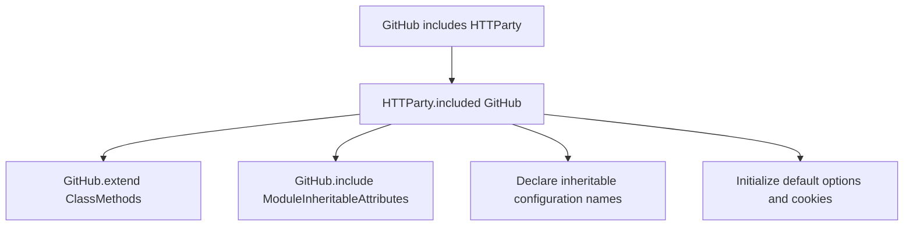

# Chapter 4 — `include HTTParty`

> **Goal:** Explain how a plain class receives HTTParty’s class-level DSL.

## Problem Solver

Ruby’s normal `include` adds a module’s instance methods to instances of the
including class. HTTParty needs a different public shape:

```ruby
class GitHub
  include HTTParty
  base_uri "https://api.github.com"
end

GitHub.get("/users/octocat")
```

`base_uri` and `get` must be callable on the **class**, not on `GitHub.new`.

## Under the hood

Ruby invokes `HTTParty.included(GitHub)`. The hook performs four jobs:



`extend ClassMethods` inserts that module into the singleton class’s lookup
chain:

```text
GitHub singleton class
        ↓
HTTParty::ClassMethods
        ↓
Class / Module / Object...
```

Therefore `GitHub.get` has:

| Property | Value |
|---|---|
| Receiver | `GitHub` |
| Method owner | `HTTParty::ClassMethods` |
| Configuration owner | Class instance variables on `GitHub` |

`ModuleInheritableAttributes` is included into the class so its own inclusion
hook can extend the class with inheritance helpers. This is module composition:

```text
HTTParty inclusion
└── installs HTTP DSL
└── installs configuration-inheritance mechanism
```

## Ruby lens

| Operation | Adds methods to | Typical call |
|---|---|---|
| `include M` | Instances of the receiver class | `object.method` |
| `extend M` | The receiver object itself | `receiver.method` |

A class is also an object, so extending a class adds callable class methods.

Inspect it:

```ruby
p GitHub.singleton_class.ancestors
p GitHub.method(:get).owner
p GitHub.method(:base_uri).owner
```

## Design trade-offs

| Benefit | Cost |
|---|---|
| Small declarative client classes | Behavior arrives indirectly through a hook |
| One DSL shared by all clients | Method conflicts are possible |
| Per-class configuration | Requires custom inheritance semantics |
| No client instance required | Class-level mutable state must be controlled |

## Mental sandbox

1. What would change if HTTParty used `base.include ClassMethods`?
2. Why is `GitHub.method(:get).owner` not `GitHub`?
3. Which lookup chain should you inspect for `GitHub.get`?
4. What happens if the class already defines its own `.get` before inclusion?

## Build It

Create `MiniParty::ClassMethods#get` and an `included` hook that extends the
including class. Prove:

```ruby
Client.method(:get).owner == MiniParty::ClassMethods
```

## Teach-back

> `include HTTParty` runs a hook that extends the class with the HTTP DSL and
> installs a second module responsible for inheritable class configuration.

## Primary source

- [HTTParty inclusion hook](https://github.com/jnunemaker/httparty/blob/v0.24.2/lib/httparty.rb#L20-L30)
- [ModuleInheritableAttributes](https://github.com/jnunemaker/httparty/blob/v0.24.2/lib/httparty/module_inheritable_attributes.rb)

