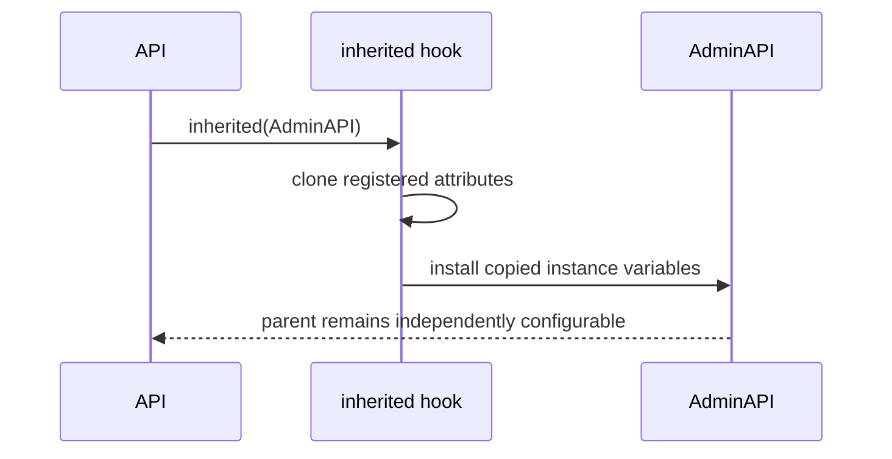

# Chapter 5 — Class Configuration

> **Goal:** Trace where client defaults live and how subclasses inherit without
> blindly sharing one mutable Hash.

## Problem Solver

A client class should define reusable policy:

```ruby
class API
  include HTTParty
  base_uri "https://api.example.com"
  headers "Accept" => "application/json"
end
```

A subclass should start with those defaults but remain configurable:

```ruby
class AdminAPI < API
  headers "X-Role" => "admin"
end
```

Sharing the same Hash would let a child mutate its parent. Copying nothing would
lose inherited behavior.

## Storage model

HTTParty stores configuration in class instance variables:

```text
API class object
├── @default_options
└── @default_cookies
```

These are not Ruby class variables (`@@name`). Class instance variables belong
to one class object and do not automatically participate in inheritance.

`mattr_inheritable` creates singleton accessors and records which attributes
must be copied when Ruby calls the `inherited(subclass)` hook.



## Merge semantics

The dynamically defined child getter combines the superclass value with the
child’s duplicate:

```text
superclass defaults.merge(child defaults)
```

Child keys win. Before each request, `build_request` calls `hash_deep_dup` again
so request-level mutation is less likely to change class configuration.

The duplication is intentionally limited:

| Value type | Duplication behavior |
|---|---|
| Hash | Recursively duplicated |
| Proc | Duplicated |
| Other object | Reference retained |

Arrays and arbitrary mutable objects can therefore remain shared. “Deep dup” is
the method name, not a universal object-graph clone guarantee.

## Configuration DSL

Most DSL methods mutate `default_options`:

| DSL call | Stored option |
|---|---|
| `base_uri value` | `:base_uri` |
| `headers hash` | nested `:headers` Hash |
| `default_params hash` | nested `:default_params` Hash |
| `basic_auth user, pass` | credential Hash |
| `format :json` | `:format` and parser policy |
| timeout methods | timeout keys |
| `connection_adapter` | adapter and adapter options |

## Trade-offs

| Choice | Advantage | Risk |
|---|---|---|
| Class instance variables | Per-client namespace | Custom inheritance required |
| Copy on inheritance/request | Reduces accidental mutation | Allocation and incomplete deep copy |
| Mutable DSL | Concise configuration | Order and concurrent mutation matter |
| Dynamic getter generation | Flexible inheritance merge | Harder debugging and static analysis |

Configure clients during boot, not concurrently while requests are running.

## Experiments

Create parent and child clients, then compare:

```ruby
p Parent.default_options.object_id
p Child.default_options.object_id
p Parent.default_options[:headers].object_id
p Child.default_options[:headers].object_id
```

Mutate only the child header Hash and verify the parent. Repeat with an Array
stored in a custom option and explain any different outcome.

## Mental sandbox

1. Why not use one global HTTParty configuration Hash?
2. When does Ruby invoke `inherited`?
3. Which side wins when parent and child define the same option?
4. Why can a method called `hash_deep_dup` still share an Array?

## Build It

Give `MiniParty` class instance-variable configuration and an `inherited` hook.
Write tests for parent defaults, child overrides, nested Hash isolation, and the
documented behavior of unsupported mutable values.

## Teach-back

> HTTParty models configuration as per-class state, then explicitly copies and
> merges that state at subclass and request boundaries.

## Primary source

- [Configuration DSL](https://github.com/jnunemaker/httparty/blob/v0.24.2/lib/httparty.rb#L64-L518)
- [Inheritance implementation](https://github.com/jnunemaker/httparty/blob/v0.24.2/lib/httparty/module_inheritable_attributes.rb)

