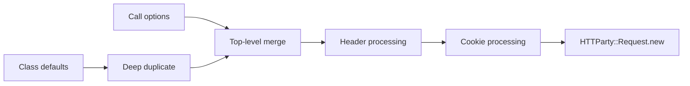

# Chapter 6 — From `get` to `Request.new`

> **Goal:** Explain option precedence and the exact output of `build_request`.

## Lifecycle position



`ClassMethods#get` selects `Net::HTTP::Get`; `perform_request` then composes
`build_request(...).perform`.

## Precedence rules

At the top level:

```text
duplicated defaults.merge(call options)
```

So per-request values win for identical keys. Two nested policies receive
special processing afterward:

| Policy | Merge behavior |
|---|---|
| Headers | Class headers merge with request headers; request values win |
| Cookies | Class cookies merge with request cookies and become one header |

This matters because normal `Hash#merge` at the top level would replace an
entire nested header Hash.

## Output contract

`build_request` returns an unperformed `HTTParty::Request`:

```ruby
request = Client.build_request(Net::HTTP::Get, "/users", timeout: 2)
```

At this point:

| Exists | Does not yet exist |
|---|---|
| Parsed/normalized path | Open socket |
| Merged option policy | HTTP response |
| HTTP method class | Parsed body |
| Parser/adapter defaults | Completed `Net::HTTPRequest` body |

Separating build from perform creates an inspection and testing seam.

## Request initialization

`Request#initialize` adds request-specific defaults such as redirect limit,
parser, URI adapter, and connection adapter; caller/configured values override
them. It then assigns `path`, which parses strings through the URI adapter.

```text
ClassMethods defaults
    + per-call overrides
    + Request intrinsic defaults
    → request.options
```

## Trade-offs

| Benefit | Cost |
|---|---|
| One option Hash crosses the pipeline | Weak schema; invalid combinations fail later |
| Per-call overrides are simple | Nested merge behavior is non-uniform |
| Request can be inspected before I/O | Object remains mutable |
| Adapters/parsers are injectable | Many behaviors become implicit option keys |

## Experiments

Build without performing:

```ruby
request = Client.build_request(
  Net::HTTP::Get,
  "/users",
  headers: { "X-Request" => "42" },
  timeout: 1
)

p request.class
p request.path
p request.options
```

Confirm class defaults remain unchanged after mutating `request.options`.

## Mental sandbox

1. Why duplicate defaults before merging?
2. Why do headers need a dedicated processor?
3. Which wins: class timeout or request timeout?
4. Has any network work occurred when `build_request` returns?

## Build It

Implement `MiniParty.build_request` with explicit precedence tests. Keep building
pure with respect to network I/O, and expose the resulting request options for
inspection.

## Teach-back

> `build_request` snapshots class policy, applies call-specific overrides and
> nested header/cookie rules, then creates the higher-level request orchestrator.

## Primary source

- [`build_request` and `perform_request`](https://github.com/jnunemaker/httparty/blob/v0.24.2/lib/httparty.rb#L599-L628)
- [`Request#initialize`](https://github.com/jnunemaker/httparty/blob/v0.24.2/lib/httparty/request.rb#L61-L90)

