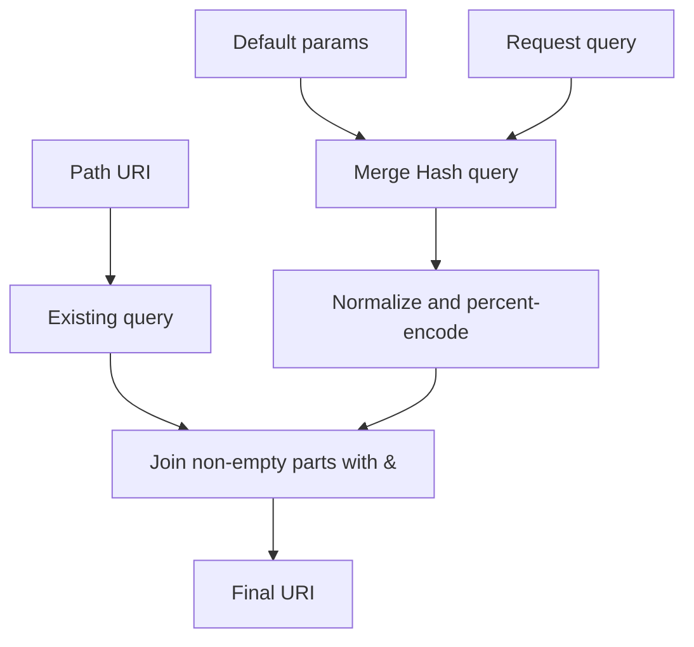

# Chapter 7 — Construct the URI

> **Goal:** Trace how base URI, path, embedded query, defaults, and caller query
> become the final request URI.

## Inputs

```ruby
class API
  include HTTParty
  base_uri "https://api.example.com/v1"
  default_params locale: "en"
end

API.get("/users?active=true", query: { page: 2 })
```

The URI builder must combine values without confusing syntax with data.

## Path normalization

`Request#path=` accepts either the configured URI adapter’s object or a String.
Strings are parsed and normalized. Other objects raise `ArgumentError`.

`Request#uri` distinguishes:

| Path form | Example | Resolution |
|---|---|---|
| Absolute | `https://x.test/a` | Use its own origin |
| Relative | `/users` | Join with configured base URI |
| Network-path reference | `//x.test/a` | Reuse prior/configured scheme |
| Redirect-relative filename | `next.json` | Resolve relative to last path |

## Query construction

For a Hash query, the effective order is:

```text
query already embedded in path
    + normalize(default_params merged with request query)
```

Request query values win over default parameters with the same key. String
queries are appended more literally.

HTTParty’s default Hash conversion uses bracket notation for arrays/nesting:

```text
filters[status]=open&ids[]=1&ids[]=2
```

Alternative normalizers include the non-Rails repeated-key style and JSON:API’s
comma-separated array style. A custom callable can replace normalization.



## Security boundary

When `base_uri` is configured, `validate_uri_safety!` rejects an absolute or
network-relative URI whose host differs from the configured host, unless the
caller explicitly disables validation.

```text
trusted base host ≠ requested absolute host → UnsafeURIError
```

This guards against accidental credential/header transmission to an unintended
host—a server-side request forgery and secret-leak boundary.

## URI versus request target

The final URI contains origin information. `request_uri(uri)` extracts the
origin-form target (`path?query`) for `Net::HTTPRequest`.

| Used by connection | Used by request line |
|---|---|
| host, port, scheme | path and query |

## Trade-offs

| Choice | Benefit | Risk |
|---|---|---|
| Flexible String/URI input | Convenient API | Many resolution branches |
| Default parameters | Central API keys/locales | Hidden query data |
| Pluggable normalizer | API compatibility | Caller must preserve encoding correctness |
| Host safety validation | Reduces secret leakage | Cross-host absolute calls require explicit opt-out |

## Experiments

Call `request.uri` twice and confirm parameters are not duplicated. Compare:

```ruby
query: { ids: [1, 2] }
query: "ids=1&ids=2"
```

Then configure a trusted base and try an absolute URI with another host.

## Mental sandbox

1. Which query wins when `default_params` and `query` share a key?
2. Why must fragments be absent from the request target?
3. Why validate the host before redirects but handle redirect hosts separately?
4. What obligation does a custom normalizer assume?

## Build It

Add base URI, default parameters, encoded Hash queries, and same-host validation
to `MiniParty`. Test reserved characters, arrays, existing queries, and a
cross-host absolute URL.

## Teach-back

> URI construction is policy: resolve location, merge parameter sources,
> percent-encode data, validate the destination, then extract the request target.

## Primary source

- [`Request#uri` and query building](https://github.com/jnunemaker/httparty/blob/v0.24.2/lib/httparty/request.rb#L79-L139)
- [HashConversions](https://github.com/jnunemaker/httparty/blob/v0.24.2/lib/httparty/hash_conversions.rb)
- [URI safety validation](https://github.com/jnunemaker/httparty/blob/v0.24.2/lib/httparty/request.rb#L448-L463)
