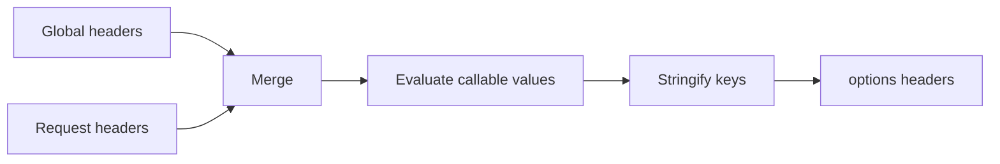

# Chapter 8 — Construct Headers and Cookies

> **Goal:** Explain header precedence, dynamic values, key normalization, and
> cookie serialization.

## Header sources

```text
class headers
    + request headers
    + generated Cookie header
    + later protocol/body/auth headers
```

`HeadersProcessor` runs during `build_request`. If request headers exist, class
headers merge first and request values win.

## Dynamic headers

A header value may be callable:

```ruby
headers "Authorization" => -> { "Bearer #{token}" }
headers "X-Path" => ->(options) { options[:query].inspect }
```

Arity controls invocation:

| Callable arity | Invocation |
|---:|---|
| `0` | Called with no arguments |
| Nonzero | Called with the merged request options |

Dynamic evaluation happens per request, after class/call options are combined.
The processor then stringifies header keys.



## Cookies

`CookieHash` accepts a Hash or a semicolon-separated String. Request cookies
override same-named defaults, then `to_cookie_string` emits pairs joined by
`; `.

Cookie attributes such as `path`, `domain`, `expires`, `secure`, `httponly`, and
`samesite` are excluded from the outgoing `Cookie` header. Those attributes
describe storage/scope; the request header sends cookie name-value pairs.

## HTTP lens

HTTP field names are case-insensitive, but Ruby Hash keys are not. HTTParty
stringifies keys here; later `Net::HTTPHeader` provides case-insensitive access.
Choose one spelling convention in application code to reduce ambiguity.

Never log authorization or cookie values indiscriminately. Dynamic headers can
also capture secrets in closures, so inspect configuration cautiously.

## Trade-offs

| Feature | Benefit | Risk |
|---|---|---|
| Request headers override defaults | Local control | A request can remove policy accidentally |
| Callable headers | Fresh tokens/signatures | Hidden work and exceptions during building |
| Options passed to callable | Context-aware value | Callable becomes coupled to internal option shape |
| Simple CookieHash | Convenient merging | Not a complete browser cookie jar |

## Experiments

Create a zero-arity token lambda and one-arity request lambda. Count calls to
prove they execute once per build. Test a Symbol key and mixed-case lookup on
the final raw request.

## Mental sandbox

1. When class and request headers share a name, which wins?
2. Why execute dynamic headers after merging options?
3. Why should `Path=/` not be sent as a cookie pair?
4. Is `CookieHash` enforcing all browser cookie rules?

## Build It

Add static/dynamic headers and cookie merging to `MiniParty`. Test precedence,
arity, key stringification, and the exclusion of cookie attributes.

## Teach-back

> Header construction combines configuration layers, evaluates request-time
> callables, normalizes keys, and serializes cookie state into protocol fields.

## Primary source

- [HeadersProcessor](https://github.com/jnunemaker/httparty/blob/v0.24.2/lib/httparty/headers_processor.rb)
- [CookieHash](https://github.com/jnunemaker/httparty/blob/v0.24.2/lib/httparty/cookie_hash.rb)
- [Header/cookie DSL](https://github.com/jnunemaker/httparty/blob/v0.24.2/lib/httparty.rb#L241-L253)

