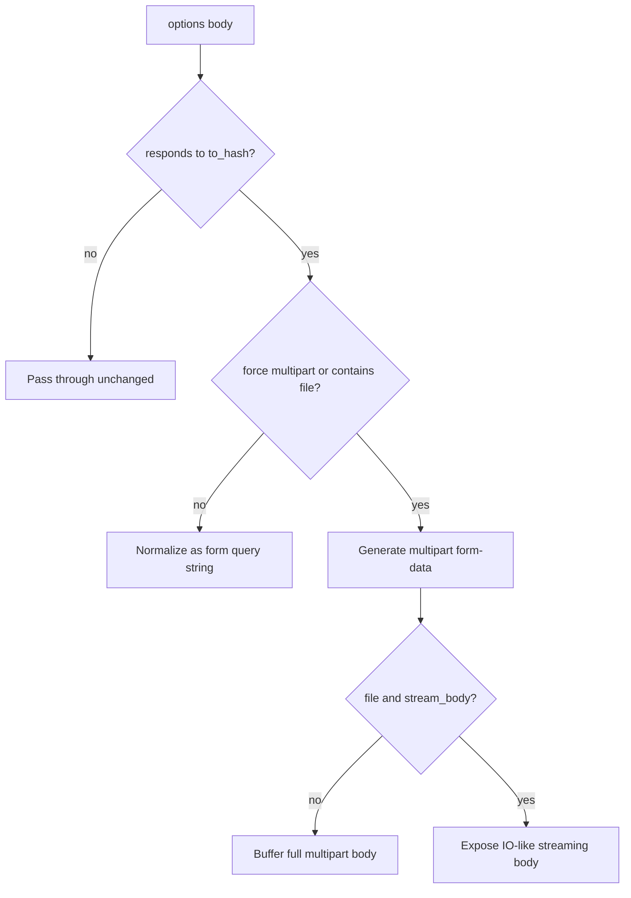

# Chapter 9 — Construct the Body

> **Goal:** Predict whether a supplied body is passed through, form-encoded,
> buffered as multipart, or streamed.

## Decision tree



## Body representations

| Input | Representation | Default content type behavior |
|---|---|---|
| String/other object | Used as supplied | Caller should specify type |
| Hash without file | URL-encoded form | Set form content type if absent |
| Hash containing file-like value | Multipart form-data | Set type with generated boundary |
| Hash plus `multipart: true` | Multipart even without file | Set multipart type |

A file is detected by duck typing: it responds to `path` and `read`. Uploaded
file wrappers may supply `original_filename` and `content_type`; otherwise the
implementation derives them from the path and MIME lookup.

## Multipart anatomy

```text
--boundary\r\n
Content-Disposition: form-data; name="avatar"; filename="me.png"\r\n
Content-Type: image/png\r\n
\r\n
<binary bytes>\r\n
--boundary--\r\n
```

The boundary must match the `Content-Type` header. Filenames escape quote and
line-break characters to prevent malformed part headers. Binary strings are
used so file bytes and UTF-8 text can be combined without transcoding damage.

## Buffering versus streaming

By default, multipart data is assembled into one in-memory String for backward
compatibility. With `stream_body: true` and a file, `StreamingMultipartBody`
implements `read`, `size`, and `rewind`, reading files in bounded chunks.

| Mode | Memory | Complexity | Retry requirement |
|---|---:|---:|---|
| Buffered | Proportional to body size | Lower | String can be resent |
| Streaming | Bounded chunks | Higher state machine | Stream must rewind correctly |

## Ruby lens

The body encoder uses protocols rather than concrete classes:

```text
to_hash → structured fields
to_ary  → repeated values
path + read → file-like
read + rewind + size → stream-like
```

This is powerful duck typing, but accidental protocol matches are possible.

## Experiments

Construct `Request::Body` with a String, simple Hash, nested Array, temporary
file, and `force_multipart`. Compare `multipart?`, `streaming?`, `call`, and
`to_stream`. Verify buffered and streamed multipart bytes are equivalent.

## Mental sandbox

1. Why can’t multipart use an arbitrary boundary in the header only?
2. Why rewind a file after buffered reading?
3. When should the caller set `Content-Type: application/json`?
4. Why is file streaming opt-in?

## Build It

Give `MiniParty` raw String, JSON, and URL-encoded form bodies first. Add
multipart only after writing byte-level tests for boundaries, CRLF placement,
filenames, and binary data.

## Teach-back

> Body construction chooses a wire representation from Ruby protocols, then
> keeps metadata, bytes, and streaming behavior consistent with that choice.

## Primary source

- [Request::Body](https://github.com/jnunemaker/httparty/blob/v0.24.2/lib/httparty/request/body.rb)
- [StreamingMultipartBody](https://github.com/jnunemaker/httparty/blob/v0.24.2/lib/httparty/request/streaming_multipart_body.rb)
- [`setup_raw_request` body integration](https://github.com/jnunemaker/httparty/blob/v0.24.2/lib/httparty/request.rb#L230-L303)
