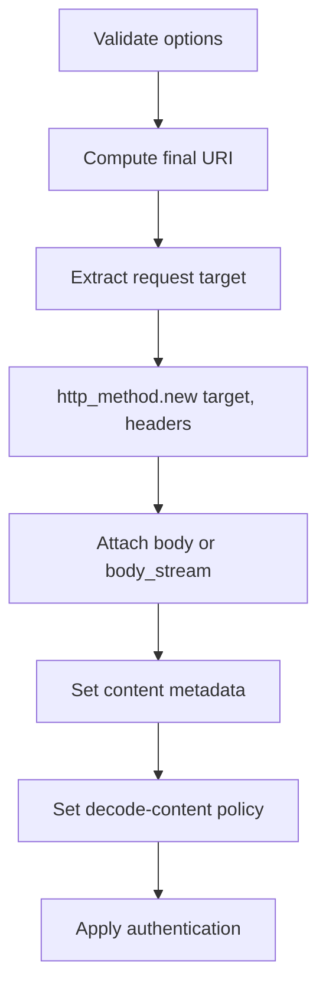

# Chapter 10 — Create the Raw Request

> **Goal:** Explain the final transformation from HTTParty policy to a concrete
> `Net::HTTPRequest` instance.

## Lifecycle boundary

```text
HTTParty::Request (policy/orchestration)
        ↓ setup_raw_request
Net::HTTP::Get/Post/... (transport request)
```

The high-level request knows configuration. The raw request knows what
`Net::HTTP` needs to serialize.

## Construction sequence



The `http_method` value is a class such as `Net::HTTP::Get`. Calling `.new`
produces the corresponding request object without a case statement.

## Validation before I/O

Validation checks redirect limits, supported method classes, Hash-like option
contracts, mutually exclusive Basic/Digest authentication, and POST query
constraints. Failing early prevents opening a connection for an invalid request.

## Request target and headers

`request_uri(uri)` yields the path plus query expected by the HTTP request line.
Headers are supplied to the `Net::HTTPRequest` constructor. `Net::HTTP` later
adds protocol-required fields such as `Host` where appropriate.

## Body integration

| Condition | Raw request mutation |
|---|---|
| `body_stream` supplied | Assign directly |
| Simple Hash body | Encode and set form content type if absent |
| Multipart | Set multipart type with matching boundary |
| Streaming multipart | Assign stream and exact `Content-Length` |
| Other body | Assign encoder result |

## Authentication and decoding

Basic auth calls the request object’s `basic_auth`, which creates an
`Authorization` field. Digest auth is delayed until a `401` challenge provides
nonce/realm information.

HTTParty also sets Net::HTTP’s internal decode-content flag based on
`skip_decompression`. The use of an instance variable reflects integration with
Net::HTTP internals and is therefore a coupling point worth noticing.

## State after setup

```text
@raw_request
├── class: Net::HTTP::Get (for this path)
├── path: /resource?query
├── headers
├── body or body_stream
└── authentication/decode policy
```

No response exists, and the network handoff has not happened.

## Trade-offs

| Choice | Benefit | Cost |
|---|---|---|
| Pass request class through pipeline | Polymorphic verb construction | Tight coupling to Net::HTTP classes |
| Mutate request stepwise | Simple integration | Partially constructed intermediate state |
| Validate first | Fail before network | Some errors remain transport/server dependent |
| Touch Net::HTTP internal flag | Align decompression behavior | Fragile across dependency changes |

## Experiments

Use `build_request`, then invoke private setup only in a learning experiment:

```ruby
request.send(:setup_raw_request)
raw = request.instance_variable_get(:@raw_request)
p [raw.class, raw.path, raw.to_hash, raw.body]
```

Do not make private-state access part of production code.

## Mental sandbox

1. Why carry `Net::HTTP::Get` as a class instead of `"GET"`?
2. Which data belongs to the connection rather than the raw request?
3. Why does Digest auth require an earlier response?
4. What is the risk of setting another library’s internal instance variable?

## Build It

Add `MiniParty::Request#to_net_http_request`. Test its class, target, headers,
body, content type, and Basic auth without opening a socket.

## Teach-back

> `setup_raw_request` commits higher-level policy into the concrete request
> object that Net::HTTP knows how to serialize and send.

## Primary source

- [`setup_raw_request`](https://github.com/jnunemaker/httparty/blob/v0.24.2/lib/httparty/request.rb#L230-L303)
- [`Request#validate`](https://github.com/jnunemaker/httparty/blob/v0.24.2/lib/httparty/request.rb#L414-L433)
