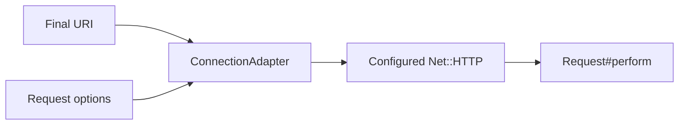

# Chapter 11 — Configure the Connection

> **Goal:** Trace how URI and options become a configured `Net::HTTP` object.

## Adapter boundary

`Request#http` calls:

```text
connection_adapter.call(uri, options)
```

The default `ConnectionAdapter.call` constructs an adapter instance and returns
its `connection`. A custom adapter only needs to return an object compatible
with the `Net::HTTP` interface expected by `Request#perform`.



## Configuration order

The adapter:

1. Cleans the host, including IPv6 bracket handling.
2. Chooses explicit/default port.
3. Constructs direct or proxy-aware `Net::HTTP`.
4. Enables TLS for HTTPS or port 443.
5. Attaches verification and optional client certificates.
6. Applies generic timeout, then phase-specific overrides.
7. Applies retries, debug output, ciphers, and local bind settings.

## Timeout precedence

```text
timeout sets open/read/write
        ↓
open_timeout/read_timeout/write_timeout override individually
```

Only numeric timeout values are applied. `max_retries` must be a non-negative
Integer.

## TLS model

```text
server authentication: verify peer certificate using trust store
client authentication: optionally present PEM or PKCS12 cert/key
```

Verification is enabled by default with the system certificate store. Setting
`verify: false` disables peer verification and weakens identity guarantees; it
should not be a routine production fix.

## Dependency inversion

The adapter is a factory seam:

```ruby
connection_adapter MyAdapter
```

This enables logging, test doubles, alternate connection management, or
instrumentation without changing request construction. The abstraction is
behavioral: the returned object must respond correctly to `request`.

## Trade-offs

| Choice | Benefit | Cost |
|---|---|---|
| New Net::HTTP per adapter call | Isolation and simple ownership | Connection reuse is limited by default |
| One options Hash | Extensible configuration | Adapter silently ignores unknown policy |
| Pluggable adapter | Testability/custom transport | Interface is conventional, not formally typed |
| Secure verification default | Protects server identity | Custom CA environments require setup |

## Experiments

Call the adapter directly and inspect `address`, `port`, `use_ssl?`, timeout
values, and `verify_mode`. Use a fake adapter returning an object with `request`
to prove `Request` depends on an interface, not an exact class.

## Mental sandbox

1. Why does connection configuration not belong in `Net::HTTP::Get`?
2. Which timeout wins when both `timeout` and `read_timeout` exist?
3. What security property disappears with verification disabled?
4. Why might a custom adapter pool connections?

## Build It

Extract `MiniParty::ConnectionAdapter.call(uri, options)`. Test connection
properties without sending a request, including TLS, timeouts, and a fake proxy.

## Teach-back

> The connection adapter converts destination and transport policy into the
> `Net::HTTP` object used at the network boundary.

## Primary source

- [ConnectionAdapter](https://github.com/jnunemaker/httparty/blob/v0.24.2/lib/httparty/connection_adapter.rb)
- [`Request#http`](https://github.com/jnunemaker/httparty/blob/v0.24.2/lib/httparty/request.rb#L202-L204)

