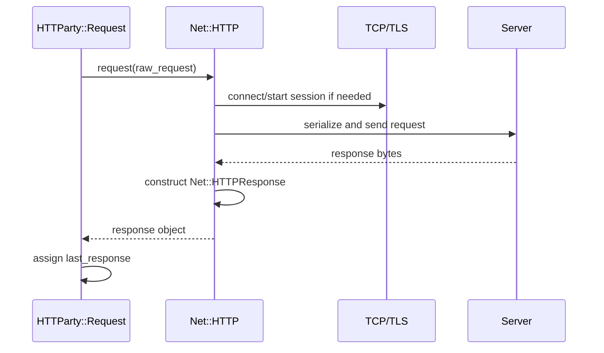

# Chapter 12 — Send and Receive

> **Goal:** Identify the exact transport handoff and the state returned across it.

## The boundary

After validation, raw-request setup, and connection configuration,
`Request#perform` reaches:

```ruby
current_http.request(@raw_request)
```

```text
before call                         after return
-----------                         ------------
Net::HTTP connection       ┐        Net::HTTPResponse subclass
Net::HTTPRequest instance  ┘
```

HTTParty does not serialize the request line, open the TCP socket, perform the
TLS handshake, or parse the HTTP response framing. `Net::HTTP` owns that work.

## Sequence



HTTParty does not explicitly call `start`; `Net::HTTP#request` can start a
single-request session when the connection is not already started.

## Blocking and state

The normal call is synchronous: the calling thread waits until a response or
exception occurs. When it returns, `last_response` becomes input to redirect,
Digest-auth, decompression, format detection, and wrapper construction.

`last_response` is both result and state. Redirect/auth branches can call
`perform` again using the same `HTTParty::Request` object with changed path or
credentials.

## Failure boundary

Transport exceptions matching `COMMON_NETWORK_ERRORS` are rescued around the
exchange. By default HTTParty re-raises the original exception. With `foul`
enabled, it wraps the failure as `HTTParty::NetworkError`.

```text
HTTP 500 → response crossed boundary successfully
timeout  → no complete HTTP response crossed boundary
```

## Trade-offs

| Choice | Benefit | Cost |
|---|---|---|
| Delegate to standard library | Mature protocol implementation | Net::HTTP behavior leaks through abstraction |
| Synchronous request | Simple control flow | Calling thread is occupied |
| Store last response | Enables multi-exchange flows | Request object becomes stateful/non-reentrant |
| Optional exception wrapping | Unified library error | May hide original exception type if enabled |

## Experiments

Inject a fake connection adapter whose `request` records the raw request and
returns a fabricated `Net::HTTPOK`. This proves everything before the boundary
without networking. Then make it raise `Net::ReadTimeout` and compare foul mode.

## Mental sandbox

1. At what exact method do Ruby request objects become transport work?
2. Why is a `404` not rescued as a network error?
3. Who creates `Net::HTTPResponse`?
4. Why can storing `last_response` complicate concurrent reuse?

## Build It

Make `MiniParty::Request#perform` accept an adapter. Test success and timeout
using fakes, and keep the single transport call visually obvious.

## Teach-back

> `Net::HTTP#request` is the ownership boundary: HTTParty supplies configured
> objects and receives either a response object or a transport exception.

## Primary source

- [`Request#perform`](https://github.com/jnunemaker/httparty/blob/v0.24.2/lib/httparty/request.rb#L152-L180)
- [Ruby Net::HTTP](https://docs.ruby-lang.org/en/3.4/Net/HTTP.html)

