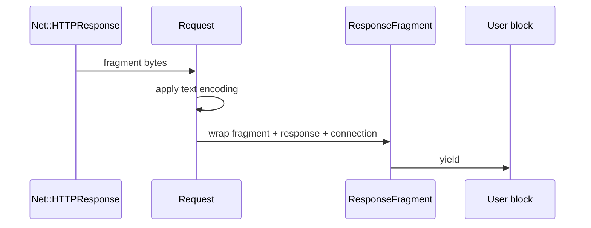

# Chapter 13 — Stream the Response Body

> **Goal:** Explain how a caller consumes fragments before the entire body is
> available and how `stream_body` changes memory behavior.

## Two consumption modes

| Call style | Body behavior |
|---|---|
| No block | Net::HTTP supplies the completed body normally |
| Block supplied | HTTParty calls `read_body` and yields encoded fragments |

Inside the block path, each fragment is wrapped as `ResponseFragment` and sent
to the user block.



## `ResponseFragment`

The fragment subclasses `SimpleDelegator`, delegating String-like behavior to
the fragment while exposing:

| Method | Meaning |
|---|---|
| String methods | Operate on fragment content |
| `code` | Integer response status |
| `http_response` | Underlying response object |
| `connection` | Current connection object |

This is a value-plus-context wrapper.

## Accumulation policy

With a block, HTTParty normally appends encoded fragments to an array and joins
them so the final wrapper still has a complete body. With `stream_body: true`,
fragments are yielded but not accumulated.

```text
default block mode: network → yield + retain → complete body
stream_body true:   network → yield only      → bounded client memory
```

Streaming transfers responsibility: the caller must write/process every chunk,
handle partial output on failure, and avoid retaining all fragments elsewhere.

## Backpressure and parsing

The user block executes synchronously during `read_body`; slow work delays
further reads. That provides natural backpressure but ties processing time to
the connection. Full-document parsers such as JSON usually cannot produce the
normal parsed value from arbitrary fragments without a streaming parser.

## Trade-offs

| Mode | Strength | Risk |
|---|---|---|
| Buffer all | Simple parsing/retry | Memory proportional to body |
| Yield and accumulate | Progress callbacks plus final body | Still uses full memory |
| Yield without accumulate | Large-download safety | Caller owns persistence and partial failure |

## Experiments

Download a known-size resource with a block. Count fragment sizes and compare
their sum to final body size with `stream_body` false and true. Add a slow block
and observe total request duration.

## Mental sandbox

1. Does using a block automatically guarantee low memory?
2. Why wrap a String fragment instead of yielding three arguments?
3. What happens to a partially written file after timeout?
4. Why is ordinary `JSON.parse` poorly matched to arbitrary chunks?

## Build It

Add optional response streaming to `MiniParty`. Yield a fragment object with
status/context and test that non-accumulating mode does not retain chunks.

## Teach-back

> Response streaming moves body ownership from the client library to a
> synchronous fragment consumer; memory savings occur only when accumulation is disabled.

## Primary source

- [Streaming path in `Request#perform`](https://github.com/jnunemaker/httparty/blob/v0.24.2/lib/httparty/request.rb#L152-L174)
- [ResponseFragment](https://github.com/jnunemaker/httparty/blob/v0.24.2/lib/httparty/response_fragment.rb)

