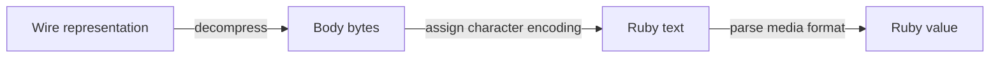

# Chapter 14 — Normalize Response Bytes

> **Goal:** Distinguish content encoding, character encoding, and parsing.

## Three transformations



| Layer | Header/input | Example |
|---|---|---|
| Content encoding | `Content-Encoding` | gzip, br, zstd |
| Character encoding | `charset` parameter in `Content-Type` | UTF-8, UTF-16LE |
| Media parsing | MIME type or explicit format | JSON, XML, CSV |

These layers are independent. “Encoding” is not one operation.

## Decompression split

Net::HTTP handles gzip/deflate when its decode-content behavior is enabled.
HTTParty’s `Decompressor` handles identity/none and optional Brotli, LZW, or
Zstandard support when their libraries are available.

Unsupported or failed optional decompression returns `nil`, which means the
parser receives no normalized body for that encoding.

## Raw body versus parser body

`handle_response` maintains two related values:

```text
raw_body → what wrapper may expose
body     → decompressed/encoded input captured by parser lambda
```

Normally successful decompression replaces the exposed body and removes the
`Content-Encoding` header. With `skip_decompression`, the response can expose
the original encoded body while the parsing lambda still holds the separately
processed `body`. This distinction is visible in the specs and deserves explicit
tests in callers relying on raw bytes.

## Character encoding

`TextEncoder` duplicates the text (so frozen input is safe), extracts `charset`,
and uses `force_encoding`. This labels bytes with a Ruby encoding; it does not
necessarily transcode them to UTF-8.

UTF-16 byte-order marks choose LE/BE. Without a mark, an option selects the
assumption. Unknown charset names leave the text unchanged.

## Trade-offs

| Choice | Benefit | Cost |
|---|---|---|
| Layered normalization | Each concern isolated | Raw/exposed/parser bodies can differ |
| Optional codecs | Small core dependency set | Unsupported encoding may yield nil |
| `force_encoding` | Avoids unnecessary byte conversion | Incorrect server charset gives mislabeled text |
| Remove encoding header after decode | Metadata matches body | Original transport metadata is lost |

## Experiments

Construct responses with `identity`, unknown encoding, and a stubbed Brotli
decoder. Compare `response.body`, headers, and `parsed_response`. Test quoted
charset, unknown charset, and UTF-16 with/without byte-order mark.

## Mental sandbox

1. Why must decompression precede JSON parsing?
2. Does `force_encoding("UTF-8")` change bytes?
3. When should `Content-Encoding` be removed?
4. How can `response.body` differ from parser input?

## Build It

Give `MiniParty` an explicit normalization pipeline returning a small struct:
`raw_body`, `normalized_body`, and normalized headers. Test every transition.

## Teach-back

> Response normalization first recovers representation bytes, then labels text
> correctly, and only afterward permits media-format parsing.

## Primary source

- [`Request#handle_response`](https://github.com/jnunemaker/httparty/blob/v0.24.2/lib/httparty/request.rb#L311-L329)
- [Decompressor](https://github.com/jnunemaker/httparty/blob/v0.24.2/lib/httparty/decompressor.rb)
- [TextEncoder](https://github.com/jnunemaker/httparty/blob/v0.24.2/lib/httparty/text_encoder.rb)
