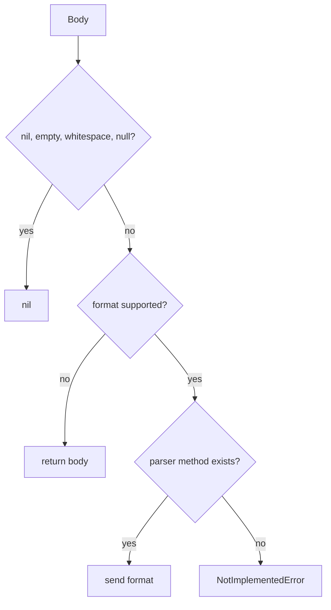

# Chapter 15 — Select and Run a Parser

> **Goal:** Trace how format selection and parser dispatch turn text into a Ruby value.

## Format selection

`Request#format` uses explicit `options[:format]` first. Otherwise, after a
response exists, it asks the parser to map `Content-Type` to a format.

```text
explicit format
    OR
Content-Type → SupportedFormats lookup
    ↓
:json / :xml / :csv / :html / :plain / nil
```

Explicit configuration wins over server metadata.

## Parser dispatch

The default class-level `.call(body, format)` constructs a parser instance and
calls `parse`.

| Format | Implementation | Result |
|---|---|---|
| JSON | `JSON.parse` with configured options | Hash, Array, scalar |
| XML | `MultiXml.parse` | Nested Ruby structure |
| CSV | `CSV.parse` | Array rows |
| HTML/plain | Return body | String |
| Unsupported/nil | Return body | String |

Before dispatch, nil, empty/whitespace, and literal `null` bodies return nil.
A UTF-8 BOM is stripped from valid UTF-8 text.



## Extension mechanisms

Clients may supply a callable parser directly or subclass `HTTParty::Parser`.
A subclass can extend or replace `SupportedFormats` and provide a protected
method named after the format.

The parser protocol is minimal:

```text
call(body, format) → parsed value
```

## Security and reliability

Parsing untrusted bodies consumes CPU/memory and can raise format-specific
exceptions. MIME types can be wrong. Lazy parsing lets callers inspect status
and raw body before triggering such failures.

## Trade-offs

| Choice | Benefit | Cost |
|---|---|---|
| MIME-driven defaults | Convenient APIs | Trusts server metadata |
| Unsupported format returns body | Graceful fallback | Type can vary silently |
| Dynamic method dispatch | Easy extension | Format name becomes method contract |
| Lazy loading parser libraries | Faster/smaller startup | First parse does require-time work |

## Experiments

Call `Parser.call` with JSON, plain text, empty body, `null`, unknown format, and
UTF-8 BOM. Build a custom `:upper` parser and map a custom MIME type.

## Mental sandbox

1. Which wins: explicit `format :json` or `Content-Type: text/plain`?
2. Why return the body for an unknown format?
3. When does a malformed JSON exception occur?
4. Why is `null` treated differently from JSON scalar `false`?

## Build It

Add a parser registry to `MiniParty` mapping MIME types to callables. Keep
format detection separate from parsing and test unknown/empty bodies.

## Teach-back

> Parser selection converts metadata into a format symbol; parser dispatch then
> converts normalized text into an application value or safely returns the text.

## Primary source

- [Parser](https://github.com/jnunemaker/httparty/blob/v0.24.2/lib/httparty/parser.rb)
- [`Request#format` and `parse_response`](https://github.com/jnunemaker/httparty/blob/v0.24.2/lib/httparty/request.rb#L140-L148)

