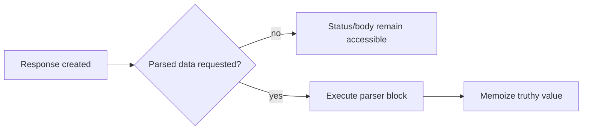

# Chapter 16 — The Response Facade

> **Goal:** Explain how one object exposes HTTP metadata and behaves like parsed data.

## Composite object

`HTTParty::Response` stores:

```text
request       → HTTParty::Request
response      → Net::HTTPResponse
body          → exposed response body
headers       → HTTParty::Response::Headers
parsed block  → deferred parser recipe
```

This is a facade over multiple objects, not a subclass of Hash or Array.

## Lazy parsing

`parsed_response` calls the stored block and memoizes with `||=`. Truthy values
parse once; `nil` and `false` can cause repeated parsing.



This lets callers inspect a `500` body/status before a malformed parser raises.

## Delegation

`method_missing` first asks parsed data, then the raw response:

```text
unknown method
├── parsed_response responds? → delegate there
├── raw response responds?    → delegate there
└── otherwise                 → super / NoMethodError
```

`respond_to_missing?` mirrors the same idea so reflection remains coherent.
Thus JSON Hash responses support `response["key"]`, and parsed Arrays support
iteration-like methods.

The priority means a parsed object method can shadow a raw-response method.

## Headers and status predicates

Headers wrap a delegated Hash plus `Net::HTTPHeader`, providing Hash
compatibility and case-insensitive HTTP access.

Status predicates are generated dynamically from Net::HTTP’s response-class
mapping: `success?`, `not_found?`, `server_error?`, and many more check the raw
response’s class.

## Surprising triggers

| Operation | Possible effect |
|---|---|
| `parsed_response` | Parses |
| Unknown delegated method | Parses to test/respond/delegate |
| `respond_to?` for parsed method | Parses |
| `inspect`/pretty printing | Parses |
| Marshalling | Parses |
| `to_s` | Uses raw body, not parsed value |

Lazy work is observable; debugging can trigger it.

## Error policy

During initialization, `throw_exception` checks configured `raise_on` patterns
against the integer status code and may raise `ResponseError`. Ordinary 4xx/5xx
responses do not raise by default.

## Trade-offs

| Benefit | Cost |
|---|---|
| Convenient Hash/Array feel | Type and method ownership are less obvious |
| Metadata and data in one value | Delegation collisions |
| Lazy parsing | Timing of exceptions is nonlocal |
| Dynamic predicates | Broad convenient API | Runtime metaprogramming |

## Experiments

Use a parser lambda that increments a counter. Call `code`, `body`,
`parsed_response` twice, `respond_to?(:[])`, and `inspect`; record when parsing
occurs. Repeat with a parser returning nil.

## Mental sandbox

1. Why is `response.class` not Hash after JSON parsing?
2. Which object handles `response["id"]`?
3. Why must `respond_to_missing?` accompany `method_missing`?
4. What happens when parsed data and raw response both implement one method?

## Build It

Implement a minimal `MiniParty::Response` with explicit `raw_response`, `body`,
and `parsed_response`. Add delegation only after tests cover collisions,
reflection, nil parsing, and error timing.

## Teach-back

> The response facade preserves transport metadata while lazily presenting the
> parsed body through delegation, trading explicit types for convenience.

## Primary source

- [Response](https://github.com/jnunemaker/httparty/blob/v0.24.2/lib/httparty/response.rb)
- [Response headers](https://github.com/jnunemaker/httparty/blob/v0.24.2/lib/httparty/response/headers.rb)

