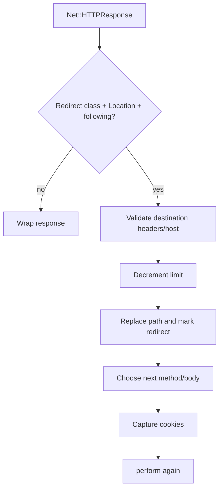

# Chapter 17 — Redirects

> **Goal:** Trace when one logical call becomes multiple HTTP exchanges and how
> method, body, cookies, and credentials change.

## Detection

A response redirects only when it is a `Net::HTTPRedirection`, following is
enabled, and a `Location` field exists. `304 Not Modified` is explicitly not
treated as navigation.



## Destination resolution

`Location` may be absolute, network-relative, root-relative, or relative to the
current path. The request retains `last_uri` so it can resolve the next URI.
Duplicate `Location` fields raise `DuplicateLocationHeader` rather than choosing
an ambiguous destination.

## Redirect limit

Each followed redirect decrements `options[:limit]`. The next `perform` begins
with validation; zero raises `RedirectionTooDeep` carrying the last raw response.
This turns recursion into a bounded state transition.

## Method rewriting

| Response | Default next method | Important options |
|---|---|---|
| 303 | GET | Maintaining plus resending can preserve original |
| 301/302/other redirect except 307/308 | GET | `maintain_method_across_redirects` preserves |
| 307/308 | Original method | Semantics preserve method/body |
| Original HEAD | HTTParty configures method preservation | Avoid accidental GET |

When the next method is GET, HTTParty clears any prior request body.

## Security boundary

Before following a cross-host redirect, HTTParty marks that the host changed.
`send_authorization_header?` then prevents Basic credentials from being attached
to the redirected request. This is a secret-boundary rule, not merely URI logic.

Cookies from `Set-Cookie` are captured and merged into subsequent request
cookies. This is convenient but reinforces why redirect destinations must be
treated as security boundaries.

## State machine

```text
path, method, body, cookies, limit, last_uri, last_response, changed_host
```

A redirect mutates this state and recursively re-enters `perform`. The final
`HTTParty::Response#request` therefore describes the evolved request object.

## Trade-offs

| Convenience | Risk |
|---|---|
| Transparent following | Multiple network calls hidden behind one API call |
| Browser-like method rewriting | Unsafe method semantics can surprise callers |
| Cookie continuity | State crosses requests/destinations |
| Credential suppression on host change | Custom auth headers may need separate protection |

## Experiments

Use WebMock or a local server to model 302, 303, 307, a cross-host redirect, a
relative location, duplicate locations, and a redirect loop. Record every
method, URI, body, cookie, and Authorization field.

## Mental sandbox

1. Why is 304 excluded from navigation?
2. Why preserve method for 307/308?
3. When must a request body be cleared?
4. Which secrets besides Basic auth could leak through custom headers?

## Build It

Add bounded redirects to `MiniParty` only after defining a redirect policy
object. Test method/body transitions and strip all sensitive headers on
cross-origin redirects unless explicitly allowed.

## Teach-back

> Redirect handling is a bounded request state machine whose hardest rules are
> method semantics and cross-origin secret containment.

## Primary source

- [Redirect handling](https://github.com/jnunemaker/httparty/blob/v0.24.2/lib/httparty/request.rb#L332-L401)
- [Redirect configuration](https://github.com/jnunemaker/httparty/blob/v0.24.2/lib/httparty.rb#L265-L341)
