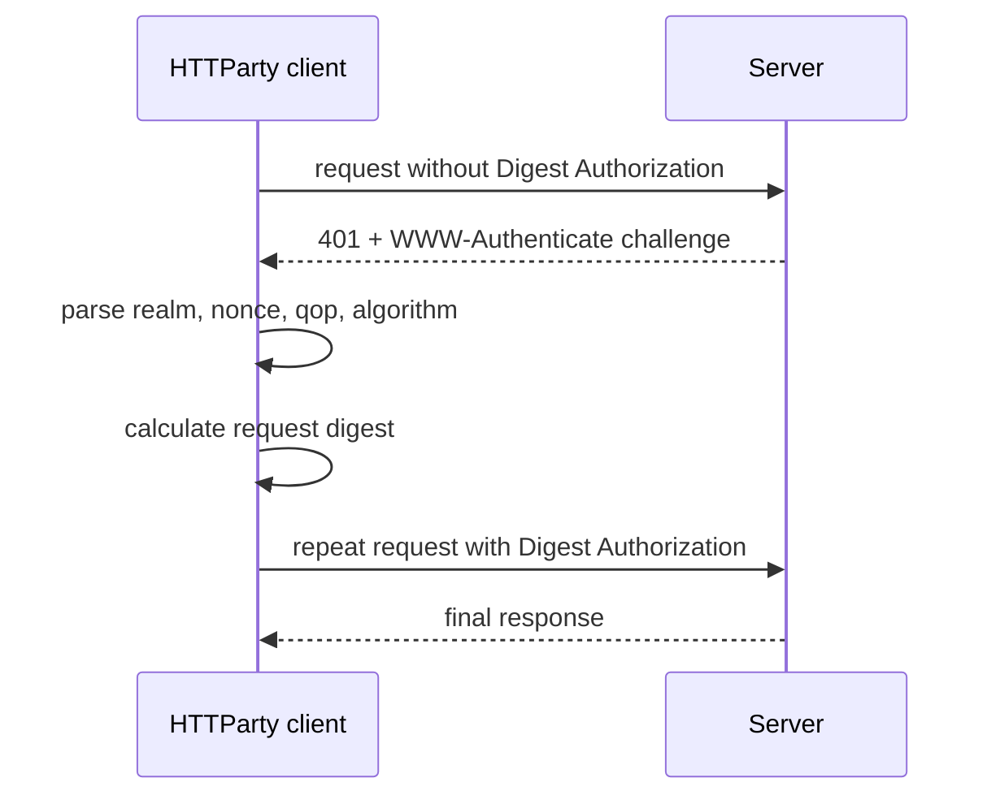

# Chapter 18 — Authentication

> **Goal:** Contrast preemptive Basic authentication with challenge-driven Digest authentication.

## Basic authentication

Configuration stores username/password. During raw-request setup, HTTParty calls
Net::HTTPHeader’s Basic-auth helper, which creates an Authorization field.

```text
username:password → Base64 credentials → Authorization: Basic ...
```

Base64 is encoding, not encryption. Confidentiality depends on HTTPS. Credentials
embedded in URI userinfo are also extracted, but URLs are especially prone to
logging/history leakage and should be avoided.

## Digest authentication

Digest requires server challenge data:



`handle_unauthorized` only retries when Digest is configured, status is 401, a
challenge exists, and credentials have not already been sent. The flag prevents
an infinite authentication loop.

The extension in `net_digest_auth.rb` augments Net::HTTPHeader. It combines
username, realm, password, nonce, method, request path, client nonce, and qop
according to the challenge’s rules.

## Validation and state

Basic and Digest options are mutually exclusive and must be Hash-like. Digest
reuses `last_response` as challenge input, making authentication a two-exchange
state machine rather than a static header.

Cookies returned with the 401 challenge are retained for the authenticated
retry, since some servers bind challenge state to cookies.

## Security model

| Concern | Rule |
|---|---|
| Confidentiality | Use HTTPS even with authentication |
| Redirects | Do not forward credentials blindly to another host |
| Logging | Redact URI userinfo and Authorization fields |
| Storage | Avoid long-lived plaintext credentials in broad scopes |
| Digest algorithm | Legacy MD5-based Digest is not a substitute for TLS |

## Trade-offs

| Mechanism | Advantage | Cost |
|---|---|---|
| Basic | Simple, widely supported | Reusable secret sent on requests |
| Digest | Password itself is not sent directly | Extra round trip, state, legacy algorithms |
| URI credentials | Compact | Severe observability/logging risk |
| Request mutation | Fits Net::HTTP | Sensitive state lives on objects |

## Experiments

Inspect a Basic raw request header without sending it. For Digest, stub a 401
challenge and final 200; assert exactly two transport calls and different
Authorization state. Repeat a second 401 and confirm it stops.

## Mental sandbox

1. Why can Basic be added before the first response?
2. Which Digest inputs are unknowable before the challenge?
3. Why retain cookies from the 401?
4. Why is HTTPS still required for Digest-era systems?

## Build It

Implement only token/Bearer or Basic auth in `MiniParty`, with redaction tests.
Treat Digest as a reading exercise unless a real target requires it.

## Teach-back

> Basic authentication is precomputed request metadata; Digest authentication
> is a bounded challenge-response protocol that mutates request state and repeats transport.

## Primary source

- [Authentication paths in Request](https://github.com/jnunemaker/httparty/blob/v0.24.2/lib/httparty/request.rb#L182-L310)
- [Digest implementation](https://github.com/jnunemaker/httparty/blob/v0.24.2/lib/httparty/net_digest_auth.rb)
