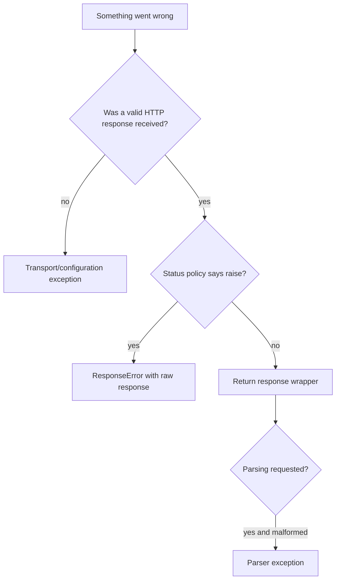

# Chapter 19 — Failures and Retries

> **Goal:** Classify failures by lifecycle layer before deciding response,
> exception, or retry policy.

## Failure taxonomy

| Layer | Example | Default outcome |
|---|---|---|
| Configuration | Invalid headers/auth combination | `ArgumentError`/HTTParty error before I/O |
| URI/security | Unsupported scheme or unsafe host | HTTParty exception before I/O |
| Transport | DNS, refusal, reset, TLS, timeout | Original network exception by default |
| HTTP semantics | 404 or 500 | Valid `HTTParty::Response` by default |
| Redirect policy | Loop or duplicate Location | Response-related HTTParty exception |
| Parsing | Malformed JSON/XML | Parser exception when parsing is triggered |



## Network exceptions and foul mode

`COMMON_NETWORK_ERRORS` includes socket, timeout, TLS, EOF, and Net::HTTP
protocol failures. HTTParty normally re-raises the original exception so callers
can distinguish it. `foul true` converts recognized failures to
`HTTParty::NetworkError` with class/message context.

## HTTP status policy

4xx/5xx do not automatically raise. `raise_on` accepts codes/patterns; response
construction checks them and raises `ResponseError`, whose `response` accessor
retains the raw `Net::HTTPResponse`.

Lazy parsing allows:

```ruby
response = Client.get(path)
return handle_error(response.code, response.body) unless response.success?
data = response.parsed_response
```

## Retries

`ConnectionAdapter` can assign `Net::HTTP#max_retries`. That delegates retry
semantics to Net::HTTP and is not a general business-operation retry engine.

Before retrying, ask:

| Question | Why it matters |
|---|---|
| Is the method idempotent? | Repeating POST may duplicate effects |
| Was any request body sent? | Failure timing may be ambiguous |
| Is the body rewindable? | Streaming retries need replayable input |
| Is there a deadline/backoff? | Immediate loops amplify outages |
| Does the server provide Retry-After? | Server policy should guide pacing |

## Trade-offs

| Policy | Benefit | Cost |
|---|---|---|
| Return all statuses | Full caller control | Easy to ignore failures |
| `raise_on` | Central status policy | Exception control flow and pattern complexity |
| Preserve native network errors | Precise handling | Larger rescue surface |
| Wrap network errors | Uniform library API | Loses direct type matching |

## Experiments

Create focused cases for invalid option, connection refusal, read timeout, 404,
500 with `raise_on`, redirect loop, and malformed JSON. Record whether a response
object exists and when the error occurs.

## Mental sandbox

1. Why should a 500 and timeout not share one default rescue path?
2. Can a GET always be retried safely if it carries credentials or rate cost?
3. Why might malformed JSON raise long after transport completes?
4. What response information survives `ResponseError`?

## Build It

Define `MiniParty` error classes by layer, then add a retry policy limited to
explicit idempotent methods, bounded attempts, exponential backoff, jitter, and
a total deadline. Test with a fake clock/adapter.

## Teach-back

> Failure handling begins by locating the failed layer; retries are a separate
> policy requiring idempotency, replayability, bounds, and timing discipline.

## Primary source

- [Exceptions](https://github.com/jnunemaker/httparty/blob/v0.24.2/lib/httparty/exceptions.rb)
- [Network rescue](https://github.com/jnunemaker/httparty/blob/v0.24.2/lib/httparty/request.rb#L152-L180)
- [`raise_on` response policy](https://github.com/jnunemaker/httparty/blob/v0.24.2/lib/httparty/response.rb#L135-L139)
