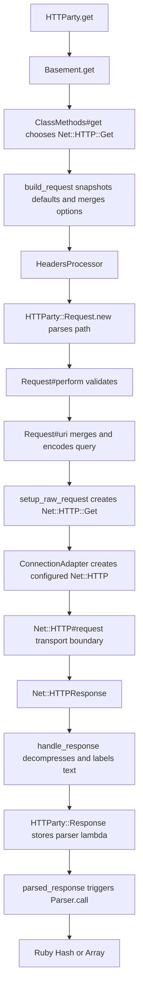

# Chapter 21 — Annotated End-to-End Trace

> **Goal:** Produce one evidence-linked explanation of a GET with query parameters and JSON.

## The call

```ruby
response = HTTParty.get(
  "https://api.example.com/users",
  query: { page: 2 },
  headers: { "Accept" => "application/json" },
  timeout: 5
)

users = response.parsed_response
```

## Completed lifecycle



## Trace ledger

| # | Receiver | Method | Input transformation | Output/evidence |
|---:|---|---|---|---|
| 1 | `HTTParty` | `.get` | Capture URL/options/block | Delegates to `Basement` |
| 2 | `Basement` | `.get` | `:get` becomes `Net::HTTP::Get` | Calls `perform_request` |
| 3 | `Basement` | `.build_request` | Defaults + request overrides | `HTTParty::Request` |
| 4 | `HeadersProcessor` | `#call` | Merge/evaluate/stringify headers | Final option headers |
| 5 | `Request` | `#initialize` | String path becomes URI object | Stored request policy |
| 6 | `Request` | `#uri` | Add `page=2`; validate host | Final URI |
| 7 | `Request` | `#setup_raw_request` | Method class + target + headers | `Net::HTTP::Get` instance |
| 8 | `ConnectionAdapter` | `.call` | Host/443/TLS/5s timeouts | `Net::HTTP` instance |
| 9 | `Net::HTTP` | `#request` | Serialize and exchange | `Net::HTTPResponse` |
| 10 | `Request` | `#handle_response` | Decode/decompress/encode | Response wrapper inputs |
| 11 | `Response` | `#initialize` | Store raw and parser recipe | `HTTParty::Response` |
| 12 | `Response` | `#parsed_response` | Execute lazy recipe | Parsed Ruby value |

## Track one datum at a time

### The HTTP method

```text
Ruby method name get → Net::HTTP::Get class → Net::HTTP::Get instance → "GET" on wire
```

### The query value

```text
{page: 2} → request options → query normalizer → "page=2" → request target
```

### The timeout

```text
5 → request options → ConnectionAdapter → open/read/write timeout properties
```

### The body

```text
response bytes → Net::HTTP body → decompression → text encoding → parser lambda → Ruby value
```

Following one datum prevents diagrams from becoming decorative rather than explanatory.

## Evidence rules

Every arrow in your final trace must have at least one:

| Evidence | Example |
|---|---|
| Source definition | Method/file link |
| Focused spec | Behavior assertion |
| Runtime observation | TracePoint/source location/output |
| Protocol document | HTTP semantic requirement |

Mark inferred arrows explicitly until verified.

## Annotate object identity

The lifecycle contains distinct objects:

```text
String URL
URI object
HTTParty::Request
Net::HTTP::Get
Net::HTTP
Net::HTTPResponse
HTTParty::Response
Hash/Array/String parsed value
```

Record `class` and `object_id` at safe seams. Do not call `inspect` on the wrapper
until you intentionally want lazy parsing.

## Branch overlay

After mastering the straight path, overlay—not redraw—the branches:

```text
after raw response
├── redirect? → mutate request and perform again
├── Digest 401? → add challenge response and perform again
└── ordinary response → normalize and wrap
```

## Deliverable

Produce:

1. One sequence diagram with exact methods.
2. One ledger like the table above.
3. One paragraph each for method, URI, timeout, and body data flow.
4. Three corrections to your Chapter 0 predictions.
5. Links to source/spec evidence.

## Teach-back

> A trustworthy end-to-end trace connects each object transformation to source,
> tests, runtime evidence, or protocol semantics—and distinguishes facts from inference.

## Primary sources

- [HTTParty v0.24.2 source tree](https://github.com/jnunemaker/httparty/tree/v0.24.2/lib)
- [HTTParty v0.24.2 specs](https://github.com/jnunemaker/httparty/tree/v0.24.2/spec/httparty)

