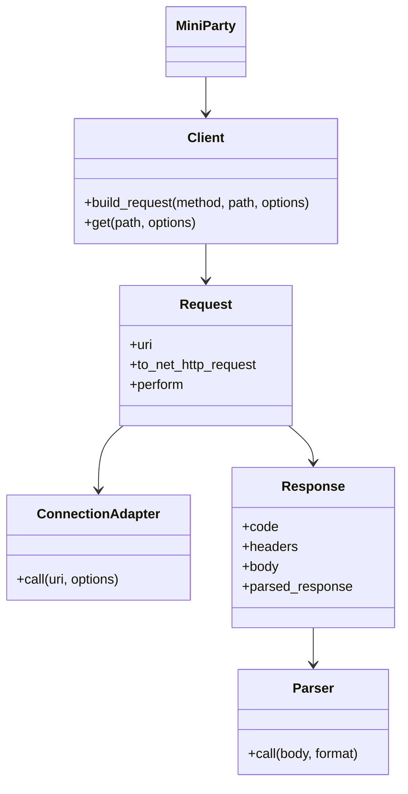
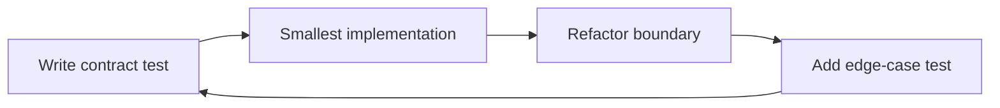

# Chapter 22 — Build `MiniParty`

> **Goal:** Reconstruct the lifecycle using Ruby’s standard library, with fewer
> features and more explicit contracts.

## Why rebuild?

Reading creates recognition. Rebuilding forces recall, boundary decisions, and
failure handling. The goal is not to replace HTTParty; it is to discover which
design pressures caused its structure.

## Constraints

- Standard library only for core client behavior.
- GET first; add POST only after GET tests pass.
- Explicit open/read/write timeouts.
- HTTP and HTTPS only.
- No global mutable configuration.
- No automatic redirect/retry until separate policies exist.
- JSON parsing remains lazy.
- Unit tests use fake adapters; integration tests use a local server.

## Target architecture



## Milestones

| Milestone | Capability | Required proof |
|---:|---|---|
| 1 | Explicit Net::HTTP GET | Local integration response |
| 2 | Request/Response separation | Unit tests with fake adapter |
| 3 | Module facade and client class | Argument/block/identity tests |
| 4 | Class configuration | Parent/child isolation tests |
| 5 | URI and query | Reserved/nested/existing-query tests |
| 6 | Headers and auth | Precedence and redaction tests |
| 7 | Bodies | Raw JSON and form tests |
| 8 | Connection policy | TLS/timeout property tests |
| 9 | Lazy response parsing | Counter and malformed-body tests |
| 10 | Optional redirects/retries | State-machine/property tests |

## Minimal public contract

```ruby
class TodoClient
  include MiniParty
  base_uri "https://example.test"
  headers "Accept" => "application/json"
end

response = TodoClient.get("/todos", query: { page: 2 })
response.code
response.body
response.parsed_response
```

## Invariants

Write these as tests before features:

```text
1. Building a request performs no I/O.
2. Per-request options do not mutate class defaults.
3. Connection options never become request headers accidentally.
4. Request target contains path/query, never fragment.
5. Transport status errors still produce responses by default.
6. Network failure produces no fake HTTP response.
7. Parsing does not occur until requested.
8. Cross-origin redirects never retain secrets by default.
```

## Test matrix

| Layer | Pure unit test | Boundary test |
|---|---|---|
| URI | Input → final URI | Local server sees target |
| Request | Options → Net::HTTPRequest | Fake connection receives object |
| Connection | Options → properties | Local TLS test if practical |
| Response | Fabricated raw response | Local server status/body |
| Parser | Body/format → value | Content-Type integration |
| Redirect/retry | Fake response sequence | Local redirect endpoints |

## Implementation order



Do not start by copying HTTParty classes. Let each class appear only when your
current code has two responsibilities that need separation.

## Comparison journal

For every milestone, record:

| Question | Your answer |
|---|---|
| What pressure created this component? | |
| How does HTTParty solve it? | |
| What did MiniParty omit? | |
| Which trade-off do you prefer and why? | |

## Completion criteria

`MiniParty` is complete when you can explain every line, tests cover each
boundary, and deleting any component produces a responsibility collision you
can name. Feature count is not the completion measure.

## Teach-back

> Rebuilding is successful when architecture emerges from tested pressures,
> not when a smaller clone happens to resemble the source.

## References

- [Ruby Net::HTTP](https://docs.ruby-lang.org/en/3.4/Net/HTTP.html)
- [HTTParty v0.24.2](https://github.com/jnunemaker/httparty/tree/v0.24.2)

