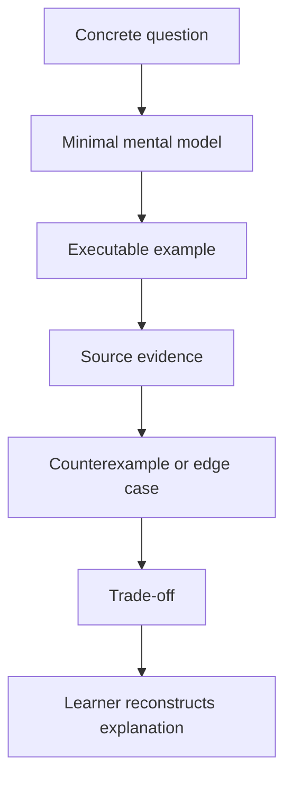

# Chapter 24 — Teach It

> **Goal:** Convert source-reading knowledge into a clear explanation another
> Ruby learner can use and challenge.

## Why teaching is the final test

An explanation fails when it substitutes labels for mechanisms:

```text
Weak:  “HTTParty handles the request.”
Strong: “Request#perform gives a configured Net::HTTPRequest to
         Net::HTTP#request, then wraps the returned Net::HTTPResponse.”
```

Teaching exposes missing receivers, hidden state, and unexplained arrows.

## Article structure

### 1. The promise

Start with one call and the question: how does it become a parsed Ruby value?

### 2. The baseline

Show the explicit URI, connection, request, exchange, response, and parse steps
with Net::HTTP.

### 3. The straight lifecycle

Use the Chapter 21 diagram. Explain every object transformation without branches.

### 4. Three Ruby lessons

- `include`/`extend` and singleton-class lookup.
- Configuration inheritance and mutable-state boundaries.
- Lazy evaluation/delegation in `HTTParty::Response`.

### 5. Three HTTP lessons

- Destination versus request target.
- Transport failure versus HTTP error status.
- Content encoding versus character encoding versus media parsing.

### 6. Branches and trade-offs

Add redirects, authentication, streaming, and failures as state-machine overlays.

### 7. Rebuild and evaluate

Demonstrate one `MiniParty` milestone and explain where it intentionally differs.

## Teaching diagram



## Vocabulary discipline

| Avoid vague phrase | Replace with |
|---|---|
| “Ruby calls it” | Name receiver, owner, and method |
| “It sends bytes” | Name `Net::HTTP#request` boundary |
| “The response is JSON” | Body text is parsed into a Ruby value |
| “HTTP failed” | State whether transport, status, or parsing failed |
| “It inherits config” | State what is copied, merged, and shared |
| “It streams” | State whether chunks are also accumulated |

## Demonstration script

Your presentation should include:

1. The Chapter 1 explicit Net::HTTP request.
2. The Chapter 2 TracePoint call sequence.
3. Inspection of receiver and method owner.
4. An unperformed raw-request inspection.
5. A fake transport returning 500 and malformed JSON.
6. A lazy-parser counter.
7. One redirect method/body transition.

Keep secrets and real production endpoints out of demonstrations.

## Evaluation rubric

| Dimension | 0 | 1 | 2 |
|---|---|---|---|
| Lifecycle | Missing | Major stages | Every boundary and return path |
| Ruby model | Vague | Names features | Explains receiver/owner/state |
| HTTP model | Conflated | Basic request/response | Separates transport/status/content layers |
| Evidence | Claims only | Some links | Each key arrow verified |
| Trade-offs | None | Generic | Tied to implementation choices |
| Active proof | None | Demo only | Prediction, experiment, reconstruction |

A score of 10–12 indicates readiness to publish; lower scores identify the next
chapter to revisit.

## Final oral exam

Answer without notes:

1. Why does `HTTParty.get` delegate to `Basement`?
2. How does `include HTTParty` create class methods?
3. How are defaults and per-call options isolated and merged?
4. Where is the final URI built and validated?
5. What distinguishes HTTParty::Request from Net::HTTPRequest?
6. Where does transport ownership change?
7. What object crosses back from Net::HTTP?
8. When does parsing occur, and what can trigger it implicitly?
9. How do redirect and Digest auth create repeated exchanges?
10. Why are 500, timeout, and malformed JSON three different failures?

## Publication checklist

- [ ] Code runs against the pinned version.
- [ ] Diagrams distinguish objects from methods.
- [ ] Every source claim links to v0.24.2.
- [ ] No credentials or sensitive response data appear.
- [ ] Examples specify timeout and failure behavior.
- [ ] Direct quotations are minimal; explanations are your own.
- [ ] A reader can reproduce experiments locally.
- [ ] The conclusion states when not to use the abstraction.

## Graduation definition

You have finished when you can:

```text
predict behavior
→ locate implementation
→ test the boundary
→ explain the trade-off
→ rebuild the core
→ teach another learner
```

The durable skill is not remembering HTTParty’s filenames. It is learning how
to turn an unfamiliar library into verified lifecycle models.

## Final teach-back

> HTTParty is a configurable policy layer around Net::HTTP: Ruby metaprogramming
> creates the client DSL, request objects normalize intent, Net::HTTP owns
> transport, and a response facade preserves HTTP metadata while deferring parsing.

