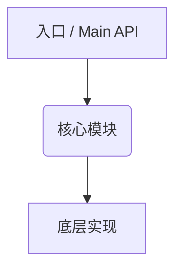

# 🗺️ CodeReading-MOC

> **📌 TL;DR**：一句话：这个库是什么，解决什么问题，为什么值得读。

---

## 🗺️ 架构全景

> 模块之间的关系，用 Mermaid 或 ASCII 图展示调用链/依赖关系。

---

## 📂 子笔记索引

| 笔记 | 内容 | 关联源码文件 |
|------|------|-------------|
| [[CodeReading-MOC-dsl-layer]] | DSL 层设计 | — |
| [[CodeReading-MOC-request-pipeline]] | 请求处理链路 | — |
| [[CodeReading-MOC-response-handling]] | 响应解析 | — |
| [[CodeReading-MOC-patterns]] | 提取的设计模式 | — |

---

## 🔑 关键设计决策

> 读源码过程中发现的"作者为什么这么设计"——反直觉的、精妙的、值得学习的。

1. **决策标题** — 描述 + 为什么这样更好
2. ...

---

## 🧠 我学到了什么

> 可以直接用到自己代码里的具体技巧/模式。

1. **技巧标题** — 一句话 + 代码片段
2. ...

---

## 📋 阅读进度

- [ ] 第一遍：快速扫读，建立整体印象
- [ ] 第二遍：逐模块深读，创建子笔记
- [ ] 第三遍：提炼设计模式，填写"关键设计决策"和"我学到了什么"
