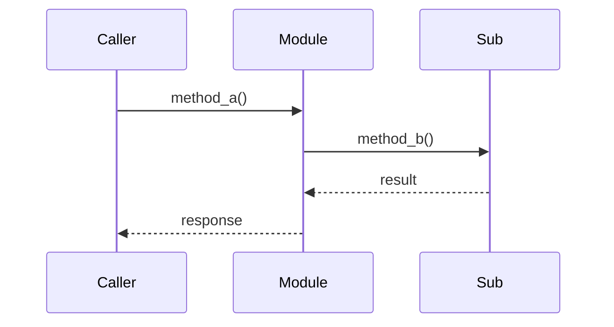

# 🔍 CodeReading-SubNote

> **📌 一句话**：这个模块/模式做什么？在整个架构中的角色是什么？

---

## 🗺️ 流程图

> 关键方法的调用链，用 Mermaid sequence/flowchart 或 ASCII 展示。



---

## 🔍 代码拆解

> 逐段读关键代码，注释式讲解。每段代码配"这做了什么"和"为什么这么写"。

```ruby
# 源码片段 + 行内注释
```

**这做了什么：** ...

**为什么这么写：** ...

---

## 🧩 设计模式/技巧

> 作者用了什么值得学的设计技巧？

| 技巧 | 代码位置 | 为什么好 |
|------|---------|---------|
| — | — | — |

---

## 💡 可复用

> 下次写类似代码时可以直接用的模式。（含代码片段）

```ruby
# 可直接复用的代码片段
```
