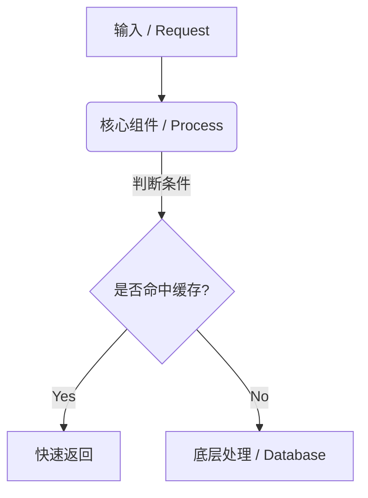

# 📌 <% tp.file.title %>

> **💡 一句话总结 (TL;DR)**：用 1-2 句话概括这篇文章解决的核心问题或关键结论。

---

## 📐 核心架构 / 流程图示 (Architecture & Flow)

> ⚠️ **原则**：拒绝长篇大论，尽量用 ASCII 图、Mermaid 流程图或架构图代替文字。

```mermaid
graph TD
    A[输入 / Request] --> B(核心组件 / Process)
    B -->|判断条件| C{是否命中缓存?}
    C -->|Yes| D[快速返回]
    C -->|No| E[底层处理 / Database]
```
