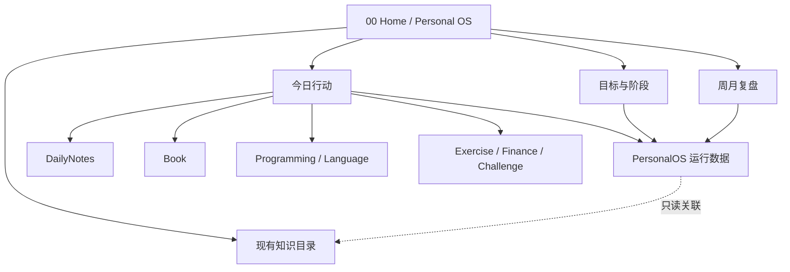

# Gariel-Brain Personal OS 设计说明

- **日期**：2026-09-04
- **状态**：设计已确认，等待用户审阅书面规格
- **目标 Vault**：`/Users/gaowanxing/Gariel/learning-garden/Gariel-Brain`
- **参考项目**：`oi0411/Personal-OS`
- **取代设计**：`Gariel-OS/docs/superpowers/specs/2026-09-03-gariel-personal-os-design.md`

## 1. 目标

在现有 Gariel-Brain 中增加一层轻量 Personal OS，用一个首页连接今日行动、目标、模块、知识成果、Daily Note 和周期复盘。

系统每天打开后，应在十秒内回答三个问题：

1. 今天唯一需要实质推进的事情是什么？
2. 今天怎样照顾身体并保护留白？
3. 今天的行动会沉淀到哪一篇现有知识笔记？

Personal OS 是控制层，不是第二套知识库，也不是重型项目管理器。

## 2. 核心原则

1. **单 Vault**：行动与知识通过 Obsidian 内部链接直接连接。
2. **唯一主线**：每天最多一个 `P1` 任务；它就是首页的唯一主线。
3. **最低可行的一天**：一项主线、一次轻量身体照顾、受保护的留白即构成最小闭环。
4. **不补偿、不追赶**：中断后只重新开始一个 25 分钟行动。
5. **原有内容优先**：不移动、复制或批量改造 Book、Programming、DailyNotes 等现有内容。
6. **Markdown 是事实来源**：界面和脚本失效时，任务、目标和复盘仍可直接阅读。
7. **写入隔离**：运行时自动写入只允许发生在 `PersonalOS/`。
8. **低维护成本**：第一版只实现高频闭环，不复制参考项目的全部功能。

## 3. 总体架构



目录结构：

```text
Gariel-Brain/
├── 00 Home/
│   ├── Personal OS.md
│   ├── 目标中心.md
│   ├── 模块中心.md
│   └── 复盘中心.md
├── PersonalOS/
│   ├── Tasks/YYYY/YYYY-MM.md
│   ├── Goals/
│   ├── Reviews/Weekly/
│   ├── Reviews/Monthly/
│   ├── Module Registry/
│   ├── Views/
│   ├── Services/
│   ├── Templates/
│   ├── Assets/
│   └── Settings.md
├── Archive/旧首页/
│   └── 🏠 我的知识宇宙.md
├── Book/
├── Programming/
├── Language/
├── Exercise/
├── Finance/
├── Challenge/
├── DailyNotes/
└── 其他原有内容……
```

## 4. 权限与修改边界

| 区域 | 运行时权限 | 说明 |
|---|---:|---|
| `PersonalOS/Tasks/` | 读写 | 快速添加、完成和调整任务 |
| `PersonalOS/Goals/` | 读写 | 维护方向、阶段和本周重点 |
| `PersonalOS/Reviews/` | 读写 | 创建周复盘和月复盘 |
| `PersonalOS/Module Registry/` | 默认只读 | 模块由用户通过 Properties/Bases 编辑 |
| Book、Programming 等原有目录 | 只读 | 读取标题、属性和链接，不自动改写 |
| `DailyNotes/` | 只读 | 打开和汇总，不自动创建或修改 |
| `.obsidian/` | 无运行时写入 | 仅在安装阶段启用 CSS 和必要配置 |

所有写入服务在写入前解析目标路径并验证其位于允许目录。越界请求直接拒绝。

## 5. 旧首页过渡

`Personal OS.md` 最终成为唯一首页。旧的 `🏠 我的知识宇宙.md` 不再保留入口。

过渡顺序：

1. 扫描 Vault 内指向旧首页文件 `🏠 我的知识宇宙.md` 的精确 wiki-link（含图标与不含图标两种形式）。
2. 如存在反向链接，先列出并仅将这些入口更新为 `[[00 Home/Personal OS]]`。
3. 将旧首页移动到 `Archive/旧首页/🏠 我的知识宇宙.md`。
4. 验证 Personal OS 首页和主要内部链接。
5. 保留归档文件，直到用户另行确认永久删除。

## 6. 模块模型

首批模块：

| `id` | 名称 | 对应现有目录 | 角色 |
|---|---|---|---|
| `programming-english` | Programming + English | `Programming/`、`Language/` | 主线 |
| `reading` | 阅读 | `Book/` | 支持 |
| `body` | 身体 | `Exercise/`、`Rest/` | 照顾 |
| `life` | 生活与探索 | `Tourist/`、`Photo/`、`Music/` | 常规 |
| `finance` | 财经 | `Finance/` | 常规 |
| `challenge` | Challenge | `Challenge/` | 常规 |
| `temporary` | 临时任务 | 无固定目录 | 收件箱 |

每个模块使用一个注册笔记：

```yaml
---
type: personal-os-module
id: reading
name: 阅读
icon: book-open
color: "#8C9A78"
order: 20
enabled: true
folders:
  - Book
---
```

模块注册只建立映射，不移动现有笔记。`temporary` 始终保留，作为无法立即归类任务的安全入口。

## 7. 任务模型

任务按月保存在 `PersonalOS/Tasks/YYYY/YYYY-MM.md`，每项任务仍是普通 Markdown 复选框：

```markdown
- [ ] 完成 Rails 登录验证
  [task_id:: 20260904-091500-auth]
  [date:: 2026-09-04]
  [module:: programming-english]
  [priority:: P1]
  [goal:: [[完成 Rails 项目身份认证]]]
  [output:: [[Programming/Rails/身份认证]]]
```

字段：

| 字段 | 必填 | 规则 |
|---|---:|---|
| checkbox 正文 | 是 | 唯一保存任务名称的位置 |
| `task_id` | 是 | 稳定且唯一，由服务生成 |
| `date` | 是 | `YYYY-MM-DD` |
| `module` | 是 | 必须对应已启用模块 |
| `priority` | 否 | `P1`、`P2`、`P3`；默认 `P2` |
| `goal` | 否 | 可选内部链接 |
| `output` | 否 | 指向知识成果或工作笔记 |
| `started_at` | 否 | 点击“开始 25 分钟”时写入 |

完成状态只由 checkbox 决定，不额外保存 `status`。

### 7.1 唯一主线

- 每个日期最多一个 `P1` 任务。
- 新任务被设为 `P1` 时，同日旧 `P1` 自动降为 `P2`。
- 更换主线不删除、完成或移动旧任务。
- 当天没有 `P1` 时，首页显示“尚未选择今日主线”。

### 7.2 身体照顾

- 首页展示当天第一个未完成的 `body` 模块任务。
- 当天没有身体任务时，显示固定最低行动：“走路 10 分钟或静坐 5 分钟”。
- 固定最低行动只是提示，不自动写入任务文件，也不计算连续天数。

### 7.3 写入规则

- 创建任务时验证日期、模块、优先级和链接格式。
- 写入使用串行队列，避免快速连续操作覆盖内容。
- 只修改受影响的月度文件。
- 移动任务日期跨月时，先验证两个文件，再完成成对更新。
- 无法识别的额外 inline fields 原样保留。

## 8. 目标模型

目标采用三级结构：

```text
direction  长期方向
└── phase  当前阶段
    └── week  本周重点
```

目标笔记示例：

```yaml
---
type: personal-os-goal
level: phase
status: active
module: programming-english
parent: "[[成为能够独立构建产品的开发者]]"
start: 2026-09-01
end:
success_criteria: 登录、退出和服务端验证均有测试覆盖
---
```

规则：

- `phase` 关联同模块的 `direction`。
- `week` 关联同模块的 `phase`。
- 任务可以不关联目标。
- 只有显式关联目标的任务参与完成率。
- 目标没有关联任务时显示“尚未开始”，不显示误导性的 `0%`。
- 第一版不提供级联删除和复杂权重计算。

## 9. 今日工作台

`00 Home/Personal OS.md` 是固定首页，不按天生成。

页面顺序：

1. 当前日期与当天 Daily Note 链接
2. 自然系水彩 Hero 和每日原则
3. 唯一主线
4. 身体照顾
5. 保护留白
6. Daily Note 入口
7. 其他今日任务
8. 快速添加
9. 知识快捷入口
10. 本周重点进度

默认原则：

> 只推进一件真正重要的事。
>
> 不补偿，不追赶。中断以后，只需重新开始一个 25 分钟行动。

默认留白提醒：

> 未安排的时间不需要被填满。今天不因为焦虑追加任务。

### 9.1 首页操作

| 操作 | 行为 |
|---|---|
| 快速添加 | 填写任务、日期和模块；优先级默认 `P2` |
| 设为主线 | 将目标任务设为 `P1`，同日旧主线降为 `P2` |
| 开始 25 分钟 | 写入 `started_at`，不构建复杂计时器 |
| 完成 | 切换对应 Markdown checkbox |
| 打开成果 | 打开任务的 `output` 内部链接 |
| 打开 Daily Note | 打开 `DailyNotes/YYYY-MM-DD.md` |

首页由 DataviewJS 渲染，有限写入统一调用 `PersonalOS/Services/`，不在页面中散落文件修改逻辑。

## 10. Daily Note 协作

现有 Daily Note 模板保持不变。

```text
Personal OS                         Daily Note
────────────                        ──────────
今天准备做什么  ────────────────→   今日锚点
完成了什么      ←───────────────   Output
遇到什么阻碍    ←───────────────   Blocker
下一步是什么    ←───────────────   Next
```

Personal OS 负责“做什么”，Daily Note 负责“今天实际发生了什么”。首页只打开或只读展示当天笔记，不自动创建、插入或改写内容。

## 11. 复盘

### 11.1 周复盘

周复盘自动汇总：

- 每日唯一主线及完成情况
- 各模块任务数量与完成情况
- 未完成或延期任务
- Daily Note 中可识别的 Output / Blocker / Next
- Challenge 当前进度

用户只需回答：

```markdown
## 本周保留什么
## 本周停止什么
## 下周唯一重点
```

### 11.2 月复盘

月复盘汇总：

- 每周唯一重点
- 各模块任务数量与完成率
- 当月完成的阅读记录
- 周复盘中的重复阻碍
- 下月唯一方向

第一版不建立评分、积分、连续天数或复杂统计图表。

## 12. 工具与插件

| 工具 | 用途 | 必要性 |
|---|---|---|
| Dataview / DataviewJS | 首页查询、聚合和渲染 | 必需，现有 |
| QuickAdd | 快速录入任务 | 使用现有插件 |
| Properties | 编辑目标与模块属性 | Obsidian 核心能力 |
| Bases | 目标、模块和阅读数据管理 | 优先使用现有核心能力 |
| Templater | 创建复盘笔记 | 使用现有插件 |
| 局部 CSS snippet | 首页视觉样式与背景图 | 安装时启用一次 |

不引入 Tasks、Buttons、Meta Bind 或其他重复能力插件。

## 13. 视觉设计

- 风格：暖白纸张、鼠尾草绿、低饱和金色、自然水彩背景。
- 层级：唯一主线最醒目，身体与留白次之，普通任务最后。
- 范围：只通过 `personal-os` CSS class 作用于 Personal OS 页面。
- 背景图：保存到 `PersonalOS/Assets/home-hero.png`，不使用网络地址。
- 桌面优先；第一版不承诺手机专项布局。

## 14. 错误处理与安全降级

| 异常 | 处理 |
|---|---|
| 当月任务文件不存在 | 在允许目录内建立标准空文件 |
| Daily Note 不存在 | 显示“尚未创建”，不擅自创建 |
| 知识链接不存在 | 保留任务并在“待整理”区域标记 |
| 模块或字段无效 | 不写入；保留表单输入并显示原因 |
| 历史任务格式无法解析 | 原文保持不动并列入诊断视图 |
| DataviewJS 失效 | 原始 Markdown 仍可阅读和勾选 |
| 写入路径越界 | 拒绝操作并记录错误，不做部分写入 |
| 跨月更新中途失败 | 使用写入前快照恢复两个文件 |

## 15. 明确不做

- 不新建第二个 Vault。
- 不迁移或重组现有知识目录。
- 不创建第二套 Daily Note。
- 不自动为所有现有笔记补充属性。
- 不实现循环任务、依赖关系、甘特图或日历排程。
- 不实现习惯连续天数、积分和游戏化。
- 不实现同步服务或移动端专项界面。
- 不永久删除旧首页；归档后等待用户再次确认。

## 16. 验证与验收

### 16.1 静态检查

- 所有新增 Markdown、YAML 和 DataviewJS 文件可解析。
- 所有内部链接和目标路径符合目录设计。
- CSS 只影响带 `personal-os` class 的页面。
- Git diff 只包含获得批准的目标文件。

### 16.2 服务测试

- 创建普通任务写入正确月份。
- 创建 `P1` 时同日旧主线降为 `P2`。
- 完成任务只切换目标 checkbox。
- 跨月移动成功或完整回滚。
- 无效字段与越界路径均被拒绝。
- 未识别字段在修改后仍然保留。

### 16.3 Vault 验收

- 打开 Personal OS 后能看到当天日期、唯一主线、身体照顾和其他任务。
- QuickAdd 能快速创建任务，失败时不会产生半条数据。
- 首页能打开现有 Book、Programming、Challenge 和 Daily Note 内容。
- 周/月复盘能汇总对应时间范围。
- 旧首页已归档且主要入口没有断链。
- 关闭 Dataview 后，核心数据仍是可读 Markdown。

## 17. 实施边界

实施计划应拆成可独立验证的小阶段：基础目录与样例数据、只读视图、任务写入服务、目标和复盘、视觉样式、旧首页过渡。每个阶段完成后都先验证，再继续下一阶段。

本设计确认的是架构与行为，不授权实施阶段永久删除任何现有内容。
