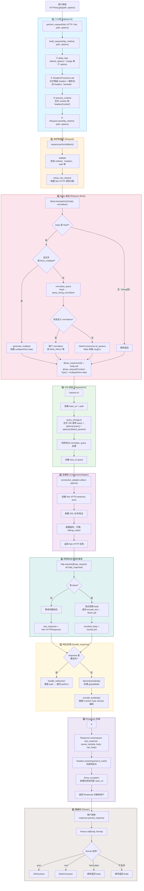

```mermaid
flowchart TD
    A["用户调用<br/>HTTParty.get(path, options)"] --> B

    subgraph S1["1️⃣ 入口层 (httparty.rb)"]
        B["perform_request(Net::HTTP::Get, path, options)"]
        B --> C["build_request(http_method, path, options)"]
        C --> C1["① deep_dup default_options + merge 用户 options"]
        C1 --> C2["② HeadersProcessor.call<br/>合并类级 headers + 解析动态 headers（lambda）"]
        C2 --> C3["③ process_cookies<br/>合并 cookies 到 headers['cookie']"]
        C3 --> C4["④ Request.new(http_method, path, options)"]
    end

    C4 --> D

    subgraph S2["2️⃣ 请求构建层 (Request)"]
        D["request.perform(&block)"] --> D1["validate<br/>校验 method、headers、auth 等"]
        D1 --> D2["setup_raw_request<br/>构建 Net::HTTP 请求对象"]
    end

    D2 --> E

    subgraph S3["3️⃣ Body 组装 (Request::Body)"]
        E["Body.new(options[:body], normalizer)"]
        E --> E1{"body 是 Hash?"}
        E1 -->|是| E2{"含文件<br/>或 force_multipart?"}
        E1 -->|否（String等）| E3["原样返回"]
        E2 -->|是| E4["generate_multipart<br/>构建 multipart/form-data"]
        E2 -->|否| E5["normalize_query<br/>Hash → query_string_normalizer"]
        E5 --> E6{"有自定义 normalizer?"}
        E6 -->|否| E7["HashConversions.to_params<br/>Rails 风格: key[]=v"]
        E6 -->|是| E8["用户 normalizer<br/>如 NON_RAILS 等"]
        E4 --> F["@raw_request.body = body.call<br/>@raw_request['Content-Type'] = multipart/form-data"]
        E8 --> F
        E7 --> F
        E3 --> F
    end

    F --> G

    subgraph S4["4️⃣ URI 组装 (Request#uri)"]
        G["request.uri"] --> G1["拼接 base_uri + path"]
        G1 --> G2["query_string(uri)<br/>合并 URI 原有 query + options[:query] + options[:default_params]"]
        G2 --> G3["同样经过 normalize_query 处理"]
        G3 --> G4["设置 new_uri.query"]
    end

    G4 --> H

    subgraph S5["5️⃣ 连接层 (ConnectionAdapter)"]
        H["connection_adapter.call(uri, options)"]
        H --> H1["创建 Net::HTTP.new(host, port)"]
        H1 --> H2["配置 SSL 证书/验证"]
        H2 --> H3["配置超时、代理、debug_output"]
        H3 --> H4["返回 Net::HTTP 实例"]
    end

    H4 --> I

    subgraph S6["6️⃣ 网络发送与响应接收"]
        I["http.request(@raw_request) do |http_response|"]
        I --> I1{"有 block?"}
        I1 -->|是| I2["流式读取 body<br/>逐块 encode_text → block.call"]
        I1 -->|否| I3["等待完整响应"]
        I2 --> I4["chunked_body = chunks.join"]
        I3 --> I5["last_response = Net::HTTPResponse"]
    end

    I5 --> J
    I4 --> J

    subgraph S7["7️⃣ 响应处理 (handle_response)"]
        J{"response 是<br/>重定向?"} -->|是| J1["handle_redirection<br/>更新 path → 递归 perform"]
        J -->|否| J2["decompress(body)<br/>处理 gzip/deflate"]
        J2 --> J3["encode_text(body)<br/>根据 Content-Type charset 编码"]
    end

    J3 --> K

    subgraph S8["8️⃣ Response 封装"]
        K --> K1["Response.new(request, last_response, parser_lambda, body: raw_body)"]
        K1 --> K2["Headers.new(response.to_hash)<br/>包装响应头"]
        K2 --> K3["throw_exception<br/>如果状态码匹配 raise_on"]
        K3 --> K4["返回 Response 对象给用户"]
    end

    K4 --> L

    subgraph S9["9️⃣ 懒解析 (Parser)"]
        L["用户调用 response.parsed_response"]
        L --> L1["Parser.call(body, format)"]
        L1 --> L2{"format 支持?"}
        L2 -->|:json| L3["JSON.parse"]
        L2 -->|:xml| L4["MultiXml.parse"]
        L2 -->|:html/:plain| L5["原样返回 body"]
        L2 -->|不支持| L6["原样返回 body"]
    end

    style S1 fill:#e1f5fe,stroke:#0288d1
    style S2 fill:#fff3e0,stroke:#f57c00
    style S3 fill:#fce4ec,stroke:#c62828
    style S4 fill:#e8f5e9,stroke:#2e7d32
    style S5 fill:#f3e5f5,stroke:#7b1fa2
    style S6 fill:#e0f2f1,stroke:#00695c
    style S7 fill:#fff8e1,stroke:#f9a825
    style S8 fill:#ede7f6,stroke:#4527a0
    style S9 fill:#efebe9,stroke:#4e342e
```