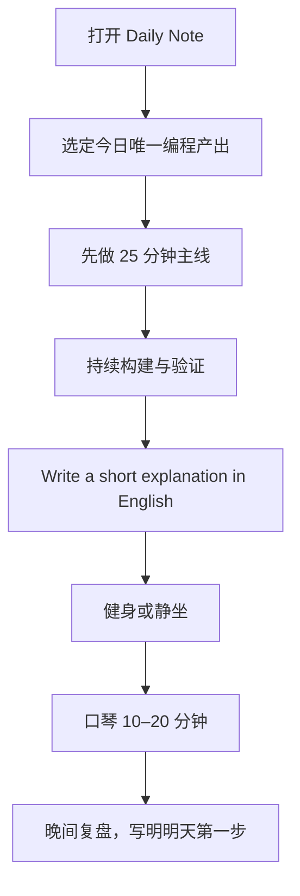

---
tags:
  - life-sop
---

# 生活 SOP

> **Programming 是主线，English 是工作语言，健身与静坐提供能量，日记负责校准，口琴用于恢复。**

## 1. 优先级

| 层级 | 方向 | 完成标准 |
|---|---|---|
| **主线** | Programming + English | 产生一个可检查的编程结果，并用 English 解释 |
| **能量** | 健身 / 静坐 | 根据当天状态至少完成一项 |
| **跟踪** | Daily Note | 记录产出、阻塞和明天第一步 |
| **恢复** | 口琴 | 练习 10–20 分钟，不追求进度压力 |

**其他兴趣暂不启动为新项目。**

## 2. 每日执行流程



### 早晨：定义产出

1. 打开当天的 Daily Note。
2. 写下**唯一主线产出**。
3. 在查消息前，先推进 25 分钟。

好的产出必须可以被验证：

- 一段能够运行的代码
- 一个已验证的实验
- 一个被定位或解决的 bug
- 一则用 English 解释机制的技术笔记

### 白天：构建闭环

```text
Read in English
      ↓
Build / Test
      ↓
Explain in English
      ↓
Record the remaining question
```

**English 不单独抢占一个项目时段，而是嵌入 Programming 的输入与输出。**

### 能量与恢复

- 按训练计划健身；不训练时，至少静坐。
- 口琴放在主线之后，练习 10–20 分钟即可停止。
- 晚间按 [[Rest/Sleep/Evening Wind-Down Ritual|Evening Wind-Down Ritual]] 减少信息消耗。

### 晚间：三句复盘

1. **Output:** 我今天产出了什么？
2. **Blocker:** 我卡在哪里？
3. **Next:** 明天打开电脑后的第一个动作是什么？

## 3. 最低可行的一天

> 状态不好时**降低强度，不中断闭环**。

| 方向 | 最低行动 |
|---|---|
| Programming + English | 读一小段技术材料，运行一次代码，写 3 句 English |
| 身体 | 走路 10 分钟或静坐 5 分钟 |
| 口琴 | 练习 5 分钟，也可主动休息 |
| 日记 | 只回答 Output / Blocker / Next |

## 4. 失速恢复

如果中断了一天或一个时段：

1. 不补进度，不计算连续天数。
2. 打开今天的 Daily Note。
3. 写下一个 25 分钟内能开始的动作。
4. 立即开始。

## 5. 每周校准

每周只检查四个问题：

- 我产生了哪些可检查的 Programming 产出？
- English 是否真正用于输入和解释？
- 什么在持续消耗能量？
- 下周只需调整哪一件事？

**一周最多修改 SOP 一处。**

---

入口：[[🏠 我的知识宇宙]]
